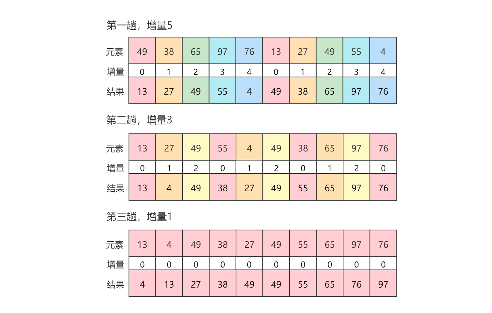

# 希尔排序

[TOC]

## 算法简介

希尔排序（Shell Sort）是插入排序的一种又称“缩小增量排序”（Diminishing Increment Sort），是直接插入排序算法的一种更高效的改进版本。希尔排序是**不稳定**的排序算法。该方法是因D.L.Shell于1959年提出而得名。

希尔排序是按其设计者希尔（Donald Shell）的名字命名，该算法由希尔在1959年所发表的论文“A high-speed sorting procedure”中所描述。

希尔排序是基于插入排序的以下两点性质而提出的改进方法：

1. 插入排序在对几乎已经排好序的数据操作时，效率高，即可以达到线性排序的效率。
2. 插入排序一般来说是低效的，因为插入排序每次只能将数据移动一位。

1961年，IBM公司的女程序员Marlene Metzner Norton（玛琳·梅茨纳·诺顿）首次使用fortram语言编程实现了希尔排序算法。在其程序中使用了一种简单有效的方法设置希尔排序所需的增量序列：第一个增量取代排序记录个数的一般，然后逐次减半，最后一个增量为1。该算法后来被称为Shell-Metzner 算法，Metzner本人在2003年的一封电子邮件中说到：“我没有为这种算法做任何事，我的名字不应该出现在算法的名字中”。

## 算法原理

希尔排序把记录按下标的一定增量分组，对每组使用直接插入排序算法排序；随着增量逐渐减少，每组包含的关键字越来越多，当增量减至1时，整个序列被分成一组，算法便终止。

一个问题是为什么不直接使用插入排序算法，而要添加额外的增量操作。这是因为对于插入排序而言，每次只能将数据移动一位，这是它的缺点，因而通过增加增量操作，可以将数据移动多位。另外插入排序的优点是对几乎已经排好序的数据操作时，效率高，即可以达到线性排序的效率。因此当增量递减为1时，此时整个序列的元素已经接近他它们完整排序之后的最终位置，此时可以大大减少元素的比较和移动操作。正是这两种情况的结合才使希尔排序效率比插入排序高很多。

## 算法示例

序列：49，38，65，97，76，13，27，49，55，04

分为三个增量：5，3，1



第一趟，增量为5，将颜色相同的元素进行插入排序。即增量位标识为对应数字的元素。

第二趟，增量为3，同样是将颜色相同的元素进行插入排序。

到第三趟，此时增量为1，并且整个序列的元素已经接近他它们完整排序之后的最终位置。将整个序列进行插入排序。

## 增量计算

增量序列的选择。Shell算法的性能与所选取的分组长度序列有很大关系，即希尔排序的执行时间依赖于增量序列，好的增量序列的共同特征是：

1. 最后一个增量必须为1。
2. 应该尽量避免序列中的值(尤其是相邻的值)互为倍数的情况（如果为倍数，不同组的会重叠）。

下面提供了二种计算公式：

公式1：

```
m≤log₂⁽ⁿ⁺¹⁾-1
dₛ = 2ᵐ⁻ˢ-1(s=0,1,2,...,m-1)
```

公式二：

```
m≤log₃⁽²ⁿ⁺¹⁾
dₛ=(3ᵐ⁻ˢ-1)/2(s=0,1,2,...,m-1)
```

## 算法实现

增量计算，公式1：

```java
/**
 * 计算希尔排序增量。
 * <br/>
 * 公式：
 * <pre>
 * m≤log₂⁽ⁿ⁺¹⁾-1
 * dₛ = 2ᵐ⁻ˢ-1 (s=0,1,2,...,m-1)
 * </pre>
 * @param n 元素数量。
 * @return 希尔排序增量。
 */
private int[] increment(int n) {
    int m = (int) (Math.log(n + 1) / Math.log(2)) - 1;
    int[] increment = new int[m];
    for (int i = 0; i < m; i++)
        increment[i] = (1 << (m - i)) - 1;
    return increment;
}

```

增量计算，公式2：

```java
/**
 * 计算希尔排序增量。
 * <br/>
 * 公式：
 * <pre>
 * m≤log₃⁽²ⁿ⁺¹⁾
 * dₛ=(3ᵐ⁻ˢ-1)/2 (s=0,1,2,...,m-1)
 * </pre>
 *
 * @param n 元素数量。
 * @return 希尔排序增量。
 */
private static int[] increment(int n) {
    int m = (int) (Math.log((n << 1) + 1) / Math.log(3));
    int[] increment = new int[m];
    for (int i = 0; i < m; i++)
        increment[i] = ((int) Math.pow(3, m - i)) >> 1;
    return increment;
}
```

希尔排序算法：

```java
public void shellSort(int[] arrays) {
    for (int incr : increment(arrays.length)) {
        for (int i = 0; i < incr; i++) {
            for (int j = i; j < arrays.length; j += incr) {
                int k, e = arrays[j];
                for (k = j - incr; k >= 0 && e < arrays[k]; k -= incr)
                    arrays[k + incr] = arrays[k];
                arrays[k + incr] = e;
            }
        }
    }
}
```

## 算法分析

**优劣**

不需要额外的辅助空间，和归并排序一样容易实现。希尔排序是基于插入排序的一种算法，在此算法基础之上增加了一个新的特性，提高了效率。希尔排序的时间复杂度O(n¹˙⁵)，其下界是O(n*log₂n)。希尔排序没有快速排序算法快（O(n log n)），因此中等规模大小的序列表表现良好，对于规模非常大的数据排序不是最优选择。但是比O(n²)复杂度的算法快的多。并且希尔排序非常容易实现，算法代码短而简单。此外，希尔排序算法在最坏和平均情况下的执行效率相差不是很多，与此同时，快速排序在最坏的情况下执行的效率会非常差。因此，建议几乎任何排序工作在开始时都可以选择希尔排序，若在实际使用中证明它不够快，再改成快速排序这样更高级的排序算法。本质上讲，希尔排序算法是直接插入排序算法的一种改进，减少了其复制的次数，速度要快很多。 原因是，当n值很大时[数据项](https://baike.baidu.com/item/数据项)每一趟排序需要移动的个数很少，但数据项的距离很长。当n值减小时每一趟需要移动的数据增多，此时已经接近于它们排序后的最终位置。 正是这两种情况的结合才使希尔排序效率比[插入排序](https://baike.baidu.com/item/插入排序)高很多。Shell算法的性能与所选取的分组长度序列有很大关系。只对特定的待排序记录序列，可以准确地估算关键词的比较次数和对象移动次数。想要弄清关键词比较次数和记录移动次数与增量选择之间的关系，并给出完整的数学分析，今仍然是数学难题。

**时间复杂度**

希尔排序在开始时增量最大，分组较多，每组元素数量少，故组内直接插入排序较快，随着增量`dᵢ`缩小，分组数逐渐减少，而各组内的元素数量逐渐增多，但由于已经按`dᵢ₋₁`的距离排过序，使序列接近于有序状态，所以新的一趟排序过程也较快。

希尔排序的时间复杂度是小于直接插入排序的。

- 增量序列取`dₛ = 2ᵐ⁻ˢ-1`时，时间复杂度`T(n)=O(n¹˙⁵)`
- n在某个特定范围内时，时间复杂度`T(n)=O(n¹˙³)`
- n→∞时，时间复杂度`T(n)=O(n*(log₂n)²)`

**空间复杂度**

希尔排序不需要额外的辅助空间，因此其时间复杂度是O(1)。

**稳定性**

希尔排序是不稳定的排序算法。


