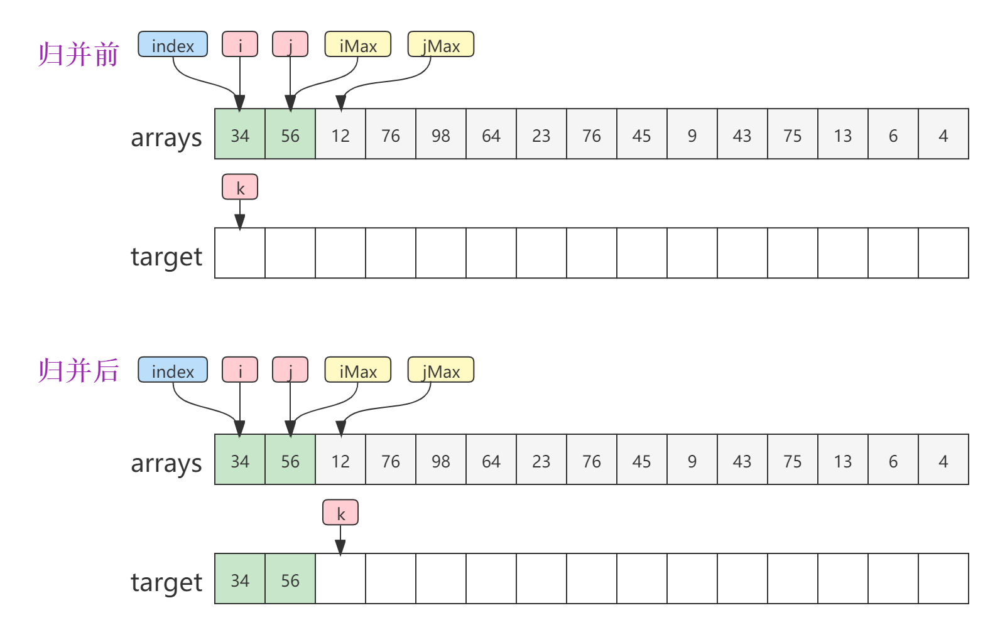
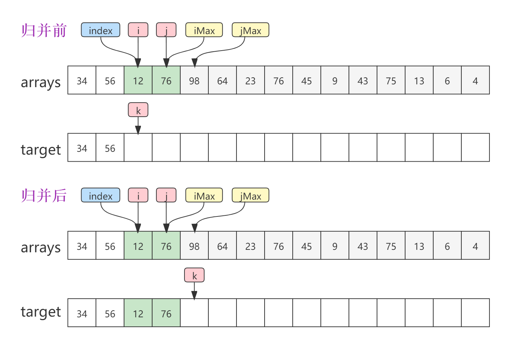
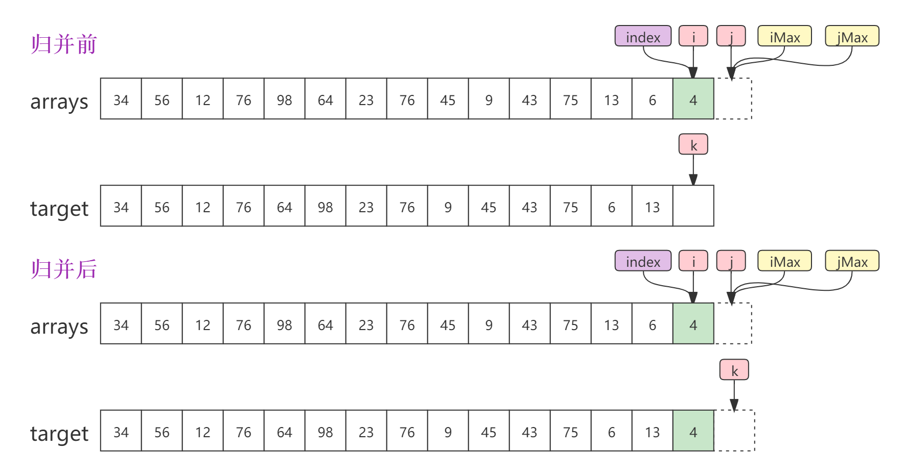
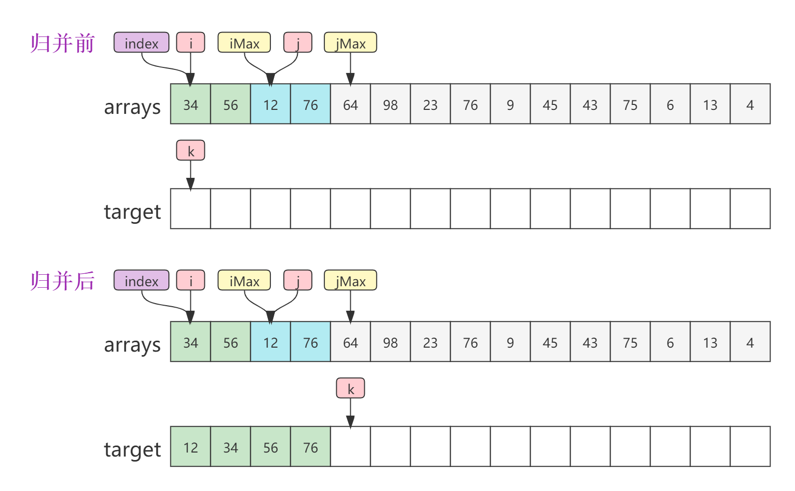
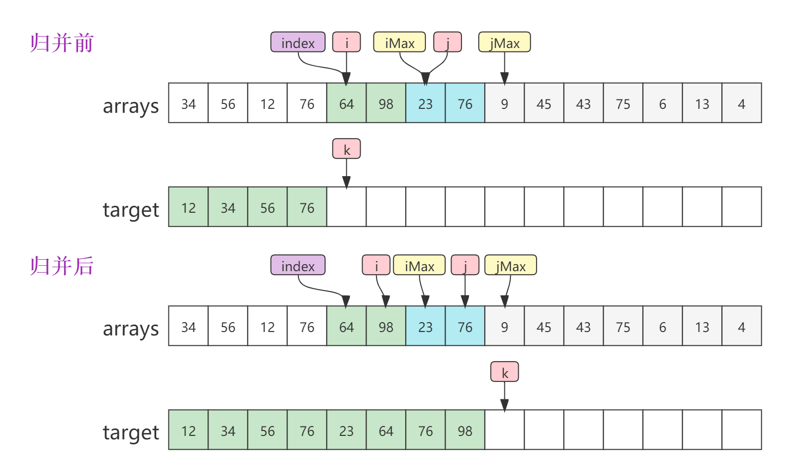
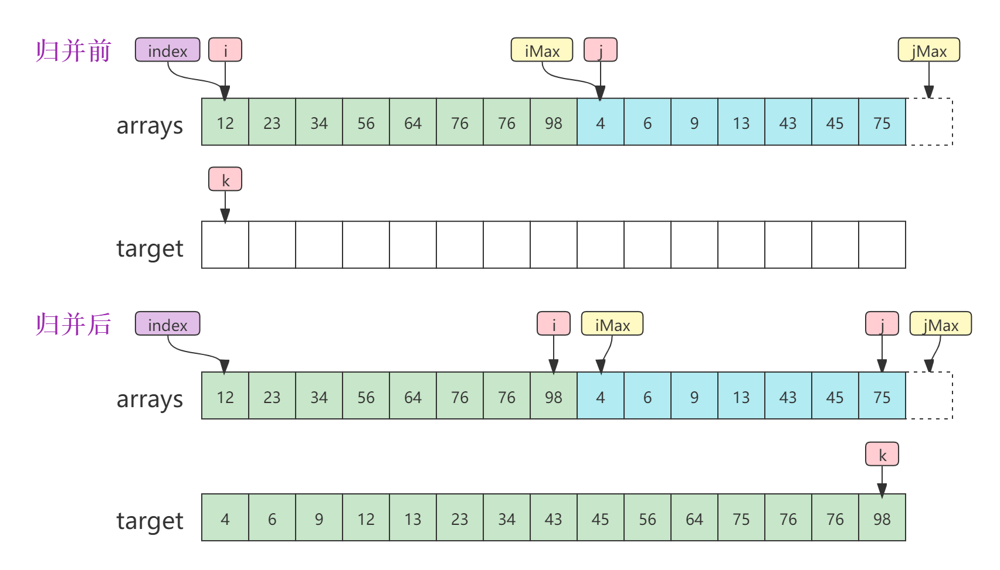
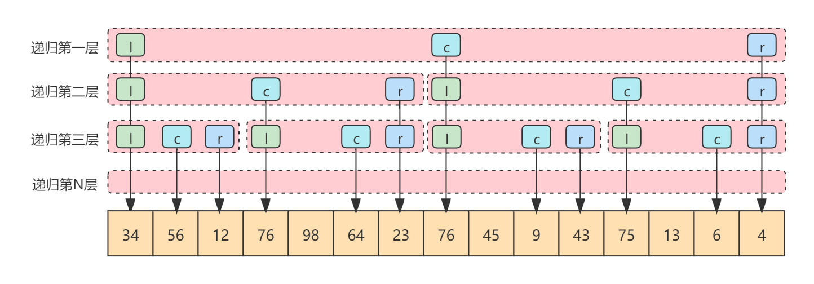
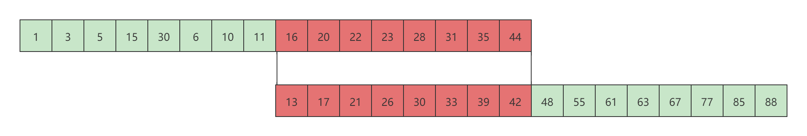
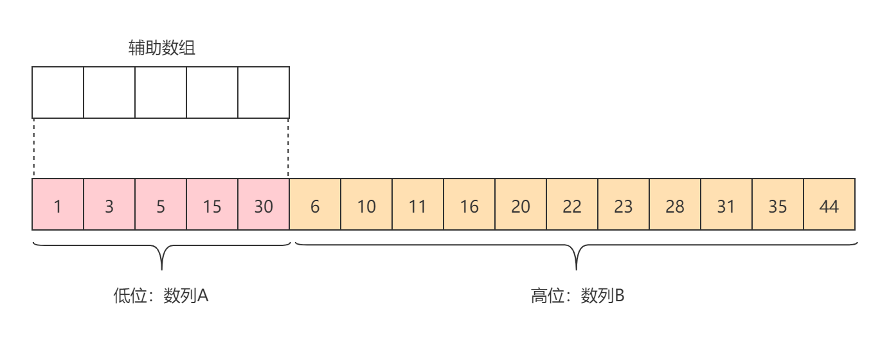
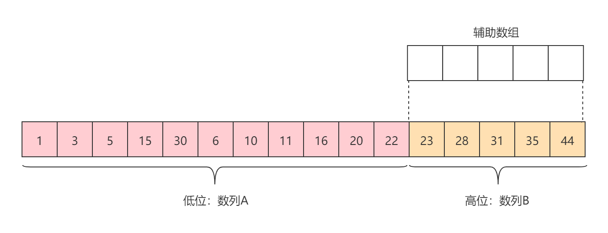

# 归并排序

[TOC]

## 算法简介

归并排序（Merge Sort）是建立在归并操作上的一种有效，稳定的排序算法，该算法是采用分治法（Divide and Conquer）的一个非常典型的应用。将已有序的子序列合并，得到完全有序的序列；即先使每个子序列有序，再使子序列段间有序。将两个有序表合并成一个有序表，称为**二路归并**。

发明者：约翰·冯·诺伊曼

## 算法原理

归并操作，又叫归并算法，是指将两个有序的顺序数列和合并为一个顺序数列。

设有数列：{34, 56, 12, 76, 98, 64, 23, 76, 45, 9, 43, 75, 13, 6, 4}

- 第一次归并：{34, 56}, {12, 76}, {64, 98}, {23, 76}, {9, 45}, {43, 75}, {6, 13}, {4} - 比较次数：7
- 第二次归并：{12, 34, 56, 76}, {23, 64, 76, 98}, {9, 43, 45, 75}, {4, 6, 13} - 比较次数：10
- 第三次归并：{12, 23, 34, 56, 64, 76, 76, 98}, {4, 6, 9, 13, 43, 45, 75} - 比较次数：11
- 第四次归并：{4, 6, 9, 12, 13, 23, 34, 43, 45, 56, 64, 75, 76, 76, 98} - 比较次数：12

总共比较了：7+10+11+12=40；


逆序数：

## 算法示例

### 非递归归并

非递归归并的关键思想在于步长（step）。给定一个顺序表，首先第一趟归并的时候步长为1，及每次两个关键字进行归并。当第一趟归并完成之后，第二趟归并步长递增为2。依次类推，第三趟归并步长递增为4，第n趟归并步长递增为2^n-1。

对于非递归归并而言，每次归并时，有6个关键字指针，分别是index，i，j，k，iMax，jMax。

- index：归并算法在逻辑上是两个有序的顺序表交替比较，但一般情况下我们只有一个原始数组。index指针指定了每趟第n次归并的起始关键字索引。
- i：逻辑上第一个顺序表的起始索引，初始状态等于index。
- j：逻辑上第二个顺序表的起始索引，初始状态等于index+step。
- k：容器顺序表的起始索引，初始状态等于index。
- iMax：逻辑上第一个顺序表的最大索引（i<iMax），等于index+step，与j相等。
- jMax：逻辑上第二个顺序表的最大索引（j<jMax），等于index+step*2。

**第一趟归并 - Step = 1**

第一次归并：



第二次归并：



第八次归并：



**第一趟归并 - Step = 2**

第一次归并：



第一次归并：



**第四趟归并 - Step = 8**



由于篇幅有限，只列举了几个归并操作的。

### 递归归并

递归归并的关键思想在于对半分。给定一个顺序表，首先将其平均分成两部分，然后对这两部分进行归并操作。当然在对这两部分进行归并操作之前，需要递归地对平均分的两部分再次进行平均拆分，递归持续这个过程一直到只有一个元素为止，拆无可拆。最后由最底层的一个元素归并完成，之后回到上一层二个元素归并完成，之后回到上一层四个元素归并完成，以此类推，回归到递归的最顶层。

给定三个指针，分别是left，center，right。left等价于i和index，center等价于j和iMax，left等价于jMax。因此递归归并的归并方式与非递归归并的归并方式是一样的。如下图所示：



## 算法实现

**非递归归并**

```java
public void mergeSort(int[] arrays) {
    int[] target = new int[arrays.length];
    int step = 1; //initial step is 1
    while (step < arrays.length) {
        for (int i = 0; i < arrays.length; i += step << 1)
            merge(arrays, i, step, target);
        step <<= 1;
        //swap
        int[] temp = arrays;
        arrays = target;
        target = temp;
    }
    if ((step & 0x55555555) == 0) System.arraycopy(arrays, 0, target, 0, target.length);
}

/**
 * 归并。
 *
 * @param arrays 原始数组
 * @param index 起始索引
 * @param step 步长
 * @param target 目标数组
 */
private void merge(int[] arrays, int index, int step, int[] target) {
    int i = index, j = index + step, k = index;
    int iMax = Math.min(j, arrays.length);
    int jMax = Math.min(j + step, arrays.length);
    while (i < iMax && j < jMax)
        target[k++] = arrays[i] >= arrays[j] ? arrays[j++] : arrays[i++];
    while (i < iMax) target[k++] = arrays[i++];
    while (j < jMax) target[k++] = arrays[j++];
}
```

**递归归并实现**

```java
public void mergeSort1(int[] arrays) {
    mergeSort(arrays, new int[arrays.length], 0, arrays.length - 1);
}

private void mergeSort(int[] arrays, int[] target, int left, int right) {
    if (left < right) {
        int center = (left + right) >> 1;
        mergeSort(arrays, target, left, center);
        mergeSort(arrays, target, center + 1, right);
        merge(arrays, target, left, center + 1, right);
    }
}

private void merge(int[] arrays, int[] target, int left, int center, int right) {
    int i = left, j = center, k = left, rightEnd = right + 1;
    while (i < center && j < rightEnd)
        target[k++] = arrays[i] >= arrays[j] ? arrays[j++] : arrays[i++];
    while (i < center) target[k++] = arrays[i++];
    while (j < rightEnd) target[k++] = arrays[j++];
    for (int l = left; l <= right; l++) arrays[l] = target[l];
}
```

## 算法优化

### Galloping

标准的归并排序算法是针对两个有序序列A和B，以及两个指针A、B首个元素的指针i和j，比较A[i]和B[j]，然后将小的元素放入到合并后的序列中，并推进小元素所在序列的指针，然后再次比较A[i]和B[j]。以此类推，重复此过程。

在许多情况下，两个有序列在进行归并时，其序列的前后有一部分子序列是不用比较合并的，可以直接将其放到排序后的序列中。如下图所示：



有序列A{1}和B{}，可以发现，子序列A{1~11}比序列B的首个元素都小。子序列B{48~88}比序列A的尾部元素都大。子序列A{1~11}和B{48~88}完全不需要参与比较归并，直接放到排序后的序列中即可。只有红色部分才需要参与。因此，针对这样的数据特性，提出了一个对归并排序的优化策略：galloping。

galloping：在两个有序序列归并之前，首先以序列B的首个元素在序列A中查找合适的插入位置，返回最后一个小于B首个元素的元素之后的索引，为了保证排序的稳定性，如果存在有元素相等，则返回最后一个等于B首个元素的元素之后的索引。同理，再次以序列A的最后一个元素在序列B中查找合适的插入位置，返回最后一个小于A最后一个元素的索引，为了保证排序的稳定性，如果存在有元素相等，则返回最后一个元素相等之前的索引。

代码实现如下所示：

```java
private void merge(int[] arrays, int index, int step, int[] target) {
    int i = index, j = index + step, k = index;
    int iMax = Math.min(j, arrays.length);
    int jMax = Math.min(j + step, arrays.length);
    if (i < iMax && j < jMax) {
        int r = gallopRight(arrays[j], arrays, i, iMax - 1);
        if (r > i) {
            System.arraycopy(arrays, i, target, k, r - i);
            k = r;
            i = r;
        }
        if (r == iMax) {
            System.arraycopy(arrays, j, target, r, jMax - j);
            return;
        }
        int l = gallopLeft(arrays[iMax - 1], arrays, j, jMax - 1);
        if (l < jMax) {
            System.arraycopy(arrays, l, target, l, jMax - l);
            jMax = l;
        }
        if (j == l) {
            System.arraycopy(arrays, i, target, k, iMax - i);
            return;
        }
    }
    while (i < iMax && j < jMax)
        target[k++] = arrays[i] >= arrays[j] ? arrays[j++] : arrays[i++];
    while (i < iMax) target[k++] = arrays[i++];
    while (j < jMax) target[k++] = arrays[j++];
}

/**
 * 定位要将指定键插入指定排序范围的位置;如果范围包含一个等于key的元素，则返回最左边相等元素的索引。
 * 之所以返回最左边相等元素的索引，是因为需要保持排序的稳定性，即最左边相等的元素仍然要在指定键的后面。
 * <p>
 * Note：从右往左找，所以为最左边。时间复杂度O(n)。
 *
 * @param key    要搜索其插入点的键
 * @param arrays 要搜索的数组
 * @param base   范围内第一个元素的索引
 * @param h      范围内最后一个元素的索引
 * @return 整数k,  0 <= k <= n 而 a[b + k - 1] < key <= a[b + k],（b为排序范围的起始索引）
 * 假设a[b - 1]是负无穷a[b + n]是正无穷。换句话说，key属于索引b + k; a的前k个元素应该在key之前，
 * 最后一个n - k应该在key之后。
 */
private int gallopLeft(int key, int[] arrays, int base, int h) {
    while (base < h && key <= arrays[h]) h--;
    return ++h;
}

/**
 * 与gallopLeft类似，不同的是，如果范围包含一个等于key的元素，那么gallopRight将返回位于最右边相等元素之后的索引。
 * 之所以返回位于最右边相等元素之后的索引，是因为需要保持排序的稳定性，位于最右边相等元素仍然要位于指定键的前面。因此，
 * 后续操作从相等元素之后的索引开始。
 * <p>
 * Note：从左往右找，所以为最右边。时间复杂度O(n)。
 *
 * @param key    要搜索其插入点的键
 * @param arrays 要搜索的数组
 * @param base   范围内第一个元素的索引
 * @param h      范围内最后一个元素的索引
 * @return 整数k,  0 <= k <= n 而 a[b + k - 1] <= key < a[b + k]（b为排序范围的起始索引）
 */
private int gallopRight(int key, int[] arrays, int base, int h) {
    while (base <= h && key >= arrays[base]) base++;
    return base;
}
```

**进一步优化**

上述在调用gallopLeft和gallopRight方法进行查找的时候，其操作是线性查找，时间复杂度O(n)。对此，可进行进一步优化，使其时间复杂度达到O(log(n))。因为被查找的子序列本身是有序的，对于有序序列，其具有二分性，因此，使用二分查找就可以达到O(log(n))的时间复杂度。

另外一点需要注意的是，上述gallopLeft是从右向左查找，gallopRight是从左向右查找。实际上，无论是查找A，还是查找B，既可以从右向左查找，也可以从左向右查找。

进一步优化之后的代码实现如下：

*merge*

merge函数替换一下gallopRight和gallopLeft函数即可。

```java
private void merge(int[] arrays, int index, int step, int[] target) {
    ......
    if (i < iMax && j < jMax) {
        int r = gallopRight(arrays[j], arrays, i, iMax - i, 0);
        if (r > i) {
        ......
        int l = gallopLeft(arrays[iMax - 1], arrays, j, jMax - j, 0);
        if (l < jMax) {
        ......
    }
    ......
}
```

*gallopRight*

```java
/**
 *  定位要将指定键插入指定排序范围的位置; 如果范围包含一个等于key的元素，则返回位于最右边相等元素之后的索引。
 *  之所以返回位于最右边相等元素之后的索引，是因为需要保持排序的稳定性，位于最右边相等元素仍然要位于指定键的前面。
 *  因此，后续操作从相等元素之后的索引开始。
 *
 * @param key  要搜索其插入点的键。
 * @param a    要搜索的数组。
 * @param base 范围内第一个元素的索引。
 * @param len  范围的长度; 必须 > 0。
 * @param hint 开始搜索的索引，0 <= hint < n。提示：离结果越近，这个方法运行得越快。
 * @return 整数k, 0 <= k <= n 而 a[b + k - 1] <= key < a[b + k]（b为排序范围的起始索引）。
 */
private int gallopRight(int key, int[] a, int base, int len, int hint) {
    assert len > 0 && hint >= 0 && hint < len;

    int ofs = 1;     // 起始偏移量
    int lastOfs = 0; // 最后比较成功的偏移量
    /*首先将key与指定搜索的起始索引hint所对应的元素进行比较，分两种情况：
       1. 如果小于，表明合适的插入位置在hint的左边，因此以hint为基点，从右向左查找。
       2. 如果大于，则表示合适的插入位置在hint的右边，因此，以hint为基点，从左向右查找。
      可以把它理解为二分查找的二分。*/
    if (key < a[base + hint]) {
        /* 在进行正式搜索的时候并没有使用二分查找，而是采用跳跃的方式搜索，即当前跳跃
           的偏移量为上次跳跃的偏移量乘以2 + 1，时间复杂度仍然是O(log(n))，等价于二分搜索 */
        // Gallop left until a[b+hint - ofs] <= key < a[b+hint - lastOfs]
        int maxOfs = hint + 1;
        while (ofs < maxOfs && key < a[base + hint - ofs]) {
            lastOfs = ofs;
            ofs = (ofs << 1) + 1; //乘以2 + 1
            if (ofs <= 0)   // int overflow
                ofs = maxOfs;
        }
        //处理一下越界的问题，因为是跳跃的方式比较，所以偏移量可能跳出最大偏移量，因此使偏移量等于最大偏移量
        if (ofs > maxOfs)
            ofs = maxOfs;
        /* 当前是从右向左查找，因此逆转一下lastOfs和ofs的指针，使lastOfs指向前，
               ofs指向后，用于方便后续lastOfs ~ ofs之间元素的二分查找*/
        int tmp = lastOfs;
        lastOfs = hint - ofs;
        ofs = hint - tmp;
    } else { // a[b + hint] <= key，这里就是从左向右查找
        // Gallop right until a[b+hint + lastOfs] <= key < a[b+hint + ofs]
        int maxOfs = len - hint;
        // 原理是一样的，只不过方向是相反的
        while (ofs < maxOfs && key >= a[base + hint + ofs]) {
            lastOfs = ofs;
            ofs = (ofs << 1) + 1;
            if (ofs <= 0)   // int overflow
                ofs = maxOfs;
        }
        //处理一下越界的问题
        if (ofs > maxOfs)
            ofs = maxOfs;
        /*此处与上面从右向左查找不同，其本身就是从小到大的顺序，因此不需要逆转lastOfs和ofs，
             但是指针还是需要使其指向被排序数组的对应索引位。*/
        lastOfs += hint;
        ofs += hint;
    }
    assert -1 <= lastOfs && lastOfs < ofs && ofs <= len;

    /*
     * 现在a[b + lastOfs] <= key < a[b + ofs]，所以需要找到key在[lastOfs ~ ofs]范围内的具体位置，
     * 最简单的方式就是采用线性查找，时间复杂度O(n)，因此，为了更进一步提升效率，采用二分法，时间复杂度O(log n)。
     */
    lastOfs++;
    while (lastOfs < ofs) {
        int m = lastOfs + ((ofs - lastOfs) >>> 1); //取中位数

        if (key < a[base + m])
            ofs = m;          // key < a[b + m]
        else
            lastOfs = m + 1;  // a[b + m] <= key
    }
    assert lastOfs == ofs;    // so a[b + ofs - 1] <= key < a[b + ofs]
    return base + ofs;
}
```

gallopLeft

```java
/**
 *  定位要将指定键插入指定排序范围的位置;如果范围包含一个等于key的元素，则返回最左边相等元素的索引。
 *  之所以返回最左边相等元素的索引，是因为需要保持排序的稳定性，即最左边相等的元素仍然要在指定键的后面。
 *
 * @param key  要搜索其插入点的键。
 * @param a    要搜索的数组。
 * @param base 范围内第一个元素的索引。
 * @param len  范围的长度; 必须 > 0。
 * @param hint 开始搜索的索引，0 <= hint < n。提示：离结果越近，这个方法运行得越快。
 * @return 整数k, 0 <= k <= n 而 a[b + k - 1] <= key < a[b + k]（b为排序范围的起始索引）。
 */
private static int gallopLeft(int key, int[] a, int base, int len, int hint) {
    assert len > 0 && hint >= 0 && hint < len;
    int lastOfs = 0;
    int ofs = 1;
    if (key > a[base + hint]) {
        // Gallop right until a[base+hint+lastOfs] < key <= a[base+hint+ofs]
        int maxOfs = len - hint;
        while (ofs < maxOfs && key > a[base + hint + ofs]) {
            lastOfs = ofs;
            ofs = (ofs << 1) + 1;
            if (ofs <= 0)   // int overflow
                ofs = maxOfs;
        }
        if (ofs > maxOfs)
            ofs = maxOfs;

        // Make offsets relative to base
        lastOfs += hint;
        ofs += hint;
    } else { // key <= a[base + hint]
        // Gallop left until a[base+hint-ofs] < key <= a[base+hint-lastOfs]
        final int maxOfs = hint + 1;
        while (ofs < maxOfs && key <= a[base + hint - ofs]) {
            lastOfs = ofs;
            ofs = (ofs << 1) + 1;
            if (ofs <= 0)   // int overflow
                ofs = maxOfs;
        }
        if (ofs > maxOfs)
            ofs = maxOfs;

        // Make offsets relative to base
        int tmp = lastOfs;
        lastOfs = hint - ofs;
        ofs = hint - tmp;
    }
    assert -1 <= lastOfs && lastOfs < ofs && ofs <= len;

    /*
         * Now a[base+lastOfs] < key <= a[base+ofs], so key belongs somewhere
         * to the right of lastOfs but no farther right than ofs.  Do a binary
         * search, with invariant a[base + lastOfs - 1] < key <= a[base + ofs].
         */
    lastOfs++;
    while (lastOfs < ofs) {
        int m = lastOfs + ((ofs - lastOfs) >>> 1);

        if (key > a[base + m])
            lastOfs = m + 1;  // a[base + m] < key
        else
            ofs = m;          // key <= a[base + m]
    }
    assert lastOfs == ofs;    // so a[base + ofs - 1] < key <= a[base + ofs]
    return base + ofs;
}
```

### 低位合并/高位合并

高低位合并是为了节省内存空间。一般情况下，每次排序待排序的序列是一个，而不是多个。对于归并排序而言，它将两个有序数列进行合并，这两个不是真正的两个，而是在排序过程中逻辑子序列，它们本身就是待排序序列的一部分。因此在创建辅助空间时可以只创建一个子序列大小的辅助空间，以辅助空间和另一个子序列进行归并操作，将归并后的结果直接放入到源数组当中，避免了元素的二次移动（从辅助空间拷贝到源数组空间）。

为了节省空间，将两个子序列中小的子序列的大小作为辅助空间的大小。由于两个子序列在原数组中一个在前，一个在后，因此，称在前的为**低位**，在后的为**高位**。而基于低位创建辅助空间归并为**低位合并**，基于高位创建辅助空间归并为**高位合并**。







```java
public void mergeSort(int[] arrays) {
    int step = 1; //initial step is 1
    while (step < arrays.length) {
        for (int i = 0; i < arrays.length; i += step << 1)
            merge1(arrays, i, step);
        step <<= 1;
    }
}


private void merge1(int[] arrays, int index, int step) {

    int base1 = index;
    int len1 = Math.min(index + step, arrays.length) - base1;
    int base2 = Math.min(index + step, arrays.length - 1);
    int len2 = Math.min(index + (step << 1), arrays.length) - base2;

    int k = gallopRight(arrays[base2], arrays, base1, len1, 0);

    base1 += k;
    len1 -= k;
    if (len1 == 0) return;

    len2 = gallopLeft(arrays[base1 +len1 - 1], arrays, base2, len2, 0);

    if (len2 == 0) return;

    if (len1 <= len2)
        mergeLo(arrays, base1, len1, base2, len2);
    else
        mergeHi(arrays, base1, len1, base2, len2);
}

/**
     * 以一种稳定（稳定性）的方式合并两个相邻的run。第一个run的第一个元素必须大于第二个run的
     * 第一个元素(a[base1] > a[base2])，第一个run的最后一个元素(a[base1 + len1-1])
     * 必须大于第二个run的所有元素。
     * <p>
     * 当前方法是低位合并。因此，为了提高性能，该方式只有在len1 <= len2的时候被调用；如果
     * len1 >= len2，则应该调用mergeHi（高位合并）。如果len1 = len2，那么都可以调用。
     *
     * @param base1 第一个run要合并的第一个元素的索引。
     * @param len1  第一个run要合并的长度 (必须 > 0)
     * @param base2 第二个run要合并的第一个元素的索引，(必须 aBase + aLen)
     * @param len2  第二个run要合并的长度(必须 > 0)
     */
private void mergeLo(int[] a, int base1, int len1, int base2, int len2) {
    // Copy first run into temp array
    int[] tmp = new int[len1];

    int cursor1 = 0; // Indexes into tmp array
    int cursor2 = base2;   // Indexes int a
    int dest = base1;      // Indexes int a
    //将低位run1拷贝到临时数组
    System.arraycopy(a, base1, tmp, cursor1, len1);

    /*
         * 由于第一个run的第一个元素大于第二个run的第一个元素(a[base1] > a[base2])，
         * 因此，直接将第二个run的第一个元素放到合并后的位置。
         */
    a[dest++] = a[cursor2++];
    //第二个run的长度减去一个。如果等于0，则表示run2没有元素了，因此将run1的元素放到合并后的位置，然后结束合并。
    if (--len2 == 0) {
        System.arraycopy(tmp, cursor1, a, dest, len1);
        return;
    }
    /*
         * run1只有一个元素。由于第一个run的最后一个元素大于第二个run的所有元素，因此不需要在
         * 进行归并的比较操作，直接将run2的所有元素放到合并后的位置。而run1的唯一元素放到合并
         * 后的最后一个位置即可。
         */
    if (len1 == 1) {
        System.arraycopy(a, cursor2, a, dest, len2);
        a[dest + len2] = tmp[cursor1]; // Last elt of run 1 to end of merge
        return;
    }

    while (len1 > 0 && len2 > 0) {
        if (tmp[cursor1] < a[cursor2]) {
            a[dest++] = tmp[cursor1++];
            len1--;
        } else {
            a[dest++] = a[cursor2++];
            len2--;
        }
    }
    if (len1 != 0) {
        System.arraycopy(tmp, cursor1, a, dest, len1);
    }
}


/**
     * 与mergeLo方法类似，除了只应该在len1 >= len2是调用之外。如果len1 <= len2，
     * 则应该调用mergeLo。(如果len1 == len2，这两个方法都可以被调用。)
     * <p>
     * 另外需要注意的是，局部变量dest是--，而mergeLo是++。
     *
     * @param base1 第一个run要合并的第一个元素的索引。
     * @param len1  第一个run要合并的长度 (必须 > 0)
     * @param base2 第二个run要合并的第一个元素的索引，(必须 aBase + aLen)
     * @param len2  第二个run要合并的长度(必须 > 0)
     */
private void mergeHi(int[] a, int base1, int len1, int base2, int len2) {
    assert len1 > 0 && len2 > 0 && base1 + len1 == base2;

    int[] tmp = new int[len2];
    int tmpBase = 0;
    System.arraycopy(a, base2, tmp, tmpBase, len2);

    int cursor1 = base1 + len1 - 1;   // Indexes into a
    int cursor2 = tmpBase + len2 - 1; // Indexes into tmp array
    int dest = base2 + len2 - 1;      // Indexes into a

    // Move last element of first run and deal with degenerate cases
    a[dest--] = a[cursor1--];
    if (--len1 == 0) {
        System.arraycopy(tmp, tmpBase, a, dest - (len2 - 1), len2);
        return;
    }
    if (len2 == 1) {
        dest -= len1;
        cursor1 -= len1;
        System.arraycopy(a, cursor1 + 1, a, dest + 1, len1);
        a[dest] = tmp[cursor2];
        return;
    }

    while (len1 > 0 && len2 > 0) {
        if (a[cursor1] > tmp[cursor2]) {
            a[dest--] = a[cursor1--];
            len1--;
        } else {
            a[dest--] = tmp[cursor2--];
            len2--;
        }
    }
    if (len2 != 0) {
        System.arraycopy(tmp, 0, a, dest - len2 + 1, len2);
    }
}


```


情形一改进：在归并时先判断前段序列的最大值与后段序列最小值的关系再确定是否进行复制比较。如果前段序列的最大值小于等于后段序列最小值，则说明序列可以直接形成一段有序序列不需要再归并，反之则需要。所以在序列本身有序的情况下时间复杂度可以降至O(*n*)。

例如：有两个有序数列A{4, 6, 9, 12, 13, 23, 34, 43}和数列B{45, 56, 64, 75, 76, 76, 98}进行归并操作。数列A的最大值43小于数据B的最小值45，因此数列A和B之间完全没有归并的必要，可以直接形成一段有序序列。因此，当检测到满足这样的情形时，直接将两个有序数列合并即可。

情形二改进：在归并时先判断后段序列的最小值M在前段序列中的位置，即找到在前段序列中小于M的最大元素N的位置，即说明0~N范围的元素不需要在合并，直接作为合并后序列的前段部分，而只从大于N的部分开始归并。

例如：有序数列A{4, 6, 9, 12, 13, 23, 34, 43}和数列B{15, 30, 40, 75, 76, 76, 98}，数列B的最小值15大于数列A的元素13，小于23，因此，数列A中的元素{4, 6, 9, 12, 13}可以不用与数列B进行归并操作，直接从元素{23}归并即可。

> 注意转换思路灵活运用，查找元素N的位置时，既可能是后段序列的最小值M在前段序列中的位置，也可能是前段序列的最小值M在后段序列中的位置。判断时既可以从前向后，也可以从后向前。


## 算法分析

时间复杂度


算法稳定性