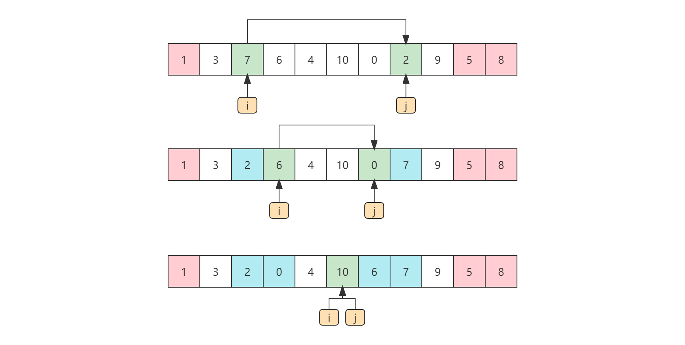

# 快速排序

[TOC]

## 算法简介

快速排序（Quicksort）是对冒泡排序算法的一种改进。快速排序是一种**不稳定**的排序算法，即在排序过程中，相同值的元素的相对位置会发生变化。

## 算法原理

给定一个数组S，在其中任意选取一元素v，将数组中所有大于或等于v的元素放到v的右边，小于或等于v的元素放到v的左边。然后递归的将v左边和右边的子数组仍以此步骤操作，直到不可分割为止。最终就是排好序的数组，而这样的排序方式就是“经典快速排序”。

经典快速排序算法由下列简单的四步组成：

1. 如果S中的元素个数是0或1，则返回。
2. 取S中的任一元素v，称之为**枢纽元**。
3. 将`S - {v}`划分为两个不相交的集合：`S₁ = {x ∈ S - {v} | x ≥ v}`和`S₂ = {x ∈ S - {v} | x ≤ v}`
4. 以`S₁`和`S₂`为源数组，重复2,3步骤，每步返回`quicksort(S₁)`后跟`v`，再跟`quicksort(S₂)`。

### 选取枢纽元

#### 首元素法

所谓首元素法就是将S的第一个元素作为枢纽元。而这是最无知的做法。如果S是随机的，那么这是可以接受的，而如果S是已排序或者反序的，那么这样的枢纽元将产生一个劣质的分割，因为所有的元素不是都被划入S₁，就是被划入S₂。更糟糕的是，这样的情况将发生在所有的递归调用当中，这将导致花费O(n²)的时间，可是实际上，什么事情都没有干。而且，在实践当中，预排序的情况是相当常见的。因此，选取第一个元素作为枢纽元绝对是不可取的。

#### 随机法

所谓随机法就是在S中随机的选取一个元素所谓枢纽元，一般来说这是一种安全的策略，因为随机选取的枢纽元不可能总是产生劣质的分割。但是，另一方面，随机数的生产一般开销很大，不能有效的减少算法其余部分的平均运行时间。

#### 三数中值分割法

三数中值分割法中的三数是指S的左端，右端，中心位置的三个元素，选取这三个元素的中值作为枢纽元。例如，{5，3，7，6，4，1，0，2，9，10，8}，它左边的元素是5，右边的元素是8，中心位置（`⌊(left+right)/2⌋`）的元素是1，于是枢纽元v=5。显然使用三数中值分割法消除了预排序的坏情形，并且实际减少了14%的比较次数。

### 分割策略

网络上大部分所讲解的快速排序所采用的方式都是以首个元素作为枢纽元，先不论选取第一个元素作为枢纽元是否可取，其所采用的分割策略也不是最优的选择。为了更好的理解已被证明能够给出最好结果的分割策略，还是先介绍一下这种非最优分割策略的方式，以做对比。

**非最优分割策略**

设要排序的序列为A[0]~A[N-1]，首选从序列中选取第一个元素A[0]作为枢纽元v。将小于v的元素放到它的左边，大于v的元素放到它的右边。

一趟快速排序算法的流程如下：

1. 定义两个指针`i`和`j`，分别指向`i=0`，`j=N-1`。
2. 以序列的第一个元素作为枢纽元（pivot），`A[i]=pivot`。
3. 首先从`j`开始向前搜索（由后向前，即`j--`），顺序查找到第一个小于`pivot`的元素`A[j]`，将`A[j]`与`A[i]`的值交换，此时枢纽元（`pivot`）等于`A[j]`。
4. 然后从`i`开始向后搜索（由前向后，即`i++`），顺序查找到第一个大于`pivot`的元素`A[i]`，将`A[i]`与`A[j]`的值交换，此时枢纽元（`pivot`）等于`A[i]`。
5. 在然后重复第3、4步，直到`i==j`为止。

不考虑枢纽元的选择，这种分割策略所带来的问题是，在指针`i`和`j`每发现一个比枢纽元大或小的元素时，都需要与枢纽元发生一次交换。

下面将介绍的最优分割策略可以使其交换次数减少一半。

**最优分割策略**

一趟快速排序算法的流程如下：

1. 采用三数中值分割法选取一个枢纽元。
2. 将枢纽元与倒数第二个元素交换使得枢纽元离开要被分割的数据段。指针`i`从第二个元素开始，而指针`j`从倒数第三个元素开始。

3. 将`i`右移，移过那些小于枢纽元的元素，将`j`左移，移过那些大于枢纽元的元素。
4. 当`i`和`j`停止的时，`i`指向一个大于枢纽元而`j`指向一个小于枢纽元的元素，此时如果`i`在`j`的左边，就将`i`和`j`所指向的元素进行交换，其效果是把一个大的元素推向右边，把一个小的元素推向左边。
5. 重复第四步，直到`i≥j`。此时`i`和`j`已经交错，故不再交换。
6. 最后将枢纽元与`i`所指向的元素交换。

> 当最后一步将枢纽元与`i`所指向的元素交换时，我们知道在位置`p<i`的每一个元素都必然是小于枢纽元的元素，这是因为在位置p或者包含一个从它开始移动的小元素，或者位置p上原来的大元素在移动期间被置换。类似的论断可以指出，在位置`p>i`上的都必然是大于枢纽元的元素。因此，最后一步将枢纽元与`i`所指向的元素交换即可满足枢纽元左边的元素都小于它，右边的元素都大于它。

采用这种分割策略，其交换是将左边大于枢纽元和右边小于枢纽元的元素交换，一对大于枢纽元和小于枢纽元的元素只需要交换一次，而在*非最优分割策略*中需要交换两次，针对同一数列S，基本可以减少一半的交换次数。

### 相等元素处理

另外需要考虑的是如何处理哪些等于枢纽元的元素。问题在于当`i`遇到一个等于枢纽元的元素时是否应该停止，以及当`j`遇到一个等于枢纽元的元素时是否应该停止。直观的看，`i`和`j`应该做相同的工作，否则分割将出现偏向一方的倾向。例如`i`停止而`j`不停止，那么所有等于枢纽元的元素都将被分配到`S₂`中。

为了更好的说明，我们考虑数组中所有元素都相等的情况：

如果`i`和`j`停止，那么在相等元素间将会有多次交换，看起来这似乎没有什么意义，但其正面效果则是`i`和`j`将在中间被交换，因此当枢纽元被交换回来时，将建立两个几乎相等的子数组。归并排序的分析告诉我们，此时的运行时间为O(n log(n))。

如果`i`和`j`都不停止，那么`i`或`j`会一直移动到S的右端或左端，这样产生的效果与采用*首元素法*选取枢纽元所导致的问题是一样的，所有的元素不是都被划入`S₁`，就是被划入`S₂`。此时时间复杂度为O(n²)。

如此看来，进行不必要的交换得到两个均衡的子数组比冒险蛮干得到两个不均衡的子数组要好。因此，如果`i`或`j`遇到与枢纽元相等的元素时，那么`i`和`j`就都停止。

### 小数组

对于很小的数组（N≤20），快速排序不如插入排序。因此对于小于的数组，不推荐使用递归的快速排序，而代之以诸如插入排序这样对小数组有效的排序算法。

## 算法示例

数列S：{5，3，7，6，4，1，0，2，9，10，8}

### 非最优分割策略示例

第一趟快速排序的流程如下图所示：


将顺序表的第一个元素5作为枢纽元（pivot）。

1. 首先从指针`j`开始向前查找，第一个小于5的元素是2，将5于2交换。
2. 然后从指针`i`开始向后查找，第一个大于5的元素是7，将5于7交换。
3. 继续从指针`j`开始向前查找，第一个小于5的元素是0，将5于0交换。
4. 继续从直接`i`开始向后查找，第一个大于5的元素是6，将5于6交换。
5. 继续从指针`j`开始向前查找，第一个小于5的元素是1，将5于1交换。
6. 继续从直接`i`开始向后查找，到指针`j`之前，没有大于5的元素了。
7. 此时指针`i`和指针`j`重合，`pivot`左边的元素都小于它，右边的元素都大于它，第一趟快速排序完成。

依次类推，继续将5左边部分序列和右边部分序列以同样的原理分别进行快速排序，如下图所示：


不同分界值的排序结果：

```
5 : [2, 3, 0, 1, 4, 5, 6, 7, 9, 10, 8]
2 : [1, 0, 2, 3, 4, 5, 6, 7, 9, 10, 8]
1 : [0, 1, 2, 3, 4, 5, 6, 7, 9, 10, 8]
3 : [0, 1, 2, 3, 4, 5, 6, 7, 9, 10, 8]
6 : [0, 1, 2, 3, 4, 5, 6, 7, 9, 10, 8]
7 : [0, 1, 2, 3, 4, 5, 6, 7, 9, 10, 8]
9 : [0, 1, 2, 3, 4, 5, 6, 7, 8, 9, 10]
```

### 最优分割策略示例

1. 采用三数中值分割法选取一个枢纽元。并将枢纽元与倒数第二个元素交换使得枢纽元离开要被分割的数据段。指针`i`从第二个元素开始，而指针`j`从倒数第三个元素开始。


2. 将`i`右移，移过那些小于枢纽元的元素，将`j`左移，移过那些大于枢纽元的元素。当`i`和`j`停止的时，将`i`和`j`所指向的元素进行交换。



3. `i`和`j`已经交错，将枢纽元与`i`所指向的元素交换。


## 算法实现

下面以非最优分割策略：选取第一个元素作为枢纽元实现

```java
public void quickSort(int[] arrays) {
    quickSort(arrays, 0, arrays.length - 1);
}

private void quickSort(int[] arrays, int s, int e) {
    int i = s, j = e, pivot = arrays[s];
    while (i < j) {
        while (j > i && arrays[j] >= pivot) j--;
        if (j != i) {
            arrays[i] = arrays[j];
            arrays[j] = pivot;
        }
        while (i < j && arrays[i] <= pivot) i++;
        if (i != j) {
            arrays[j] = arrays[i];
            arrays[i] = pivot;
        }
    }
    if (i > s + 1) quickSort(arrays, s, i - 1);
    if (i < e - 1) quickSort(arrays, i + 1, e);
}
```

下面以最优分割策略：三者取中值作为枢纽元实现

```java
private static final int CUT_OFF = 20;

private void swapReference(int[] a, int i, int j) {
    int tmp = a[i];
    a[i] = a[j];
    a[j] = tmp;
}

private int median3(int[] a, int lo, int hi) {
    int center = (lo + hi) >> 1;
    if (a[center] < a[lo]) swapReference(a, center, lo);
    if (a[hi] < a[lo]) swapReference(a, lo, hi);
    if (a[hi] < a[center]) swapReference(a, center, hi);
    swapReference(a, center, hi - 1);
    return a[hi - 1];
}

private void insertSort(int[] a, int lo, int hi) {
    for (int p = lo + 1; p <= hi; p++) {
        for (int j = p; j > lo && a[j] < a[j - 1]; j--)
            swapReference(a, j - 1, j);
    }
}

private void quickSort(int[] a, int lo, int hi) {
    if (lo + CUT_OFF > hi) {
        insertSort(a, lo, hi);
        return;
    }
    int i = lo + 1, j = hi - 2;
    int pivot = median3(a, lo, hi);
    for (; ; ) {
        while (a[j] > pivot) j--;
        while (a[i] < pivot) i++;
        if (i < j)
            swapReference(a, i++, j--);
        else
            break;
    }
    swapReference(a, i, hi - 1);
    quickSort(a, lo, i - 1);
    quickSort(a, i + 1, hi);
}


public void quickSort(int[] arrays) {
    quickSort(arrays, 0, arrays.length - 1);
}
```

## 算法分析

**时间复杂度**

快速排序跟归并排序一样，也是递归的，因此，它的分析需要求解一个递推公式。和归并排序一样，快速排序的运行时间等于两个递归调用的运行时间加上花费在分割上的线性时间（枢纽元的选取仅花费常数时间:cN）。得到基本的快速排序关系如下：

$$
T(N) = T(i) + T(N-i-1)+cN
$$

> `S₁ = {x ∈ S - {v} | x ≥ v}`和`S₂ = {x ∈ S - {v} | x ≤ v}`，其中`i = |S₁|`是`S₁`中元素的个数。

**最坏情况的分析**

选取的枢纽元始终是最小元素。此时i = 0，忽略无关紧要的T(0) = 1，递推关系如下：

$$
T(N) = T(N-1)+cN \\
T(N-1) = T(N-2)+c(N-1) \\
T(N-2) = T(N-3)+c(N-2) \\
...... \\
T(2) = T(1)+c(2) \\
$$

将所有这些方程相加，得到

$$
T(N) = T(1) + c\sum_{i=2}^N = O(N^2)
$$

**最好情况的分析**

在最好的情况下，每次选取的枢纽元恰好位于正中间。假设两个子数组恰好为各位原数组大小的一半。得到基本的快速排序关系如下：

$$
T(N) = 2T(N/2) + cN
$$

用N除以方程的两边：

$$
\frac{T(N)}{N} = \frac{2T(N/2)}{N} + \frac{N}{N} = \frac{T(N/2)}{N/2} + c
\\
\frac{T(N/2)}{N/2} = \frac{T(N/4)}{N/4} + c
\\
\frac{T(N/4)}{N/4} = \frac{T(N/8)}{N/8} + c
\\
......
\\
\frac{T(2)}{2} = \frac{T(1)}{1} + c
$$

将所有这些方程相加，即将等号左边的所有各项相加并使结果等于右边所有各项的和。等号两边相同的项可以去除，例如`T(N/2)/(N/2)`。而这样的求和过程称为**叠缩求和**。最后结果如下：

$$
\frac{T(N)}{N} = \frac{T(1)}{1} + clog N
$$

最后之所以加logN，是因为等号两边所有相同的项都已经去除了，而c没有被去除，等式从N到1有logN个，即有logN个c。因此最后加c logN。

再将两边同乘以N（去除被除数，得到T(N)的值），最后结果如下：

$$
T(N) = N + cN log N = O(N log N)
$$

> 最好情况下的计算方式跟归并排序完全相同。

**平均情况的分析**

快速排序平均情况下的时间复杂度$O(N log N)$

>由于平均情况的分析相对复杂，所以，这里直接给出结论。感兴趣的可以参考《数据结构与算法分析》一书，快速排序小节。

**空间复杂度**

快速排序只需要一个元素的辅助空间。但是快速排序是一个递归操作，每一次递归都需要申请相应的栈空间。跟时间复杂度一样，最好的情况下，每一趟快排都将序列元素等分，因此所需栈的最大深度为O(log₂⁽ⁿ⁺¹⁾)；而最坏的情况下，栈的最大深度为O(n)。因此，快速排序的空间复杂度为O(log n)。

**稳定性**

快速排序是一种**不稳定**的内部排序算法。
