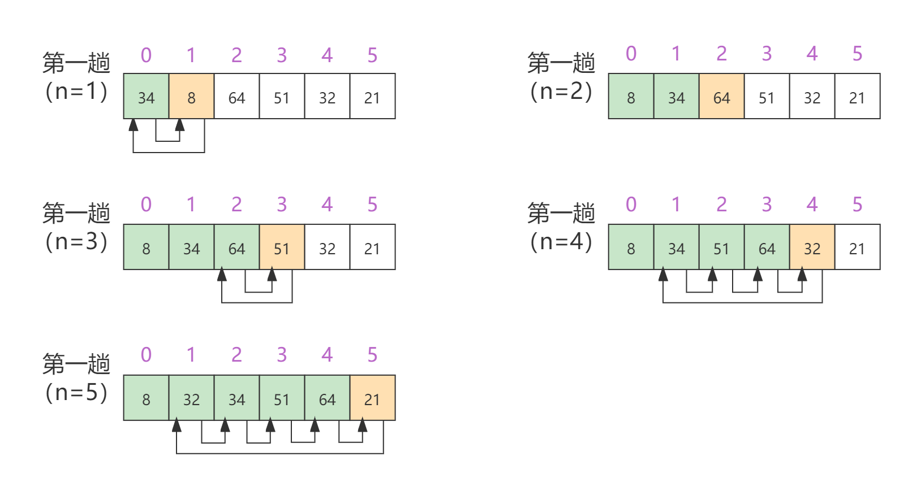

# Insert Sort

[TOC]

## 算法简介

插入排序，一般也被称直接插入排序。它是一个对少量元素进行排序的算法。插入排序是一种最简单的排序方法，它的基本思想是将一个记录插入到已经排好序的有序表中。在其实现过程中使用双层循环，外层循环对除了第一个元素之外的所有元素，内层循环对当前元素前面有序表进行待插入位置的查找，并进行移动。

## 算法原理

保证顺序表中0~n-1的元素都是有序的，将第n个元素插入到0~n-1的合适位置，使得0~n的元素都是有序的。直到顺序中最后一个元素为止。

具体操作：依次从第2个元素开始（认为第一个元素就是有序的），将第n（n>0）个元素插入到前面0~n-1的有序表中正确的位置，直至最后一个元素为止，排序完成。

## 算法示例

顺序表{34,8,64,51,32,21}插入排序流程如下图所示：



第一趟（n=1）：由于8小于34，因此将34后移一位，将8插入到位置0。

第二趟（n=2）：由于64比34大，所以第二趟什么都不做。

第三趟（n=3）：51小于64，因此将51后移一位，将51插入到位置2。

第四趟（n=4）：32小于34，因此将34，51，64都各自后移一位，将32插入到位置1。

第五趟（n=5）：21小于32，因此将32，34，51，64都各自后移一位，将21插入到位置1。

最后，排序完成。

## 算法实现

Java 1

```java
public void insertSort(int[] nums) {
    for (int i = 1; i < nums.length; i++) {
        int temp = nums[i];
        int j;
        for (j = i - 1; j > -1 && temp < nums[j]; j--)
            nums[j + 1] = nums[j];
        nums[j + 1] = temp;
    }
}
```

Java 2

```java
public void insertSort(int[] nums) {
    for (int i = 1; i < nums.length; i++) {
        int temp = nums[i];
        int j = i - 1;
        while (j > -1 && temp < nums[j]) {
            nums[j + 1] = nums[j];
            j--;
        }
        nums[j + 1] = temp;
    }
}
```

C

```c
void insertSort(int nums[], int len) {
    for (int i = 1; i < len; i++) {
        int temp = nums[i];
        int j = i - 1;
        while (j > -1 && temp < nums[j]) {
            nums[j + 1] = nums[j];
            j--;
        }
        nums[j + 1] = temp;
    }
}
```

## 算法优化

**折半插入排序算法**

由于0~n-1的元素都是有序的，那么它自然具有二分性。因此**使用二分查找，可以节省关键字间的比较次数**。但是折半插入排序算法相比较于直接插入排序算法，只是减少了关键字间的比较次数，而记录的移动次数没有进行优化，所以该算法的时间复杂度仍是 `O(n²)`。

算法实现如下（Java）：

```java
public void binaryInsertSort(int[] nums) {
    for (int i = 1; i < nums.length; i++) {
        int low = 0, high = i - 1, mid;
        while (low <= high) {
            mid = (low + high) >> 1;
            if (nums[mid] > nums[i])
                high = mid - 1;
            else
                low = mid + 1;
        }
        int temp = nums[i];
        /* API后移 */
        if (i - low >= 0) System.arraycopy(nums, low, nums, low + 1, i - low);
        /* for循环后移 
        for (int j = i - 1; j >= low; j--)
            nums[j + 1] = nums[j];
        */
        /* while循环后移 
        int j = i - 1;
        while (j >= low) {
            nums[j + 1] = nums[j];
            j--;
        }
        */
        nums[low] = temp;
    }
}
```

## 算法分析

**时间复杂度**

在插入排序中，当待排序数组是有序时，是最优的情况，只需要当前数跟前一个数比较一下就可以了，这时一共需要比较N-1次。时间复杂度为O(n)。

最坏的情况是待排序数组是逆序的，此时需要比较次数最多，总次数记为：1+2+3+...+N-1，所以，插入排序最坏情况下的时间复杂度是O(n²)。

**空间复杂度**

插入排序的空间复杂度为常数阶O(1)。

**算法稳定性**

对于插入排序而言，当顺序表中具有两个或两个以上相同关键字时，排序后这些关键字的相对次序保持不变。即插入排序算法是**稳定**的。

## 应用分析

插入排序适用于已经有部分数据已经排好序，并且排好的部分越大越好。一般在输入规模大于1000的场合下不建议使用插入排序。


