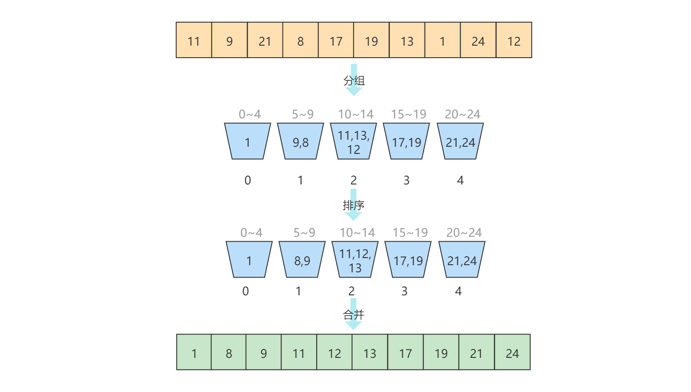

# 桶排序

[TOC]


## 算法简介

桶排序（Bucket sort），又称为箱排序。其是鸽巢排序的一种归纳结果。当要被排序序列内的数值是均匀分布的时候，桶排序可以达到线性时间O(n)。但桶排序并不是比较排序，它不受到比较排序O(n log n)的下限时间复杂度影响。

## 算法原理

原理一：

给定一组数字序列，找到其中最大的元素K，然后定义一个具有K+1长度的数组M（桶）。将序列中的每一个数字元素以其为M下标的方式在数组M对应的索引上+1，最后遍历数组M，即可得到排序后的结果。

原理二：

给定一组序列和M个桶，将序列中的元素尽可能均匀放到M个桶中，然后再分别对每个桶进行排序，最后再将所有桶中的元素合并。

## 算法示例

数字序列{6, 3, 7, 3, 9, 2, 4}，其中最大的元素是9，因此定义10个桶（0~9）。以序列中元素为索引，在对应桶的数加1。如下图所示：


最后遍历桶，输出桶的索引，即得到了有序的结果。

---

原理二：

序列{11, 9, 21, 8, 17, 19, 13, 1, 24, 12}，其中最大的元素是24，计算得到其第一个大于24的指数25，其幂值为5，因此定义5个桶，每个桶分别存放0~4，5~9，10~14，15~19，21-25范围的元素，然后每个桶进行比较排序。如下图所示：



最后遍历桶，即得到了有序的结果。

## 算法实现

原理一：

```java
public void bucketSort(int[] data) {
    if (data.length < 2) return;
    int max = 0, j = 0;
    for (int k : data) if (k > max) max = k;
    int[] bucket = new int[++max];
    for (int datum : data) bucket[datum]++;
    for (int i = 0; i < bucket.length; i++)
        for (int p = 0; p < bucket[i]; p++) data[j++] = i;
}
```

原理二：

桶为`LinkedList`。另外对于每个桶进行排序，为了简单起见，直接使用了`Collections.sort`函数。

```java
public void bucketSort(int[] data) {
    if (data.length < 2) return;
    int max = 0, j = 0, n = 1;
    //找出最大数
    for (int k : data) if (k > max) max = k;
    //计算最近的幂指数 - 作为桶的大小
    while ((1 << n) <= max) n++;
    //构建并初始化桶
    List<Integer>[] buckets = new LinkedList[n];
    for (int i = 0; i < n; i++) buckets[i] = new LinkedList<>();
    //按照一定的规则将元素分配到不同的桶中
    for (int datum : data) buckets[datum / n].add(datum);
    //将桶中的元素回写到原始数组中
    for (List<Integer> bucket : buckets) {
        Collections.sort(bucket);
        for (Integer d : bucket) data[j++] = d;
    }
}
```

> Note：上面实现的算法中，应用了简单的例子。在实际使用中，桶数量的计算，桶用什么数据结构，以及对每个桶用什么比较排序算法进行排序都可能是不同的，需要根据对被排序的数据的情形进行具体分析，选择合适的方式。
>
> 为了使序列中的元素尽可能均匀的分布在不同的桶中，对桶数量的的一种计算方是：首先定义固定大小的桶容量，然后以序列中的最大值减去最小值并除以桶的大小，即可得出桶的数量。

## 算法分析

桶排序可以达到O(n)的线性时间复杂度，看起来很棒，但它并没有看起来那么美好。

就“原理一”而言，其中一个问题是序列的类型只能是整数数字，因为序列中的元素需要作为桶的索引。对于最大的元素K的值而言，也不能过大，例如，如果K等于2000000000（20亿），那么我们绝不可能创建20亿长度的数组，假设数组元素是int型，占4个字节，那么大约需要7,629GB的内存空间，这将直接导致内存溢出。当然，这只是一个极端的例子。不过道理这里这样的。因此，对于被排序的序列，其**元素类型必须是整数数字，并且其数字范围0~K，K不能太大**。

就“原理二”而言，桶的数量不能过大，这也将导致每个桶中需要存储多个元素。而这样不会受到最大元素K的限制。然而却需要对每一桶进行比较排序，最后在进行合并。虽然这种方式看起来它不仅解决了原理一的问题，也应用了分治的思想，因此效率应该很高，但事实却不是如此美好。第一个问题是需要额外的辅助空间，第二个问题是我们并不能事先预知到每一个桶的大小，因此，将存在空间上的浪费，如果桶使用数组，那么将不得不面对扩容的问题。如果使用链表，对链表进行排序操作是一件很麻烦的事情，最后还是需要转换为数组进行排序。最后是每个桶还需要进行比较排序，其时间复杂度最高也只能达到O(n log n)。解决方式是需要在合理的范围尽量增大桶的数量，极限情况下是每一个桶只分配一个元素，这样就避免了桶内比较排序的操作。但桶数量太多的话，又会导致空间浪费严重。这就是一个空间和时间代价权衡的问题了。而一般情况下，我们会牺牲一定的空间来追求时间。

**时间复杂度**

原理一

首先需要遍历整个序列，找到最大元素，需要执行N次。然后再次遍历整个序列，将元素对应索引的位置加1，也需要执行N次。最后遍历所有桶，假设桶有K个，因此需要遍历K次。遍历桶的同时，也需要遍历桶中的元素数量，而这也需要执行N次。因此，最终的执行时间：T(n)=O(N+N+K+N) = O(3N+K) = O(N+K)。

原理二

首先需要遍历整个序列，找到最大元素，需要执行N次。然后构建并初始化桶，假设桶有K个，因此需要遍历K次。再然后按照一定的规则将元素分配到不同的桶中，需要执行N次。最后遍历所有桶合并元素，需要K+N次。另外还需要对每个桶进行比较排序，而比较排序的下限是O(n log n)，K个桶，需要K * O(n log n)次。最好的情况下，每个桶只有一个元素，此时O(n log n)不存在。因此，最终的执行时间：T(n)=O(N+K+N+K+N) = O(3N+2K) = O(N+K)。

**空间复杂度**

很显然，桶排序的空间复杂度为 O(N)。

**稳定性**

桶排序是一种稳定的排序算法。

## 算法应用

**案例一：如何根据年龄给100万用户排序？**

分析：对100万数据排序，如果使用比较排序，即使最快，其平均比较次数也需要O(100W*log100W)≈600W。根据对其数据的特性分析可以发现，其年龄的范围是有限的。

方法：我们假设年龄范围在1~120岁之间，创建120个桶，遍历这100万用户的年龄数据，根据年龄的大小将其放到对应的桶中，然后依次遍历这120个桶中的元素。这样就得到了按照年龄排序的100万用户数据。

**案例二：一年的全国高考考试人数为500万，分数使用标准分，最低100，最高900，没有小数，要求对这500万考生分数进行排序。**

其原理跟*案例一*是一样的。根据对数据的分析，创建800（900-100）个桶，将每个考生的分数放到f(score)=score-100的桶中，最后依次遍历这800个桶中的元素。这样就得到了按照分数排序的500万考生的分数数据。