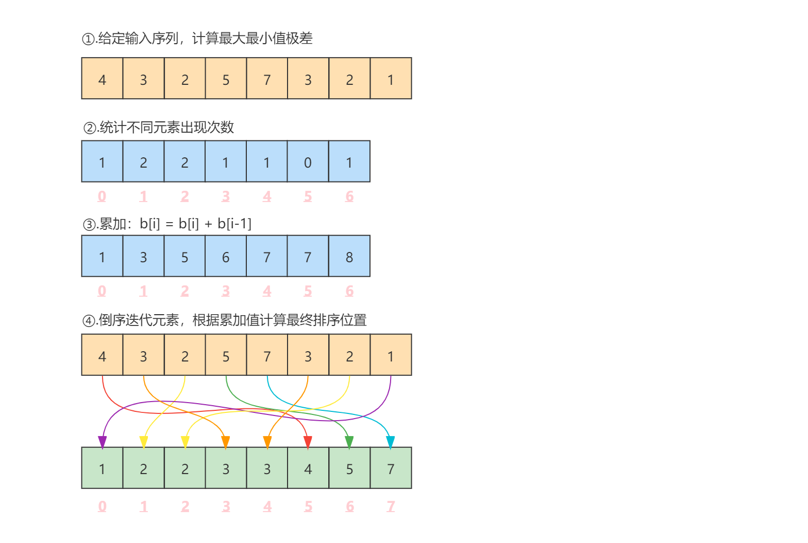

# 计数排序
[TOC]
## 算法简介

计数排序是一个基于非比较的排序算法，该算法于1954年由Harold H. Seward提出。它的优势在于对一定范围内的整数排序时，它的复杂度为O(n+k)（其中k是整数的范围），其快于任何比较排序算法。而这是基于牺牲空间换取时间的做法，当O(k)>O(n log(n))的时候其效率反而不如基于比较的排序（基于比较的排序其时间复杂度在理论上的下限是O(n log(n))，如归并排序，堆排序等。）。

## 算法原理

计数排序的原理是计算出对于给定输入序列中的每一个元素其最终排序后的位置。具体的做法就是首先给定一个桶，在桶中统计出给定输入序列中不同元素出现的次数，然后再将桶中元素出现次数的数据依次累加（b[i] = b[i] + b[i-1]），累加后的数值即对应索引的元素在最终排序后的位置。而这个累加的过程即为计数。

## 算法示例

给定输入序列：{4, 3, 2, 5, 7, 3, 2, 1}

计数排序流程如下：



- ①、获取到最大值7和最小值1，其极差为6。

- ②、统计给定输入序列中不同元素出现的次数。由于极差为6，因此定义的桶长度为7。

  元素值对应桶的索引，需要注意的是，对应索引的时候需要元素值减去最小值才是真正桶的索引（这是一个优化策略）。

- ③、累加计算，计算后的不同元素最终排序后的位置。

- ④、倒序迭代元素，根据累加值计算最终排序位置。

  例如，首先迭代的第一个元素是1，减去最小值1，为0，对应桶索引为0的元素为1，即代表元素1排最终排序后的第一位，因此将元素1输出到输出数组中，由于数组索引从0开始，因此将桶中元素1减1得0，即将元素1输出到输出数组索引0的位置。

  以此类推：

  元素:1 → 桶元素:bucket[1 - 1] = 1 → 输出数组索引:1 - 1 = 0 → out[0] = 1，桶元素减1: bucket[0] = 0；

  元素:2 → 桶元素:bucket[2 - 1] = 3 → 输出数组索引:3 - 1 = 2 → out[2] = 2，桶元素减1: bucket[1] = 2；

  元素:3 → 桶元素:bucket[3 - 1] = 5 → 输出数组索引:5 - 1 = 4 → out[4] = 3，桶元素减1: bucket[2] = 4；

  元素:7 → 桶元素:bucket[7 - 1] = 8 → 输出数组索引:8 - 1 = 7 → out[7] = 7，桶元素减1: bucket[6] = 7；

  元素:5 → 桶元素:bucket[5 - 1] = 7 → 输出数组索引:7 - 1 = 6 → out[6] = 5，桶元素减1: bucket[4] = 6；

  元素:2 → 桶元素:bucket[2 - 1] = 2 → 输出数组索引:2 - 1 = 1 → out[1] = 2，桶元素减1: bucket[1] = 1；

  元素:3 → 桶元素:bucket[3 - 1] = 4 → 输出数组索引:4 - 1 = 3 → out[3] = 3，桶元素减1: bucket[2] = 3；

  元素:4 → 桶元素:bucket[4 - 1] = 6 → 输出数组索引:6 - 1 = 5 → out[5] = 4，桶元素减1: bucket[3] = 5；

  **倒序迭代元素的目的为保证排序的稳定性。**

## 算法实现

```java
private int[] findMaxAndMin(int[] a) {
    int[] v = new int[]{a[0], a[0]};
    for (int e : a) {
        v[0] = Math.min(e, v[0]);
        v[1] = Math.max(e, v[1]);
    }
    return v;
}

public void countSort(int[] a) {
    //查找数组中的最大值和最小值
    int[] maxAndMin = findMaxAndMin(a);
    int min = maxAndMin[0];
    int max = maxAndMin[1];
    //以最大值和最小值的极差作为桶大小(一个小的优化点，可以减少桶的大小)
    int[] bucket = new int[max - min + 1];
    //统计各元素出现次数，并记录到桶上
    for (int e : a)
        bucket[e - min]++;
    //计算各元素应该出现的位置
    for (int i = 1; i < bucket.length; i++)
        bucket[i] = bucket[i] + bucket[i - 1];
    //定以输出容器
    int[] out = new int[a.length];
    /* 根据已计算好的个元素位置输出元素到out中（注意，输出之后桶中对应元素数量减1）。
     * 另外，为了保证稳定性，需要倒序输出。 */
    for (int i = a.length - 1; i > -1; i--)
        out[--bucket[a[i] - min]] = a[i];
    System.arraycopy(out, 0, a, 0, a.length);
}
```

## 算法分析

**时间复杂度**

由于计数排序不是基于比较的排序算法，因此其就突破了O(n log(n))的时间下限。

根据算法实现分析，其时间主要消耗在以下几部分：

1. 查找数组中的最大值和最小值，需要迭代完整个数组，因此需要时间O(n)。
2. 统计各元素出现次数，并记录到桶上，需要时间O(n)。
3. 累加元素出现次数，而这个计算的次数是根据桶的大小来决定的。将桶的大小定义为k，因此需要时间O(k)。
4. 最后输出元素到out中，也需要时间O(n)。

因此，计数排序的时间复杂度为O(3n+k) = O(n+k)。

**空间复杂度**

整个计数排序过程中需要两个额外的辅助空间，一个是桶，另一个是输出数组out，因此其空间复杂度也为O(n+k)。

**稳定性**

计数排序的稳定性由最后输出元素到out中时是顺序还是倒序决定，如果是顺序，则是不稳定的，如果是倒序，则是稳定的。

**应用**

由于计数排序是根据数组的索引来计算的，因此它只能针对可以将元素转为数值的数据。另外桶排序和基数排序一样，由于桶空间的限制，对于极差太大的数据也不太适用。