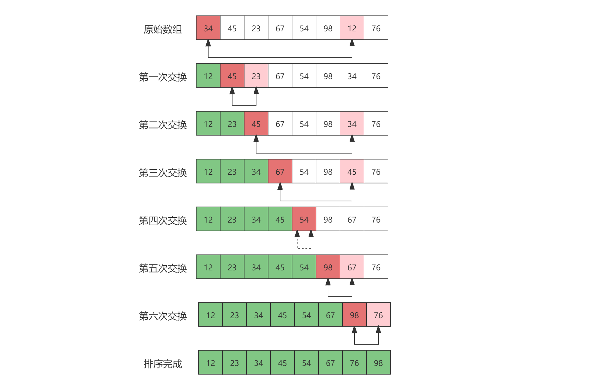

# 选择排序

[TOC]

## 算法简介

选择排序（Selection sort）是一种简单直观的排序算法。它的工作原理是：第一次从待排序的数据元素中选出最小（或最大）的一个元素，存放在序列的起始位置，然后再从剩余未排序的元素中找到最小（大）的元素，然后将其放到已排序序列的末尾。以此类推，直到全部待排序的数据元素的个数只剩一个为止。

## 算法原理

首先在未排序的序列中找到最小（大）元素，将其与序列第一个元素进行交换（或者说将这个最小（大）元素存放到序列的首位）。然后，再从剩余未排序元素中继续寻找最小（大）元素，将其与已排序序列的下一个元素进行交换。以此类推，直到只剩一个元素为止（剩下的这一个元素必然是最大（小）的）。

## 算法示例

eg. 基于一维数组元素选最大值/最小值。

R[0~n-1]升序排列方法：

- (0). R[0~n-1]选出最小值元素和R[0]交换
- (1). R[1~n-1]选出最小值元素和R[1]交换
- ......
- (i). R[i~n-1]选出最小值元素和R[i]交换
- ......
- (n-2). R[n-2~n-1]选出最小值元素和R[n-2]交换




## 算法实现

非递归实现

```java
/**
 * 时间复杂度O(n²)
 * 空间复杂度O(1)
 * 不稳定
 */
public void selectSort(int[] arrays) {
    for (int i = 0; i < arrays.length - 1; i++) {
        int p = i;
        for (int j = i; j < arrays.length; j++) 
            if (arrays[j] < arrays[p]) p = j;
        if (p != i) {
            int temp = arrays[p];
            arrays[p] = arrays[i];
            arrays[i] = temp;
        }
    }
}
```

递归实现

```java
public void selectSort(int[] arrays) {
    selectSort(arrays, 0);
}

private void selectSort(int[] arrays, int i) {
    if (i > arrays.length - 1) return;
    int p = i;
    for (int j = i; j < arrays.length; j++)
        if (arrays[j] < arrays[p]) p = j;
    if (p != i) {
        int temp = arrays[p];
        arrays[p] = arrays[i];
        arrays[i] = temp;
    }
    selectSort(arrays, ++i);
}
```

## 算法分析

**时间复杂度**

选择排序的交换操作介于0至(n-1)次之间；比较操作固定为n(n-1)/2；赋值操作介于0至3(n-1)次之间。

- 选择排序的比较次数与序列的初始状态无关，因此总的比较次数：

  N = (n-1)+(n-2)+...+(n-n+1)+1 = n*(n-1)/2

  因此其比较的时间复杂度为O(n²)。

- 选择排序的交换次数，在最好的情况下，序列已经有序，交换0次；最坏的情况下逆序，交换n-1次。因此，其交换时间复杂度为O(n)。

- 相比较冒泡排序而言，交换次数比冒泡排序少多了。由于交换所需CPU时间比比较所需的CPU时间多，n值较小时，选择排序比冒泡排序快。

**空间复杂度**

一般情况下，选择排序是采用就地排序法，因此其空间复杂度是O(1)。

当然，也可以在实现的时候，新建一个序列用于存放已经排好序的元素，此时，空间复杂度为O(n)。

**稳定性**

选择排序是给每个位置选择当前元素最小的，比如给第一个位置选择最小的，在剩余元素里面给第二个元素选择第二小的，依次类推，直到第n-1个元素，第n个元素不用选择了，因为只剩下它一个最大的元素了。那么，在一趟选择，如果一个元素比当前元素小，而该小的元素又出现在一个和当前元素相等的元素后面，那么交换后稳定性就被破坏了。举个例子，序列5 8 5 2 9，我们知道第一遍选择第1个元素5会和2交换，那么原序列中两个5的相对前后顺序就被破坏了，所以选择排序是一个**不稳定**的排序算法。