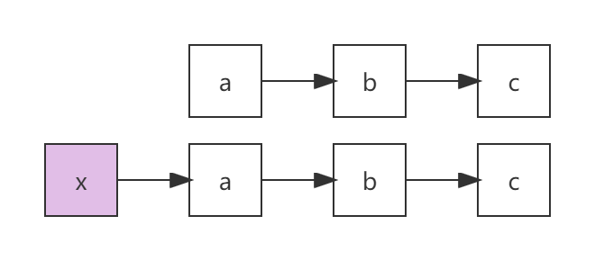

# 链表-哨兵节点

哨兵节点，就是一个附加在原链表最前面用来简化边界条件的附加节点，它的值域不存储任何值，只是为了方便操作而引入。

例如链表a→b→c，附加哨兵节点之后为x→a→b→c，如下图所示：



**为什么需要哨兵节点？**

目的：简化边界条件，方便操作。

例如要删除单向链表的某一个节点，常见的操作是找到被删除节点的前一个节点（`pre`）。通过如下操作来进行删除：

```java
pre.next = pre.next.next;
```

若被删除的节点为链表的头节点，那么就无法通过如上操作进行删除。因为此时链表头节点的前一个节点为nil（空），如果使用`pre.next`就会出错。而如果设置了哨兵节点，那么此时`pre`就是哨兵节点。那么对于链表中的任何一个节点，要被删除，都可以通过`pre.next = pre.next.next`进行操作。而这就是哨兵节点的作用。

