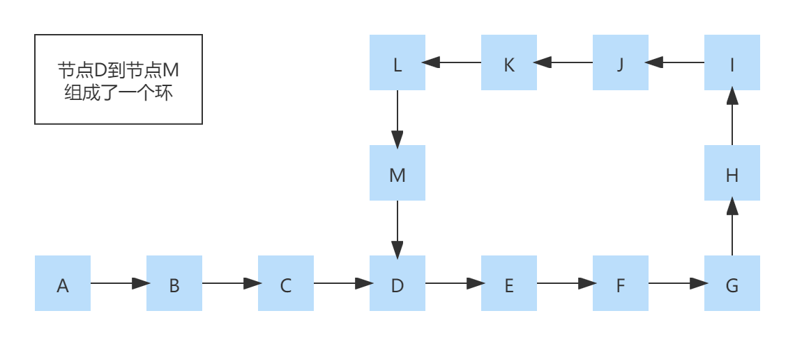

# 链表中的环检测

[TOC]

## 简介

链表中有环的定义是**链表的尾节点指向了链表的某个中间节点**。

如下图所示：



## 需求

检测给定的链表是否存在环。

## 方案

```java
@Getter
@Setter
public static class Node<E> {

    private E element;
    private Node<E> next;
    private boolean tag;

    public Node(E element) {
        this.element = element;
    }

    public Node(E element, Node<E> next) {
        this.element = element;
        this.next = next;
    }
}
```

### 快慢指针

思路

设定两个快慢指针，都从链表的头部开始移动。慢指针每移动一步，则快指针移动两步，如果链表中存在环的话，那么它们必然会在某个节点相遇，否则，快指针将先遇到NULL。

代码

```java
public static <E> boolean hasRing(Node<E> node) {
    Node<E> fast = node, slow = node;
    while (fast != null) {
        slow = slow.next;
        fast = fast.next == null ? null : fast.next.next;
        if (fast == slow) return true;
    }
    return false;
}
```

分析

假设链表中存在环的长度为n，快指针和慢指针都从环的起始节点开始，那么经过n/2次移动，快指针将会回到起始节点，而慢指针此时则只移动到了环的中间节点，然后再次经过n/2次移动，慢指针也回到了起始节点，快指针也再次回到起始节点，此时慢指针与快指针重合，说明链表中存在环。而这总共经过了n次移动。因此其时间复杂度O(n)。

优化

上述代码的实现是慢指针每走一步，则快指针走两步。在实践过程当中，如果链表中的节点较多的话，则可以增加快指针的移动步数，以减少移动的次数。当然，其时间复杂度在去掉低阶，系数，常量之后也是O(n)。而O(n)也是最坏情况下的时间复杂度。最好的情况下，快指针每次移动的步数刚好等于环的长度，因此，只需要移动一次，快慢指针就重合了，其时间复杂度O(1)。

### 节点路径计算

思路

给定两个指针p和q，p总是向前走，并统计p走过的步数。而q在p每走一步时都需要从头开始走，一直走到p为止，并统计q走过的步数。如果p走过的步数与q走过的步数相等，则说明链表存在环。如果p走到链表的末尾（NULL），则说明链表不存在环。

实现

```java
public static <E> boolean hasRing(Node<E> node) {
    int count1 = 0;
    Node<E> p = node;
    while (p != null) {
        int count2 = 0;
        Node<E> q = node;
        while (p != q) {
            q = q.next;
            count2++;
        }
        if (count1 != count2) return true;
        p = p.next;
        count1++;
    }
    return false;
}
```

分析

假设链表首尾相连，长度为n，那么指针p需要走n步才会再次到回起始节点，而指针q则需要走1+2+3+...+(n-1)+n步。因此时间复杂度为O(n+n/2+0.5) = O(n+n/2+0.5) = O(n)。

> 1+2+3+...+(n-1)+n = (n+1)/2 = n/2+0.5

### 标记法

思路

遍历整个链表，遍历过的节点标记为Done。如果当前正在遍历的节点为Done，则说明存在环，反之，则不存在。

实现

```java
public static <E> boolean hasRing(Node<E> node) {
    while (node != null) {
        if (node.tag) return true;
        node.tag = true;
        node = node.next;
    }
    return false;
}
```

分析

很明显，它的时间复杂度O(n)。

### 哈希表法

思路

给定一个哈希表，然后遍历整个链表，遍历过的节点添加到哈希表中。如果当前正在遍历的节点在哈希表中存在，则说明存在环，反之，则不存在。

实现

```java
public static <E> boolean hasRing(Node<E> node) {
    Set<Node<E>> set = new HashSet<>();
    while (node != null) {
        if (!set.add(node)) return true;
        node = node.next;
    }
    return false;
}
```

分析

很明显，它的时间复杂度O(n)。不过它需要一个额外的哈希表辅助，其空间复杂度O(n)。

## 总结

| 方案         | 最坏时间复杂度 | 最好时间复杂度 | 空间复杂度 |
| ------------ | -------------- | -------------- | ---------- |
| 快慢指针     | O(n)           | O(1)           | O(1)       |
| 节点路径计算 | O(n+n/2+0.5)   | O(n+n/2+0.5)   | O(1)       |
| 标记法       | O(n)           | O(n)           | O(1)       |
| 哈希表法     | O(n)           | O(n)           | O(n)       |

很明显，我们应该选择*快慢指针*方案。