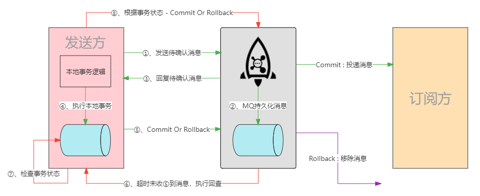

# RocketMQ事务消息

[TOC]

## 简介

从4.3.0版本开始，RocketMQ提供了分布式事务的事务消息操作，可以被认为是一个2PC的分布式事务实现，用以确保消息的最终一致性。其采用的思想与"独立消息服务"完全一致，不同之处在于，独立消息服务模式需要我们自己实现消息的管理（消息发送，消息回查），而RocketMQ做为一个第三方消息中间件为开发者提供了独立消息服务功能的实现。

## 原理

RocketMQ分布式事务消息原理如下图所示：



流程如下：

1. 事务发送方向RocketMQ发送"待确认"（half）消息。
2. RocketMQ将收到的"待确认"消息持久化。
3. RocketMQ向事务发送方回复"待确认"消息已发送成功。
4. 事务发送方开始执行本地事务。
5. 事务发送方根据本地事务的执行结果向RocketMQ发送Commit或Rollback消息。如果RocketMQ收到Commit消息，则将之前的"待确认"消息标记为可投递，订阅方将能够收到该消息。如果RocketMQ收到Rollback消息，则删除之前的"待确认"消息，订阅方接受不到该消息。
6. 若RocketMQ超时未收到事务发送方的Commit或Rollback消息，则回调事务发送方，发起回查请求，以确认当前事务消息是否投递。
7. 事务发送方查询事务状态。
8. 事务发送方根据查询到的事务状态向RocketMQ返回Commit或Rollback消息。
9. RocketMQ接收到回查请求的响应后，按照步骤5执行。

> 事务发送方能否执行成功由本地事务保证。
>
> 事务订阅方能够消费成功由MQ保证。

### 使用限制

1. 事务消息没有调度和批处理支持。
2. 为了避免单条消息的回查次数过多，导致half队列消息积压，RocketMQ默认将单条消息的回查次数限制为15次。用户可以在broker的配置中通过修改`transactionCheckMax`参数来更改此限制。如果一条消息的回查次数超过`transactionCheckMax`，broker默认将会丢弃这条消息，同时打印错误日志。用户可以通过重写`AbstractTransactionCheckListener`类来改变这种行为。
3. 事务消息将在一定时间后回查，该时间可以通过在broker配置里的`transactionTimeout`参数确定。用户还可以通过在发送事务消息时设置用户属性`CHECK_IMMUNITY_TIME_IN_SECONDS`来改变这个限制。该属性的优先级比`transactionTimeout`参数高。
4. 一个事务消息可能会被回查或消费不止一次。
5. 将已提交的消息重新提交到用户的目标topic可能失败。当前，它依赖于日志记录。高可用性由RocketMQ自身的高可用性机制来保证。如果希望确保事务消息不会丢失，并保证事务完整性，建议使用同步双写机制。
6. 事务消息的生产者ID不能与其他消息类型的生产者ID共享。与其他类型的消息不同，事务消息允许向后查询。MQ服务器通过它们的生产者ID查询客户端。

## 事务状态

事务消息有三种状态

- `LocalTransactionState.COMMIT_MESSAGE`：提交事务，表示允许消费者消费该消息。
- `LocalTransactionState.ROLLBACK_MESSAGE`：回滚事务，表示该消息将被删除，不允许消费。
- `LocalTransactionState.UNKNOW`：中间状态，表示需要MQ回查才能确定状态。

`LocalTransactionState`枚举源码：

```java
public enum LocalTransactionState {
    COMMIT_MESSAGE,
    ROLLBACK_MESSAGE,
    UNKNOW;
}
```

## 实现

### API

创建事务生产者

使用`TransactionMQProducer`创建事务生产者客户端，并需要设置线程池和事务监听器，然后启动生产者客户端。注意，使用`TransactionMQProducer#sendMessageInTransaction`方法发送事务消息时需要指定两个参数，分别是事务消息（`Message`）和本地事务执行参数（`arg`）。

```java
import org.apache.rocketmq.client.consumer.DefaultMQPushConsumer;
import org.apache.rocketmq.client.consumer.listener.ConsumeConcurrentlyContext;
import org.apache.rocketmq.client.consumer.listener.ConsumeConcurrentlyStatus;
import org.apache.rocketmq.client.consumer.listener.MessageListenerConcurrently;
import org.apache.rocketmq.common.message.MessageExt;

public class TransactionProducer {
    public static final ExecutorService executorService = new ThreadPoolExecutor(2, 5, 100, TimeUnit.SECONDS, new ArrayBlockingQueue<>(2000), r -> {
        Thread thread = new Thread(r);
        thread.setName("client-transaction-msg-check-thread");
        return thread;
    });

    public static void main(String[] args) throws MQClientException {
        // 创建事务监听器
        TransactionListener transactionListener = new TransactionListenerImpl();
        // 创建事务生产者
        TransactionMQProducer producer = new TransactionMQProducer("please_rename_unique_group_name");
        // 设置MQ地址
        producer.setNamesrvAddr("localhost:9876");
        // 设置线程池
        producer.setExecutorService(executorService);
        // 设置事务监听器
        producer.setTransactionListener(transactionListener);
        // 启动事务生产者
        producer.start();
        // 构建事务消息
        byte[] body = "Hello transaction message".getBytes(StandardCharsets.UTF_8);
        Message message = new Message("{topic}", "{tags}", "{kes}", body);
        // 发送事务消息
        TransactionSendResult sendResult = producer.sendMessageInTransaction(message, null);
        System.out.println(sendResult);
    }
}
```

**实现TransactionListener接口**

TransactionListener接口包含两个函数：

- `executeLocalTransaction`：用于在发送half消息成功时执行本地事务，然后返回事务状态。
- `checkLocalTransaction`：用于检查本地事务状态并响应MQ的检查请求，然后返回事务状态。

```java
import org.apache.rocketmq.client.producer.LocalTransactionState;
import org.apache.rocketmq.client.producer.TransactionListener;
import org.apache.rocketmq.common.message.Message;
import org.apache.rocketmq.common.message.MessageExt;

public class TransactionListenerImpl implements TransactionListener {

    @Override
    public LocalTransactionState executeLocalTransaction(Message msg, Object arg) {
        try {
            // 执行本地事务
        } catch (Exception e) {
            // 异常处理
        }
        return LocalTransactionState.UNKNOW;
    }

    @Override
    public LocalTransactionState checkLocalTransaction(MessageExt msg) {
        try {
            // 执行回查请求
        } catch (Exception e) {
            // 异常处理
        }
        return LocalTransactionState.COMMIT_MESSAGE;
    }
}
```

> **本地事务**
>
> `TransactionListener#executeLocalTransaction`方法执行时并不会自动开启本地事务，需要额外的操作，通过`PlatformTransactionManager`或者添加`@Transactional`注解。
>
> **本地事务执行参数**
>
> 本地事务执行参数是`TransactionListener#executeLocalTransaction`方法的第二个参数`arg`，它通过在发送事务消息时`TransactionMQProducer#sendMessageInTransaction`方法传递。本地事务执行参数的作用是本地事务执行时所需。例如在执行本地事务时，需要一些参数，而这些参数可能并不包含在事务消息中，因此，就需要通过`arg`参数传递。
>
> **异常处理**
>
> `TransactionListener`的`executeLocalTransaction`和`checkLocalTransaction`会吃掉所有异常，简而言之，就是这两个方法中抛出的任何异常都不会有任何反应，就像什么也没有发生一样。因此，我们需要捕获并处理异常，无论是运行时还是非运行时异常。

### Spring

Spring为操作RocketMQ消息提供了模板工具类`RocketMQTemplate`，通过`RocketMQTemplate`的`sendMessageInTransaction`方法可以发送事务消息。跟RocketMQ的原生API一样，也需要创建事务生产者以及为其设置线程池和事务监听器。不同的是，Spring提供了自定义的事务监听器接口`RocketMQLocalTransactionListener`，在向事务生产者注册监听器时，源码实现是通过`RocketMQUtil`工具类将`RocketMQLocalTransactionListener`包装为`TransactionListener`。

**创建事务生产者**

事务生产者的创建有两种方式，一种是通过API的方式，另外一个种是通过Spring框架自动创建。

**API创建事务生产者**

`RocketMQTemplate`的`createAndStartTransactionMQProducer`方法用于创建事务生产者，需要指定四个参数：

- `String txProducerGroup`：生产组名称（唯一）。
- `RocketMQLocalTransactionListener transactionListener`：事务监听器。
- `ExecutorService executorService`：线程池。
- `RPCHook rpcHook`：RPC钩子。

事务生产者一旦创建完毕，就会将其注册到本地缓存中。下次需要时直接从缓存中获取。

源码如下所示：

```java
public boolean createAndStartTransactionMQProducer(
                                String txProducerGroup,
                                RocketMQLocalTransactionListener transactionListener,
                                ExecutorService executorService, 
                                RPCHook rpcHook) throws MessagingException {
    txProducerGroup = getTxProducerGroupName(txProducerGroup);
    if (cache.containsKey(txProducerGroup)) {
        log.info(String.format("get TransactionMQProducer '%s' from cache", txProducerGroup));
        return false;
    }

    TransactionMQProducer txProducer = createTransactionMQProducer(txProducerGroup, transactionListener, executorService, rpcHook);
    try {
        txProducer.start();
        cache.put(txProducerGroup, txProducer);
    } catch (MQClientException e) {
        throw RocketMQUtil.convert(e);
    }
    return true;
}
```

**自动创建事务生产者**

所谓自动创建事务生产者是指我们只需要指定相应的事务监听器，框架会检测到该监听器的存在，并创建一个对应的事务生产者。操作方式是通过如下注解：

```java
@RocketMQTransactionListener(txProducerGroup = "{txProducerGroup}")
```

将该注册标注在事务监听器类上，Spring会将其注册为Bean。

`@RocketMQTransactionListener`注解的源码如下所示：

```java
@Target({ElementType.TYPE, ElementType.ANNOTATION_TYPE})
@Retention(RetentionPolicy.RUNTIME)
@Documented
@Component
public @interface RocketMQTransactionListener {

    String txProducerGroup() default RocketMQConfigUtils.ROCKETMQ_TRANSACTION_DEFAULT_GLOBAL_NAME;

    int corePoolSize() default 1;
    int maximumPoolSize() default 1;
    long keepAliveTime() default 1000 * 60; //60ms
    int blockingQueueSize() default 2000;

    String accessKey() default "${rocketmq.producer.access-key}";
    String secretKey() default "${rocketmq.producer.secret-key}";
}
```

注解上标注了`@Component`注解，这就是是事务监听器会被注册为Bean的原因。另外除了主要的`txProducerGroup`属性之外，还声明了线程池所需要的参数，并提供了默认值。最后是访问RocketMQ的秘钥。

> 注意，通过`RocketMQLocalTransactionListener`实现的事务监听器也需要保证"本地事务"和"异常处理"。

**API注册事务生成者**

```java
@Component
public class TransactionProducer implements BeanFactoryAware {

    @Autowired
    private RocketMQTemplate rocketMQTemplate;

    /* 线程池 */
    public static final ExecutorService executorService = new ThreadPoolExecutor(2, 5, 100, TimeUnit.SECONDS, new ArrayBlockingQueue<>(2000));

    @Override
    public void setBeanFactory(@NonNull BeanFactory beanFactory) throws BeansException {
        RocketMQLocalTransactionListenerImpl listener = beanFactory.getBean(RocketMQLocalTransactionListenerImpl.class);
        rocketMQTemplate.createAndStartTransactionMQProducer("{txProducerGroup}", listener, executorService, null);
    }

    public void sendTransactionMessage() {
        Message<String> message = new GenericMessage<>("Hello transaction message");
        rocketMQTemplate.sendMessageInTransaction("{txProducerGroup}", "{destination}", message, null);
    }
}
```

创建事务监听器

```java
@Component
public class TransactionListenerImpl implements RocketMQLocalTransactionListener {

    @Override
    @Transactional
    public RocketMQLocalTransactionState executeLocalTransaction(Message msg, Object arg) {
        try {
            // 执行本地事务
        } catch (Exception e) {
            // 异常处理
        }
        return RocketMQLocalTransactionState.UNKNOWN;
    }

    @Override
    public RocketMQLocalTransactionState checkLocalTransaction(Message msg) {
        try {
            // 执行回查请求
        } catch (Exception e) {
            // 异常处理
        }
        return RocketMQLocalTransactionState.COMMIT;
    }
}
```

**自动注册事务生产者**

```JAVA
@Component
public class TransactionProducer {
    
    @Autowired
    private RocketMQTemplate rocketMQTemplate;

    public void sendTransactionMessage() {
        Message<String> message = new GenericMessage<>("{body}");
        rocketMQTemplate.sendMessageInTransaction("{txProducerGroup}", "{destination}", message, null);
    }
}
```

创建事务监听器

```java
@RocketMQTransactionListener(txProducerGroup = "{txProducerGroup}")
public class TransactionListenerImpl implements RocketMQLocalTransactionListener {
	......
}
```

## 参考资料

https://rocketmq.apache.org/docs/transaction-example/

https://github.com/apache/rocketmq-spring/wiki/事务消息