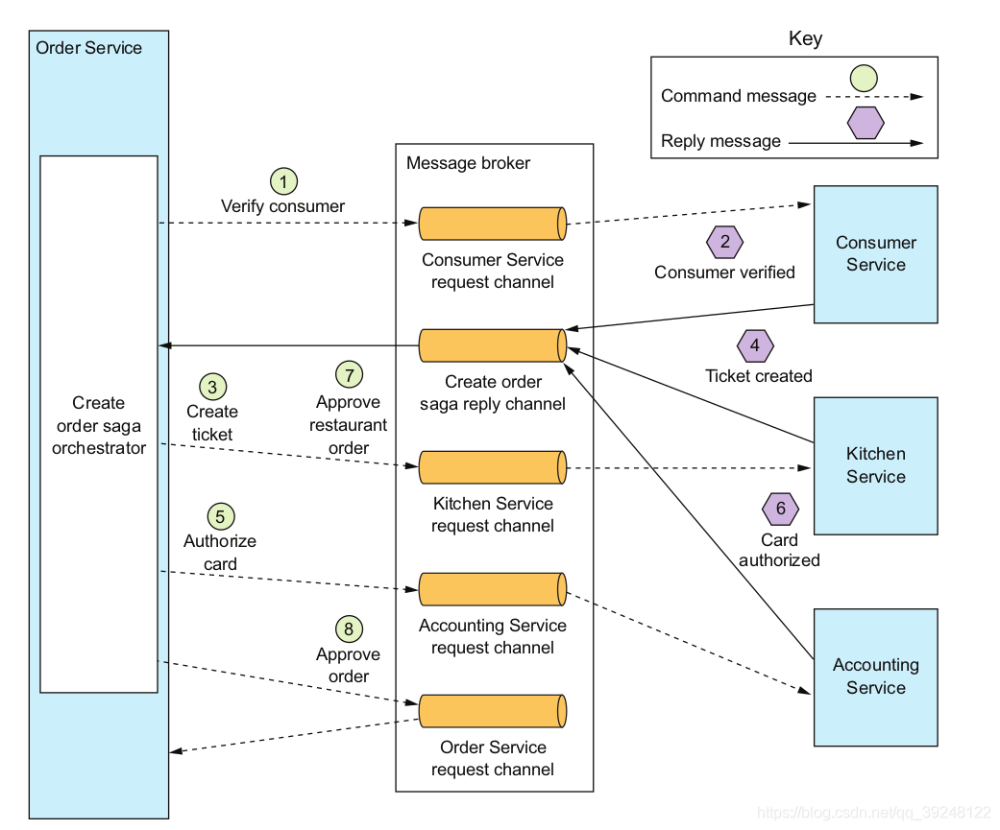
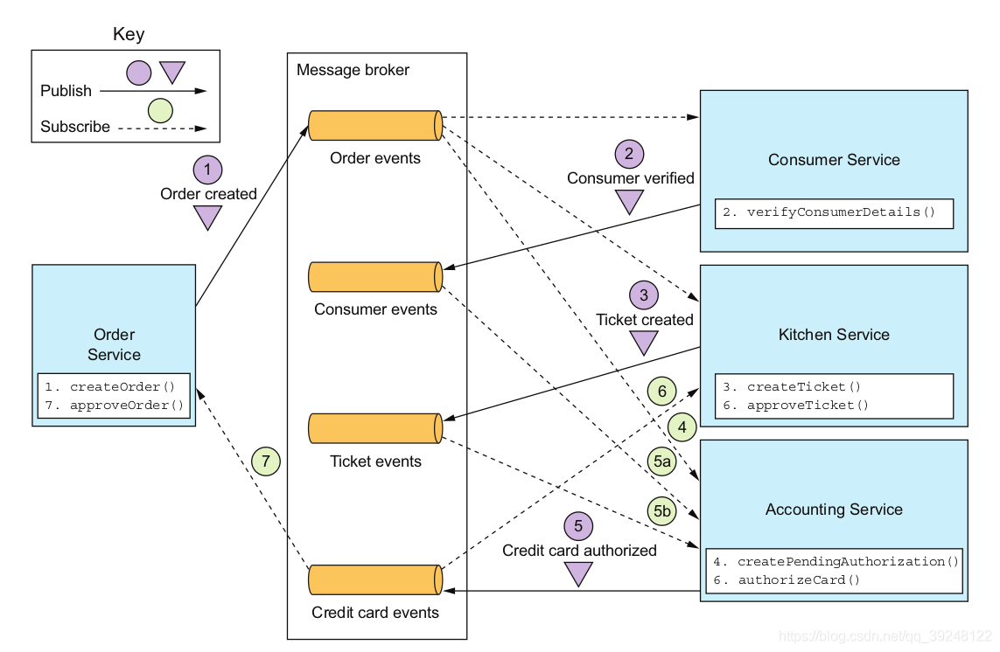

# Saga

[TOC]

## 简介

Saga起源于1987年普林斯顿大学的Garcia-Molina, Hector / Salem, Kenneth发表的论文《[Sagas](https://www.cs.princeton.edu/research/techreps/TR-070-87)》。Saga是分布式事务相关概念的最早出现。Saga是一种长生命周期事务（Long Lived Transaction, LLT）模型，Saga将一个LLT事务分解为多个子事务的集合，这些子事务可以和其他子事务交织在一起。每一个子事务都是一个独立的原子事务，一旦有某个子事务执行失败，就将为前面所有已经执行成功的子事务执行相应的补偿操作。

## 逆序恢复

每一个子事务Ti都要有相应的补偿事务Ci，当一个子事务失败时，则就要执行相应的补偿操作。假设一个Saga事务中包含n个子事务，分别为T1、T2、T3、......、Tn，那么其相应的补偿事务为C1、C2、C3、......、Cn。在这里，我们假定所有的补偿事务Ci都不会执行失败。

系统将保证以下两种执行序列: 

- 正常序列：T1 → T2 → T3 → ...... → Tn
- 补偿序列：T1 → T2 → T3 → ...... → Ti → Ci → C3 → C2 → C1（1 ≤ i < n）

## 正向恢复

另一种恢复方式是正向恢复，即假设在Saga中，当任何一个子事务失败时，只要重试足够的次数，最终将会成功。它只有一种序列，即T1 → T2 → T3 → ...... → Tn。在该方式下，不需要提供补偿操作。如果应用程序宕机或崩溃，在重启或恢复时，它将恢复停止事务的执行。

## 异常

无论是逆向恢复还是正向恢复，都假定子事务Ci或Ti不会发生异常，即一定能够执行成功。但在现实工程当中这是不可能的，如果由于错误而导致无法在逆序恢复中完成事务补偿操作，或者无法在正向恢复中完成子事务操作，那么一种解决方案就人工干预。虽然这不是一个优雅的解决方案，但这是一个实用的解决方案。

## Saga与TCC

Saga与TCC都是分布式事务中事务补偿型的解决方案。

- Saga没有Try（检查和预留资源）行为，直接进行Commit。如果Saga是正向恢复模式，则连Cancel行为也没有。

- TCC最少通信次数为2n（一次预留，一次确认或者取消），Saga最少通信次数为n。

- Saga对业务的侵入性相对较小，逆向恢复模式只需要提供一个补偿操作即可。而TCC则需要对业务进行全局性流程改造。

- Saga的Commit操作会留下原始事务的操作痕迹，Cancel操作属于不完美补偿，需要考虑对业务上的影响。而TCC的Cancel操作属于完美补偿。

  例如航空公司的订票系统，在购票时需要选定座位，一张票选定一个座位。如果saga事务T中购买了多张票，则需要选定多个座位。假设事务T是一个LLT（每次选定后，客户都会暂停以决定下一个座位选择哪儿），这这个事务中，每次选定之后可能并不会预留资源，而是直接提交，每一次选定都是一个子事务。但仍然将T看做一个整体，希望它们全部成功或者全部失败，而不是在需要选定的5个座位的时候只预定成功了3个，然后由于系统异常，什么也做不了。同时，希望能成功预定全部的5个座位，如果T必须停止，则所有预定成功的座位也要被取消。

  取消时，不太可能向TCC一样直接将预定记录直接删除，一般情况下是将其标记"已取消"状态。因此，相对而言，Saga的Commit操作会留下原始事务的操作痕迹，而Cancel操作属于不完美补偿，需要考虑对业务上的影响。而TCC的Cancel可以直接删除在Try阶段预留的资源，对用户而言，是感知不到事务取消之前的状态的。

## Saga的ACID特性

Saga可以保证最终一致性、持久性、弱原子性，但不能保证完全原子性和隔离性。

- 原子性：原子性要求一个事务要么全部成功，要么全部回滚。Saga不能保证完全原子性。例如由于服务宕机，部分执行成功，部分执行失败，需要等待服务恢复或人工干预。如果能够正常执行或正常回滚，那么是符合原子性的，但不是完全原子性。

- 一致性：Saga保证了最终一致性。

- 持久性：Saga的每一个子事务都是一个独立的数据库本地事务，因此，可以保证持久性。

- 隔离线：Saga不能保证隔离性。在运行中可以看到其他Saga的部分提交结果。

## 问题

- 幂等

  由于服务宕机，应用崩溃，网络延迟等原因，可能会导致调用子事务Ti或Ci失败，为了保证子事务的正确执行，需要加入异常重试机制，将会对调用失败的子事务Ti或Ci发起重试请求。因此子事务Ti或Ci需要保证幂等性。

- 空回滚

  在逆向恢复策略中，由于网络延迟等原因，补偿子事务Ci可能先于子事务Ti调用，此时子事务Ti还未真正执行。因此需要避免空回滚问题。

- 悬挂

  在逆向恢复策略中，由于网络延迟等原因，补偿子事务Ci可能先于子事务Ti调用，此时子事务Ti还未真正执行，当补偿子事务Ci执行完成之后，子事务Ti的请求才真正到达。因此需要避免悬挂问题。
  
- 缺乏隔离性

  缺乏隔离性会导致事务A可以看到事务B的部分提交结果。这将导致很严重的问题，例如：如果事务A将事务B提交的资源使用，而此时事务B恰好执行失败需要进行补偿，却发现资源已被使用，导致无法补偿。还会导致一下问题：

  - 更新丢失：事务B覆盖了事务A的更新。

  - 脏读：另外一个情形是事务A读取事务B提交的资源用于自己的业务，而事务B却被回滚补偿。

  - 不可重复读：一个Saga事务两次读取的结果不一致，原因是由于被其他Saga事务更新。

  - 幻读：以本不存在数据的条件查询到数据。

Saga所产生的幂等、空回滚和悬挂问题与TCC是一致的，因此解决方案参考TCC即可，或者采用通用的子事务屏障技术解决。

## 实现

不管采用哪种恢复方式，都需要考虑的一个问题是Saga崩溃，当恢复时，我们需要事务能够继续执行（完成或补偿），为此，我们必须追踪子事务以及补偿事务的每一步，如此当Sage重启时才能知道（完成或补偿）从哪里开始。

Sage的实现有两种模式，分别是**编排模式**和**事件模式**。

### 编排模式

增加一个协调中心，每当一个Saga事务开始都向协调中心发送begin-saga命令，用以注册整个Saga事务的所有流程。然后由协调中心触发Saga事务子事务或补偿事务的调用。之所以这么做是因为协调中心必须得到当前Saga事务的所有流程，如果由子事务之间相互调用，并仅仅向协调者报告自己的执行状态，一旦系统崩溃，协调中心就不知道下一步该做什么。当然由协调中心触发Saga子事务或补偿事务的调用并不是必须的，但是不推荐这么做，因为在Saga事务中每一个子事务都是一个可以保证ACID特性的本地事务，如果它们之间相互调用，就存在耦合性，当系统较为复杂时，并不利于维护。在Saga事务结束时，协调者中心记录end-saga命令（无论完成还是补偿），如果Saga被终止，例如调用子事务失败，则记录abort-saga命令，或者子事务执行不满足条件，则向协调中心发送abort-saga命令，协调中心则触发补偿操作流程。在调用每一个子事务或补偿事务，在开始、结束和终止时向其发送begin-transaction、end-transaction和abort-transaction命令。当系统崩溃恢复时，协调中心根据记录的Saga日志，向对应的子事务服务发送begin-transaction命令，重新开启事务，直到最后一个子事务完成并记录end-saga命令为止。

这种模式被称为命令模式或编排模式，模型如下图所示：

优点

1. 简单依赖关系：子事务只与协调中心交互，不会产生循环依赖问题。
2. 较少的耦合：子事务只需要实现被协调中心调用的接口，不需要知道其他子事务的行为。
3. 简化域对象：Saga的协调逻辑被协调中心控制，而子事务只需要关注自己的实现。

### 事件模式

另一种实现Saga的策略是基于事件或消息使子事务相互调用，这种模式被称为事件模式或消息模式。子事务订阅与自己关心的事件，如果子事务执行失败，则发布相关的失败事件，而其他相关联的子事务订阅这个事件并执行补偿操作。模型如下图所示：

优点：

1. 简单：每个子事务只需要根据的自己的执行状态发布相应的事件即可。
2. 松耦合：每个子事务只需要关心自己的实现，彼此之间没有直接了解。

缺点

1. 复杂：一个子事务可能会订阅多个事件，随着子事务的增多，相互之间的依赖关系会越发复杂，直至难以理解和维护。
2. 循环依赖：子事务相互订阅彼此的事件，这通常会创建循环依赖关系。虽然这并不一定是个问题，但循环依赖被认为是设计问题。

> 在实践中，推荐使用编排模式。

## 开源框架

Saga模型并不难以理解，不过在现实的实现上却有很多问题需要考虑，例如事务协调，正向恢复，逆向恢复，重试等多种因素。因此一些公司提供了Saga实现的开源框架。

已知存在的开源框架如下：

- [Seata](https://seata.io/zh-cn/)：由阿里开源，前身叫fescar。
- [Apache servicecomb](https://servicecomb.apache.org/cn/)：由华为开源，有很多开源实现，其中提供Saga支持的是[servicecomb-pack](https://github.com/apache/servicecomb-pack)组件。

## 附录

Sagas资料

- [计算机科学 - SAGAS](https://www.cs.princeton.edu/research/techreps/TR-070-87)
- [SAGAS论文](https://www.cs.princeton.edu/techreports/1987/070.pdf)

- [Sagas论文翻译](https://github.com/mltds/sagas-report)

https://zhuanlan.zhihu.com/p/93459200
https://blog.csdn.net/qq_39248122/article/details/114525058

