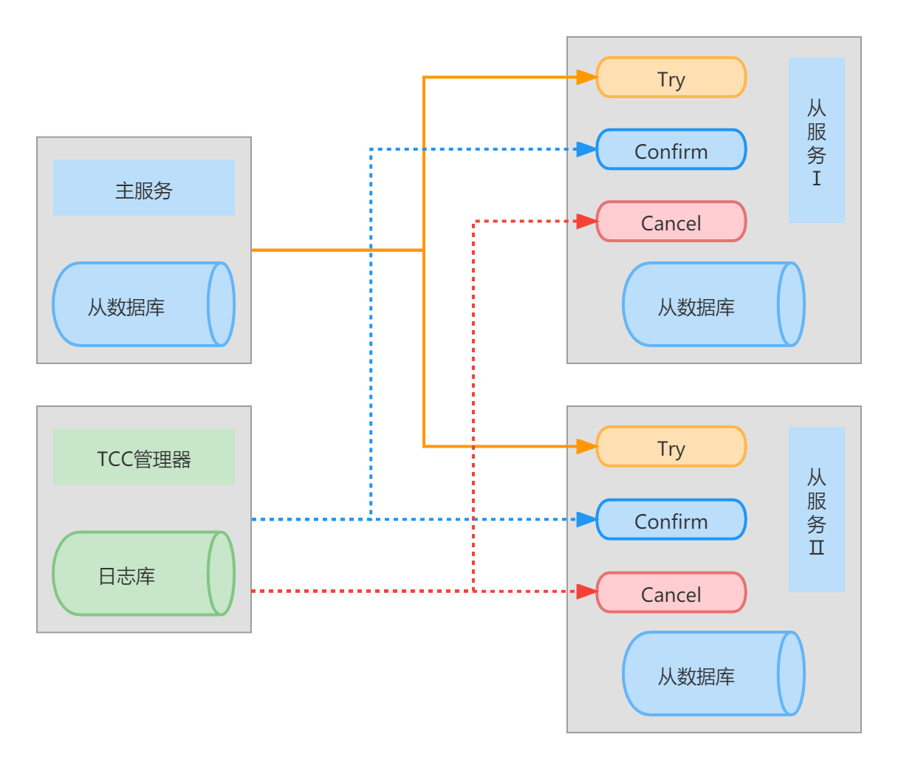
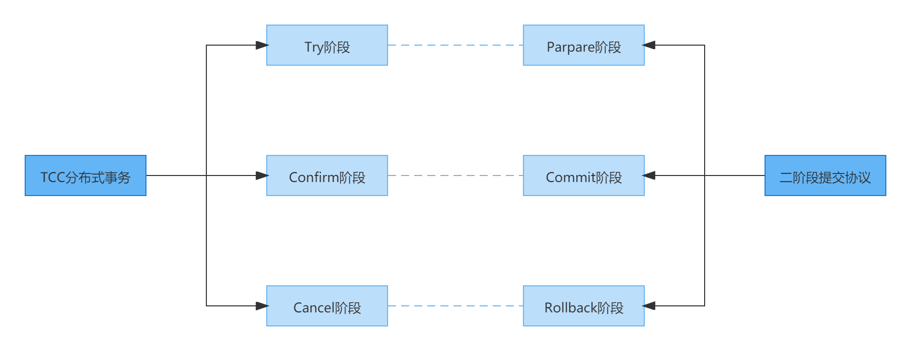

# TCC

TCC是一种典型的解决分布式事务问题的方案，主要解决跨服务调用场景下的分布式事务问题，广泛应用于分布式事务场景。

TCC分布式事务的核心思想是在应用层将一个完整的事务操作拆分分为三个阶段：

1. **Try阶段**

   Try阶段不会执行任何业务逻辑，仅做业务的一致性检查和预留相应的资源，这些资源能够和其他操作保持隔离。

2. **Confirm阶段**

   当Try阶段所有分支事务都执行成功后开始执行Confirm阶段。通常情况下，采用TCC方案解决分布式事务时会认为Confirm阶段是不会出错的。也就是说，只要Try阶段的操作执行成功了，Confirm阶段就一定会执行成功。如果Confirm阶段出错了，就需要引入重试机制或人工处理，对出错的事物进行干预。

3. **Cancel阶段**

   在业务执行异常或出现错误的情况下，需要回滚事务的操作。执行分支事务的取消操作，并且释放Try阶段预留的资源。通常情况下，采用TCC方案解决分布式事务时同样会认为Cancel阶段一定会执行成功。如果Cancel阶段出错了，也需要引入重试机制或人工处理，对出错的事物进行干预。

TCC方案的执行流程如下图所示：

TCC是如何保证分布式事务的事务特性呢？从本质上来讲，TCC是一种在应用层实现的二阶段提交协议。那么二阶段提交协议是怎么样的呢？即首先所有的分支事务先预执行（先执行完成所有的业务逻辑操作），然后在大家都预执行完成之后，一起提交。如果有某一个分支事务预执行失败，则大家都进行回滚。如此，就完成了分布式事务，保证了一致性。你可能会提出质疑，如果某一个分支事务不是执行失败，而是提交失败了呢？比如网络波动，那岂不是数据不一致了。这个时候也不能回滚了，因为其他分支事务已经成功提交了。为了解决这个问题，就需要提供相应的补偿机制：所有的分支事务都需要记录提交前和提交后的数据状态，如果有某一个分支事务提交失败，其他分支事务提交成功，那么通过补偿操作，将提交后的数据状态修改为提交前的数据状态，而这些状态的信息已经被记录下了。对于提交失败的哪一个分支事务，自然就不需要进行补偿操作，因为它都没有提交成功。这里也存在另一种可能，那么就是执行补偿操作的时候失败了，要解决这个问题，就需要提供重试机制，因为补偿操作失败的原因可能是补偿提交的那一刻网络抖动导致超时，因此，再次进行重试，就有很大的概率可能成功。那如果一直重试都不成功呢？那么这时就需要引人工处理，而这就是最后的解决办法。到这里你可能还会提出质疑，如果需要人工介入处理，那岂不是表示该方案不能解决分布式事务问题。严格上来说，是的，该方案是不能完全解决分布式事务问题的。但是这个问题却不能完全这么看，因为基于该方案，可以解决99%（拍脑袋）的在没有引入该解决方案的前提下所产生的分布式事务问题，最终也只有在补偿操作多次重试失败之后才需人工介入，而这个概率相对来说是极小的。例如100万次分布式事务，可能也只有数十次需要人工介入。因此，这个方案是一个可行的方案。而TCC分布式事务也是基于这样的思想和原理，只是它的二阶段提交是作用在应用层，而传统的2PC协议是作用持久层，需要数据库的本地事务支持。

当理解了二阶段提交协议的原理之后，TCC分布式事务的三阶段也就不难理解。Try阶段每个分支事务的预执行阶段，Confirm阶段就等价于Commit阶段，而最后的Cancel就相当于Rollback操作，或者说补偿阶段。将这三个阶段带入到上述对二阶段的描述，那么也就可以说的通了。

对应关系如下图所示：

即使如此，TCC分布式事务毕竟不是基于数据库事务的二阶段提交协议，因此，在具体的实现上肯定也是不一样的。那么TCC分布式事务的三个阶段要如何去实现呢？

TCC分布式事务三个阶段主要关注的重点如下：

1. Try阶段

   Try阶段是准备执行业务的阶段，在这个阶段尝试执行业务，重点关注如下事项：

   - 完成所有的业务检查，确保数据的一致性。
   - 预留必要的业务资源，确保数据的隔离性。

2. Confirm阶段

   Confirm阶段是确认执行业务的阶段，在这个阶段确认执行的业务。重点关注如下事项：

   - 真正的执行业务。
   - 不做任何业务逻辑检查，直接将数据库持久化到数据库。
   - 使用Try阶段预留的资源。

3. Cancel阶段

   Cancel阶段取消执行业务。重点关注如下事项：

   - 释放Try阶段预留的业务资源。
   - 将数据库中的数据恢复到最初的状态。

对三个阶段关注的重点的描述还是比较抽象，下面给出一个案例来进行说明。

## 案例

在电商业务场景中，一个典型的业务场景就是订单支付。这个场景包含修改订单状态、扣减库存、增加积分、创建出库单等业务。这些业务要么全部执行成功，要么全部执行失败，必须是一个完整的事务。如果不能构成一个完整的事务，就有可能出现库存未扣减或者超卖的问题。

跟基于数据库事务的二阶段提交协议一样，Try阶段执行分支事务的预操作，Confirm阶段执行最后的提交操作，Cancel阶段在Try阶段失败时执行回滚操作。但跟基于数据库事务的二阶段提交协议不同的是，基于数据库事务的二阶段提交协议在Commit阶段有数据库事务可以保证它的提交，在提交之前，无论执行了多少的与操作，对于其他事务都是不可见，因此数据库事务保证在分支事务提交之前的隔离性。但TCC的Try阶段却不一样，因为Try阶段也是一个独立的事务，因此一旦Try阶段预操作执行完成，那就是真的提交了，而此时整个分布式事务还没有执行完成，但却已经对其他事务可见了。进而就会产生隔离性的问题，比如分布式事务A有一个分支事务预执行失败（Try失败），然后由事务管理器开始协调大家一起执行Cancel阶段进行补偿回滚，但是回滚之前，此时有另一个分布式事务B产生，读取到了A分布式事务在Try阶段所提交的数据。同时也会有另一个问题，如果Try阶段把所有预操作执行完并提交了事务，那Confirm阶段干啥？就像下图所示的那样：

为了解决这个问题，在Try阶段就不能真正的提交，而这个真正的提交动作必须交由Confirm阶段。可以问题在于Try阶段也是一个独立的事务，它执行的所有操作都会被真正提交持久化。因此，这里就产生了一个逻辑上矛盾。前面已经强调过，TCC分布式事务是一个在应用层上实现的分布式事务，那么其解决这个矛盾的方法就是遵循Base理论，为其增加一个中间状态，也称软状态。例如在上述业务场景中，对于修改订单状态、扣减库存、增加积分、创建出库单等业务场景，Try阶段应该完成如下工作：

- 订单服务将订单数据库中订单的状态更新为“支付中”。
- 订单服务调用库存服务冻结部分库存，将冻结的库存数量也就是用户下单时提交商品数量，单独写入商品库存表的冻结字段中，同时将商品库存数量将去冻结的商品数量。
- 订单服务调用积分服务进行预增加积分的操作，在用户积分数据表中，将要增加的积分写入单独的预增加积分字段中，而不是直接增加用户积分。
- 订单服务调用有仓储服务生成出库单时，将出库单的状态标记为“未知”，并不直接生成正常的出库单。

如此，就可以保证事务隔离性。因为在Try阶段所做的修改虽然被提交了数据库事务，但它所提交数据的状态却是中间态，订单为真正支付，库存未真正扣减，积分未实际增加，出库单也没有真正生成。那么虽然这些状态对其他事务可见，但是在业务逻辑上却是隔离的。例如其他的事务并不会应该订单的状态处于“支付中”而做额外的操作。

---

所有Try节点所有预操作执行完成，并且都执行成功了，那么就要由事务管理器协调开始执行Confirm阶段，而就是真正的提交（业务层面的提交），其需要完成如下工作：

- 订单服务将订单数据库中订单的状态更新为“支付成功”。
- TCC分布式事务框架调用库存服务中Confirm阶段的方法，真正地扣减库存，将预扣减字段中的库存数量减去当次下单提交的商品数量。
- TCC分布式事务框架调用积分服务中Confirm阶段的方法，真正地增加积分，将预增加积分字段中的积分数量减去当次支付产生的积分数量，并且在用户的积分账户中增加当次支付产生的积分数量。
- TCC分布式事务框架调用仓储服务中Confirm阶段的方法，将出库单的状态更新为已创建。

Confirm阶段所做的工作看起来好像有些不对，嗯......，如果Confirm阶段执行失败了怎么呢？对于Try阶段而言，如果Try阶段只有一个失败，那么就会由事务管理协调所有分支事务开始执行Cancel阶段进行补偿回滚。但Confirm阶段阶段却不行了，如果有一或多个Confirm执行失败，其他的执行成功，对于失败的Confirm，又没有一个Cancel对Confirm失败时进行补偿回滚，那岂不是会造成数据不一致。而这个问题在TCC分布式事务解决方案中会认为Confirm阶段是不会出错的。也就是说，只要Try阶段的操作执行成功了，Confirm阶段就一定会执行成功。 什么？大家都是程序员写的，你凭啥就一定能成功呢。当然不可能说绝对的保证Confirm阶段就一定会执行成功，即使是基于数据库事务的二阶段提交协议，在Commit的时候也有可能因为网络等原因导致提交失败，更别说建立在应用层的TCC分布式事务的Confirm阶段了。这里仅仅说的是认为Confirm阶段是不会出错，那也就是说要尽可能保证Confirm阶段不会出错，而这就考验程序员的功底了。所以说TCC分布式事务也是一个对程序员要求比较高的分布式事务。

Confirm阶段出错肯定是存在的，对此TCC也有相应的拯救机制。如果Confirm阶段出错了，就需要引入重试机制进行重试，因为可能是因为网络抖动导致失败，重试一下就好了。当然重试不可能是无限的，如果重试失败超过一定次数就不需要在重试了，此时就需要引入最后的拯救方案——人工处理，对出错的事物进行干预。

---

如果有至少一个分支事务的Try阶段执行异常，那么就要由事务管理器协调开始执行Cancel阶段，其需要完成如下工作：

- 订单服务将订单数据库中订单的状态标记为“已取消”。
- TCC分布式事务框架调用库存服务的Cancel阶段的方法进行事务回滚，将库存数据表中的预扣减库存字段中存储的商品数量减去当次下单提交的商品数量，并且将库存数据表中的商品库存字段存储的商品库存数量增加当次下单提交的商品数量。
- TCC分布式事务框架调用积分服务的Cancel阶段的方法进行事务回滚，积分数据中的预增加积分字段中的积分数量减去当次支付产生的积分数量。
- TCC分布式事务框架调用仓储服务的Cancel阶段的方法进行事务回滚，将出库单的状态标记为“已取消”。

如果Cancel阶段执行失败，那么与Confirm阶段也是一样的。要尽可能编写正确的代码，保证不会出错。如果出错了，也是一样引入重试机制和人工介入处理。

## TCC异常

前面已经介绍过，如果Try阶段异常，就由Cancel阶段回滚补偿。如果Confirm和Cancel异常，就进行重试或人工介入处理。但是还有一些特殊的异常是需要在编码时就预防的，分别是空回滚，幂等，悬挂。

### 空回滚

 假设有一个分支事务的Try阶段执行失败，如何触发所有分支事务的Cancel阶段执行呢？Cancel方法有由事务管理器进行调用，但是有一个前提，那就是事务管理器需要知道谁是Cancel方法。因此需要在执行Try方法的时候向事务管理器上报我的Confirm方法和Cancel方法是谁。然后才开始执行Try方法（不能先执行Try，然后再上报，因为如果Try）。

### 幂等

### 悬挂

## TCC的定义

TCC是Try，confirm，cancel单个单词的缩写。

TCC是将一个大的事务拆分为两阶段的多个子事务。其中第一个节点的子事务和第二阶段的子事务独立。

第一阶段和第二阶段异步执行，而不影响整体事务的特性。

## TCC一致性

## 整体事务架构

## 案例

## TCC模型一

模型四是一个高效的编程模型，模式五是标准的编程模型

本地事务和分布式事务冲突

五

六

七，空回滚

