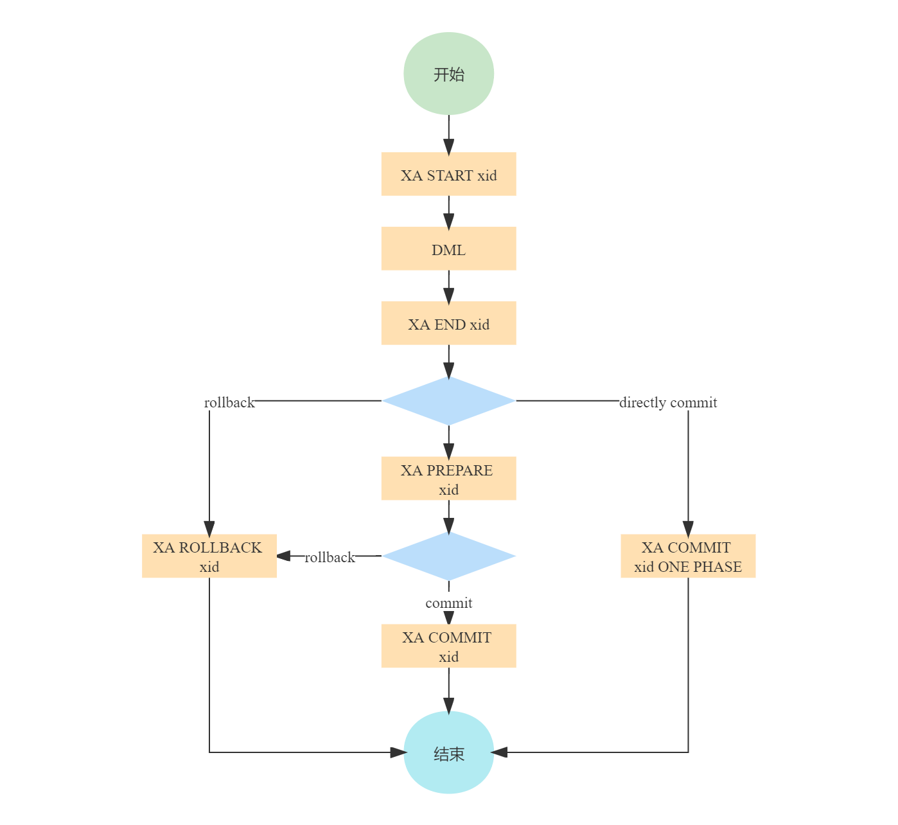
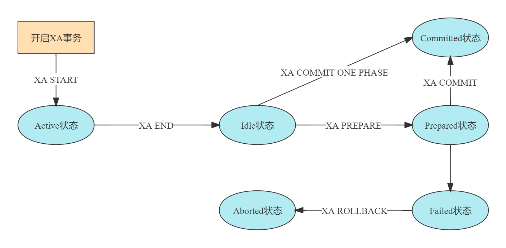
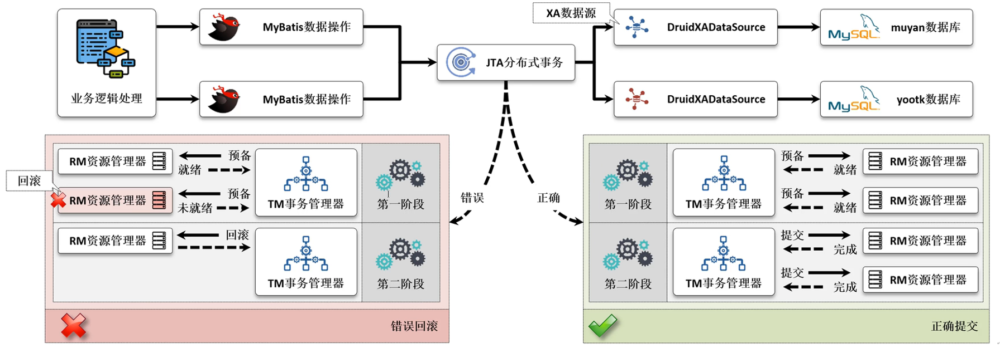

# DTP XA规范

DTP全称分布式事务处理（[Distributed Transaction Processing](https://publications.opengroup.org/c193)），它是由X/Open组织所定义的分布式事务处理模型。这个模型定义了分布式事务处理的一套规范和API，而具体的实现则由各个厂商负责。

DTP模型定义了三个软件组件：

- 应用程序（AP）定义事务的边界并指定构成事务的操作。
- 资源管理器（RM，例如数据库或文件系统）提供对共享资源的访问。
- 事务管理器（TM）为分支事务分配标识符，监视分支事务进度，并负责分支事务的完成和故障恢复。

<font style="background-color:#e91e64">X/Open DTP模型</font>


## XA协议

XA规范是DTP模型所定义的标准，它定义了事务管理器（TM）和资源管理器（RM）之间的交互接口（如下图所示）。这些接口不是普通的应用程序编程接口（API），而是DTP软件组织内的系统级接口。这些接口由具体的厂商负责实现。


XA规范也属于两阶段提交协议。并且已经被许多数据库（Oracle、DB2、SQL server、MySQL）和中间件（CICS、Tuxedo等）实现。

<font style="background-color:#e91e64">XA接口 - 清单</font>

| Name          | Description                                                  |
| ------------- | ------------------------------------------------------------ |
| `ax_reg`      | 注册事务分支，由TM提供给RM调用。                             |
| `ax_unreg`    | 注销事务分支，由TM提供给RM调用。                             |
| `xa_open`     | 为AP使用RM进行初始化。                                       |
| `xa_close`    | 停止AP使用RM。                                               |
| `xa_start`    | 启动或恢复一个事务分支——将一个XID与线程请求RM的未来工作关联起来。 |
| `xa_end`      | 解除线程与事务分支的关联。                                   |
| `xa_prepare`  | TM通知RM准备提交分支事务。                                   |
| `xa_commit`   | TM通知RM提交分支事务。                                       |
| `xa_rollback` | TM通知RM回滚分支事务。                                       |
| `xa_complete` | 测试一个异步`xa_`操作是否完成。                              |
| `xa_recover`  | 获取RM已准备（prepare）或启发式完成的XID列表。               |
| `xa_forget`   | 允许RM丢弃启发式完成的事务分支的信息。                       |

**XA接口分为两类：**

- 一类是以`ax_`开头，只有`ax_reg`和`ax_unreg`，由TM提供。用于让RM可以动态地在TM中注册或注销。
- 
> TM必须以特定的顺序调用`xa_`接口。而多个TM之间相互隔离，即互不影响。

> **启发式完成**
>
> RM提供了一种优化措施，即准备提交事务分支的RM可以自行决定提交或回滚，而不用等待TM的`xa_commit`或`xa_rollback`指令，如此，RM可以尽早解锁共享资源。这种RM自行决定提交或回滚的完成方式称为<span alt="emp">启发式完成</span>。启发式完成可能会使RM间处于不一致的状态。当TM最终指示RM完成事务分支时，RM可能会响应说它已经完成了。RM报告它是提交分支，回滚分支，还是使用混合结果完成分支（提交一些工作并回滚其他工作）。

**XA两阶段时序图：**


<font style="background-color:#e91e64">XA接口描述</font>

1. 在开始一个全局事务前，需要涉及的RM调用TM的`ax_reg()`注册资源管理器信息。
2. 开始一个全局事，需要TM调用RM的`xa_open()`打开资源管理器。
3. TM调用RM的`xa_start()`开始事务。
4. 由AP调用RM完成局部事务分支（相应的业务操作）。
5. TM调用RM的`xa_end()`结束事务。
6. TM调用RM的`xa_prepare()`来询问RM是否可以提交事务。
7. TM根据RM的回应来决定是提交还是回滚，如果所有RM都回应可以提交，则TM调用所有RM的`xa_commit()`进行提交；如果有一个RM回应不能提交，则TM调用所有RM的`xa_rollback()`进行回滚。
8. 提交或回滚事务之后，由TM调用RM的`xa_close()`来关闭与资源管理器的连接。
9. 最后RM调用TM的`ax_unreg()`注销资源管理器信息。

另外，如果整个全局事务只有一个RM，那么第二阶段是没有必要的，此时在调用`xa_end()`结束事务之后，TM可以直接调用RM的`xa_commit()`提交事务。

## MySQL中的XA

MySQL从5.0.3版本开始支持XA分布式事务，且只有InnoDB存储引擎支持。MySQL Connector/J从5.0.0版本开始直接提供对XA的支持。通过DCL（`show engines;`）可以查看存储引擎的基本信息。

| Engine             | Support | Comment                                                      | Transactions | XA   | Savepoints |
| ------------------ | ------- | ------------------------------------------------------------ | ------------ | ---- | ---------- |
| MEMORY             | YES     | Hash based, stored in memory, useful for temporary tables    | NO           | NO   | NO         |
| MRG_MYISAM         | YES     | Collection of identical MyISAM tables                        | NO           | NO   | NO         |
| CSV                | YES     | CSV storage engine                                           | NO           | NO   | NO         |
| FEDERATED          | NO      | Federated MySQL storage engine                               | NULL         | NULL | NULL       |
| PERFORMANCE_SCHEMA | YES     | Performance Schema                                           | NO           | NO   | NO         |
| MyISAM             | YES     | MyISAM storage engine                                        | NO           | NO   | NO         |
| InnoDB             | DEFAULT | Supports transactions, row-level locking, and foreign keys   | YES          | YES  | YES        |
| BLACKHOLE          | YES     | /dev/null storage engine (anything you write to it disappears) | NO           | NO   | NO         |
| ARCHIVE            | YES     | Archive storage engine                                       | NO           | NO   | NO         |

### MySQL XA事务语法

- `XA [START|BEGIN] 'xid'`：开始XA事务。
- `XA END 'xid'`：结束XA事务。
- `XA PREPARE 'xid'`：准备提交XA事务（如果是一阶段提交，则可省略）。
- `XA COMMIT 'xid' [ONE PHASE]`：提交XA事务。
- `XA ROLLBACK 'xid'`：回滚XA事务。
- `XA RECOVER [CONVERT XID]`：列出所有处于`Prepared`阶段的事务。选项`CONVERT XID`是可选的，如果不添`CONVERT XID`选项，将以字符串的形式输出`DATA`。如果添加`CONVERT XID`选项，将以十六进制的形式输出`DATA`。

### MySQL XA事务示例

 <font style="background-color:#e91e64">二阶段提交</font>

```mysql
mysql> XA START 'mxid';
QUERY OK, 0 ROWS affected (0.00 sec)

mysql> UPDATE inventory SET balance=900 WHERE product_id=1000;
QUERY OK, 1 ROW affected (0.07 sec)
ROWS matched: 1  CHANGED: 1  WARNINGS: 0

mysql> XA END 'mxid';
QUERY OK, 0 ROWS affected (0.00 sec)

mysql> XA PREPARE 'mxid';
QUERY OK, 0 ROWS affected (0.11 sec)

mysql> XA COMMIT 'mxid';
QUERY OK, 0 ROWS affected (0.10 sec)
```

  <font style="background-color:#e91e64">一阶段提交</font>

```mysql
mysql> XA BEGIN 'mxid';
QUERY OK, 0 ROWS affected (0.00 sec)

mysql> UPDATE inventory SET balance=900 WHERE product_id=1000;
QUERY OK, 1 ROW affected (0.00 sec)
ROWS matched: 1  CHANGED: 1  WARNINGS: 0

mysql> XA END 'mxid';
QUERY OK, 0 ROWS affected (0.00 sec)

mysql> XA COMMIT 'mxid' ONE PHASE;
QUERY OK, 0 ROWS affected (0.30 sec)
```

 <font style="background-color:#e91e64">XA RECOVER</font>

```mysql
mysql> XA START 'mxid';
QUERY OK, 0 ROWS affected (0.00 sec)

mysql> UPDATE inventory SET balance=900 WHERE product_id=1000;
QUERY OK, 1 ROW affected (0.00 sec)
ROWS matched: 1  CHANGED: 1  WARNINGS: 0

mysql> XA END 'mxid';
QUERY OK, 0 ROWS affected (0.00 sec)

mysql> XA RECOVER;
EMPTY SET (0.00 sec)

mysql> XA PREPARE 'mxid';
QUERY OK, 0 ROWS affected (0.04 sec)

mysql> XA RECOVER;
+----------+--------------+--------------+------+
| formatID | gtrid_length | bqual_length | DATA |
+----------+--------------+--------------+------+
|        1 |            4 |            0 | mxid |
+----------+--------------+--------------+------+
1 ROW IN SET (0.00 sec)

mysql> XA RECOVER CONVERT XID;
+----------+--------------+--------------+------------+
| formatID | gtrid_length | bqual_length | DATA       |
+----------+--------------+--------------+------------+
|        1 |            4 |            0 | 0x6D786964 |
+----------+--------------+--------------+------------+
1 ROW IN SET (0.00 sec)

mysql> XA COMMIT 'mxid';
QUERY OK, 0 ROWS affected (0.06 sec)
```

### MySQL XA事务流程


### MySQL XA事务状态

MySQL每次执行XA事务语句时都会有相应的状态，该状态是事务正确执行的关键。XA状态流程如下图所示：



### MySQL XA事务XID信息

上面的“MySQL XA示例”中我们通过XA RECOVER列出了处于Prepared状态的事务，包含4个属性。实际上这是XA规范中所定义XID的结构体属性。XA规范使用XID作为一个事务分支的标识符。

```mysql
mysql> XA RECOVER;
+----------+--------------+--------------+------+
| formatID | gtrid_length | bqual_length | DATA |
+----------+--------------+--------------+------+
|        1 |            4 |            0 | mxid |
+----------+--------------+--------------+------+
```

XID结构：

```c
/∗
 ∗ Transaction branch identification: XID and NULLXID:
 ∗/
#define XIDDATASIZE 128 /∗ size in bytes ∗/
#define MAXGTRIDSIZE 64 /∗ maximum size in bytes of gtrid ∗/
#define MAXBQUALSIZE 64 /∗ maximum size in bytes of bqual ∗/
struct xid_t {
	long formatID;     /∗ format identifier ∗/
	long gtrid_length; /∗ value 1-64 ∗/
	long bqual_length; /∗ value 1-64 ∗/
	char data[XIDDATASIZE];
};
typedef struct xid_t XID;
/∗
 ∗ A value of -1 in formatID means that the XID is null.
 ∗/
/∗
 ∗ Declarations of routines by which RMs call TMs:
 ∗/
extern int ax_reg(int, XID ∗, long);
extern int ax_unreg(int, long);
```

字段含义：

- `formatID`：记录`gtrid`、`bqual`的格式，类似Memcached中flags字段的作用。XA规范中通过一个结构体约定了XID的组成部分，但没有规定data中存储的`gtrid`、`bqual`的内容应该是什么格式。
- `gtrid_length`：全局事务标识符的长度，最大不能超过64字节。
- `bqual_length`：分支限定符长度，最大不能超过64字节。
- `data`：XID的值，即`gtrid`和`bqual`拼接后的内容。在XID的结构体中，没有`gtrid`和`bqual`，只有`gtrid_length`和`bqual_length`，`gtrid和bqual`的内存存储到data中，而`gtrid_length`和`bqual_length`仅仅表示data中`gtrid`和`bqual`的长度，因此根据其长度反推出data中`gtrid`和`bqual`的值。举例来说：假设`gtrid_length=3`，`bqual_length=4`，`data=001mxid`，那么`data[0]~data[gtrid_length-1]`的部分就是`gtrid`的值（001），`data[gtrid_length]~data[bqual_length-1]`的部分就是`bqual`的值（mxid）。

### 小结

XA事务和非XA事务（即本地事务）的更新操作是互斥的。即跟本地事务的互斥性是一样的。开启一个XA事务的同时可以开启一个本地事务，不过，如果XA事务和本地事务都执行了对同一条数据的更新操作，它们将会阻塞，直到其中一个事务提交或回滚为止。

## JTA规范

JTA（Java Transaction API）为J2EE平台提供了分布式事务服务的能力。JTA规范是XA规范的Java版，即把XA规范中规定的DTP模型交互接口抽象成Java接口中的方法，并规定每个方法要实现什么样的功能。

### javax.transaction.TransactionManager

`TransactionManager`接口为事务管理器，定义了允许应用服务器管理事务边界的方法，常用的主要是`begin`、`commit`和`rollback`等方法。

```java
public interface TransactionManager {
    public void begin() throws NotSupportedException, SystemException;
    public void commit() throws RollbackException,
	HeuristicMixedException, HeuristicRollbackException, SecurityException,
	IllegalStateException, SystemException;
    public int getStatus() throws SystemException;
    public Transaction getTransaction() throws SystemException;
    public void resume(Transaction tobj)
            throws InvalidTransactionException, IllegalStateException,
            SystemException;
    public void rollback() throws IllegalStateException, SecurityException,
                            SystemException;
    public void setRollbackOnly() throws IllegalStateException, SystemException;
    public void setTransactionTimeout(int seconds) throws SystemException;
    public Transaction suspend() throws SystemException;
}
```

### javax.transaction.UserTransaction

`UserTransaction`接口的作用跟`TransactionManager`接口一样，都是定义了允许应用程序显式管理事务边界的方法。 不同的是`UserTransaction`接口一般是暴露给用户显式调用的。实际上`UserTransaction`接口的实现调用的也是`TransactionManager`接口的方法。例如Atomikos的`com.atomikos.icatch.jta.UserTransactionImp`。

```java
public interface UserTransaction {
    void begin() throws NotSupportedException, SystemException;
    void commit() throws RollbackException,
	HeuristicMixedException, HeuristicRollbackException, SecurityException,
	IllegalStateException, SystemException;
    void rollback() throws IllegalStateException, SecurityException,
        SystemException;
    void setRollbackOnly() throws IllegalStateException, SystemException;
    int getStatus() throws SystemException;
    void setTransactionTimeout(int seconds) throws SystemException;
}
```

### javax.transaction.Transaction

Transaction接口为事务的抽象，允许对目标事务执行操作。每个全局事务都有一个对象的Transaction对象。Transaction对象可用于资源的登记、同步注册、事务完成和状态查询。

   ```java
   public interface UserTransaction {
       void begin() throws NotSupportedException, SystemException;
       void commit() throws RollbackException,
   	HeuristicMixedException, HeuristicRollbackException, SecurityException,
   	IllegalStateException, SystemException;
       void rollback() throws IllegalStateException, SecurityException,
           SystemException;
       void setRollbackOnly() throws IllegalStateException, SystemException;
       int getStatus() throws SystemException;
       void setTransactionTimeout(int seconds) throws SystemException;
   }
   ```

### javax.transaction.TransactionSynchronizationRegistry

`TransactionSynchronizationRegistry`接口主要提供给系统级应用程序服务器组件使用，如持久性管理器、资源适配器以及EJB和Web应用程序组件。其目的是用于事务同步注册。

提供了如下功能：

- 使用特殊的排序语义注册同步对象。
- 将资源对象与当前事务关联。
- 获取当前事务的事务上下文。
- 获取当前事务的状态。
- 标记当前事务进行回滚。

`TransactionSynchronizationRegistry`接口接口由应用服务器通过无状态服务对象实现。 具有线程安全的任意数量的组件都可以使用同一个对象。  

在标准的应用服务器环境中，可以通过JNDI通过标准名称查找实现该接口的实例。 标准名称是`java:comp/TransactionSynchronizationRegistry`。  

```java
public interface TransactionSynchronizationRegistry {
    Object getTransactionKey();
    void putResource(Object key, Object value);
    Object getResource(Object key);

    void registerInterposedSynchronization(Synchronization sync);
    int getTransactionStatus();
    void setRollbackOnly();
    boolean getRollbackOnly();
}
```

### javax.transaction.Synchronization

事务管理器支持同步机制，允许在事务完成之前和之后通知关联方。使用`registerInterposedSynchronization`方法，应用服务器为当前与目标`Transaction`对象关联的事务注册一个Synchronization对象。

```java
public interface Synchronization {
    public void beforeCompletion();
	public void afterCompletion(int status);
}
```

> `Synchronization`对象就是`registerInterposedSynchronization`方法的目标参数。该方法的功能如下：
>
> 注册一个具有特殊顺序语义的同步实例。它的beforeCompletion将在所有SessionSynchronization beforeCompletion回调和直接注册到Transaction的回调之后被调用，但在两阶段提交进程开始之前。同样，afterCompletion回调将在两阶段提交完成之后，但在任何SessionSynchronization和Transaction afterCompletion回调之前被调用。
>
> 在调用此方法时，beforeCompletion回调将在绑定到当前线程的事务的事务上下文中调用。允许的方法包括对资源的访问，例如连接器。不允许访问“用户组件”(例如定时器服务或bean方法)，因为这些可能会更改调用方管理的数据的状态，也可能会更改已被另一个registerInterposedSynchronization调用方刷新的数据的状态。通用上下文是registerInterposedSynchronization调用者的组件上下文。
>
> afterCompletion回调将在一个未定义的上下文中调用。不允许访问上述定义的“用户组件”。资源可以关闭，但不能对其执行任何事务工作。
>
> 如果在没有活动事务上下文的情况下调用此方法，则会抛出一个IllegalStateException。
>
> 如果在两阶段提交处理启动之后调用此方法，则会抛出一个IllegalStateException。

### javax.transaction.xa.XAResource

`XAResource`接口是基于X/Open CAE规范(分布式事务处理:XA规范)的行业标准XA接口的Java映射。

XA接口定义了分布式事务处理(DTP)环境中资源管理器（RM）和事务管理器（TM）之间的契约。 JDBC驱动程序或JMS提供程序实现此接口，以支持全局事务与数据库或消息服务连接之间的关联。  

在事务由外部事务管理器控制的环境中，任何事务资源都可以支持`XAResource`接口，这些事务资源旨在供应用程序使用。 数据库管理系统就是这种资源的一个例子。 应用程序可以通过多个数据库连接访问数据。 每个数据库连接都作为事务资源在事务管理器（TM）中登记。 事务管理器（TM）为参与全局事务的每个连接获取一个`XAResource`。 事务管理器（TM）使用`start`方法将全局事务与资源关联起来，并使用`end`方法将事务与资源解除关联。 资源管理器（RM）负责将全局事务与在开始和结束方法调用之间对其数据执行的所有工作关联起来。  

在事务提交时，事务管理器（TM）通知资源管理器（RM）根据两阶段提交协议准备、提交或回滚事务。 

   ```java
   public interface XAResource {
       void commit(Xid xid, boolean onePhase) throws XAException;
       void end(Xid xid, int flags) throws XAException;
       void forget(Xid xid) throws XAException;
       int getTransactionTimeout() throws XAException;
       boolean isSameRM(XAResource xares) throws XAException;
       int prepare(Xid xid) throws XAException;
       Xid[] recover(int flag) throws XAException;
       void rollback(Xid xid) throws XAException;
       boolean setTransactionTimeout(int seconds) throws XAException;
       void start(Xid xid, int flags) throws XAException;
   
       public final static int TMENDRSCAN =   0x00800000;
       public final static int TMFAIL =       0x20000000;
       public final static int TMJOIN =       0x00200000;
       public final static int TMNOFLAGS =    0x00000000;
       public final static int TMONEPHASE =   0x40000000;
       public final static int TMRESUME =     0x08000000;
       public final static int TMSTARTRSCAN = 0x01000000;
       public final static int TMSUCCESS =    0x04000000;
       public final static int TMSUSPEND =    0x02000000;
       public final static int XA_RDONLY =    0x00000003;
       public final static int XA_OK =        0;
   }
   ```

### javax.transaction.xa.Xid
Xid接口是X/Open事务标识符Xid结构的Java映射。 这个接口指定了三个访问器方法来检索全局事务的fortmat ID、全局事务ID和分支限定符。 事务管理器和资源管理器使用Xid接口。 该接口对应用程序不可见。

   ```java
   public interface Xid {
       final static int MAXGTRIDSIZE = 64;
       final static int MAXBQUALSIZE = 64;
       int getFormatId();
       byte[] getGlobalTransactionId();
       byte[] getBranchQualifier();
   }
   ```

### javax.transaction.Status

Status接口定义了用于事务状态代码的静态变量。  

```java
public interface Status {
    public final static int STATUS_ACTIVE = 0;
    public final static int STATUS_MARKED_ROLLBACK = 1;
    public final static int STATUS_PREPARED = 2; 
    public final static int STATUS_COMMITTED = 3;
    public final static int STATUS_ROLLEDBACK = 4;
    public final static int STATUS_UNKNOWN = 5; 
    public final static int STATUS_NO_TRANSACTION = 6;
    public final static int STATUS_PREPARING = 7;
    public final static int STATUS_COMMITTING = 8;
    public final static int STATUS_ROLLING_BACK = 9;
}
```

---

> JTA接口并没有位于JDK中，而是位于jta包中。因此，如果需要使用JTA，则需要添加依赖：
>
> ```xml
> <dependency>
>   <groupId>javax.transaction</groupId>
>   <artifactId>jta</artifactId>
>   <version>1.1</version>
> </dependency>
> ```

### 小结

事务管理器提供者，实现`TransactionManager`、`UserTransaction`、`Transaction`、`Xid`、`TransactionSynchronizationRegistry`接口，通过与`XAResource`接口交互来实现分布式事务。

资源管理器提供者，实现`XAResource`接口。

## 两阶段模型



## 总结

XA模式是标准的两阶段提交协议，因此两阶段提交协议所拥有的优缺点，XA模式也有。

优先：强一致性。

缺点：事务粒度大，高并发下，系统可用性低。实践中较少使用。

ySQL提供的XA实现（https://dev.mysql.com/doc/refman/5.7/en/xa.html）