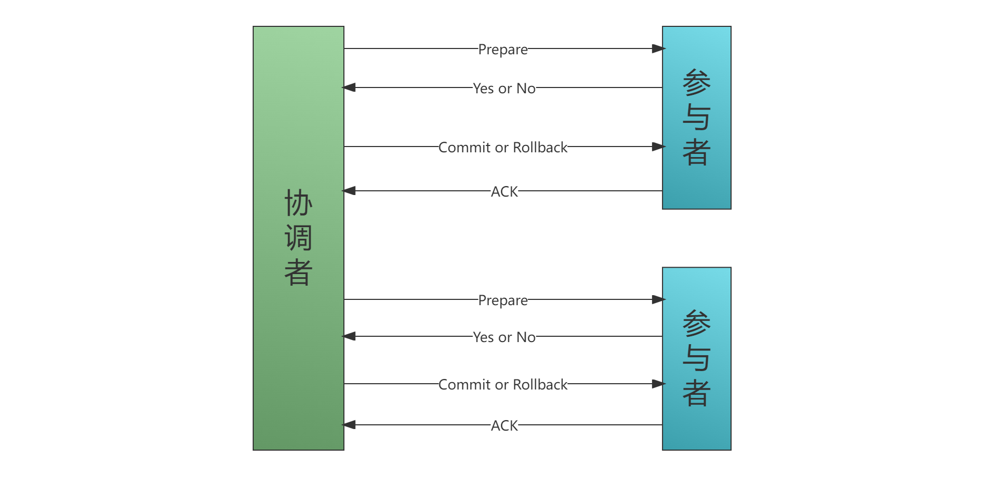
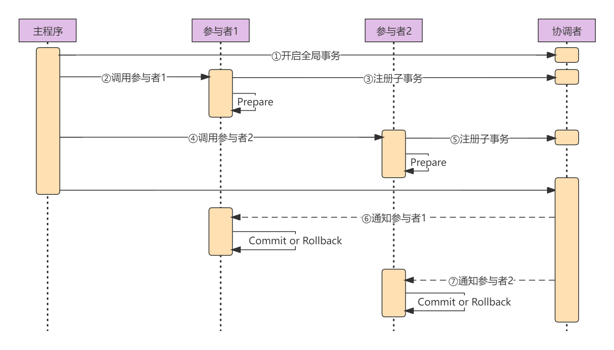
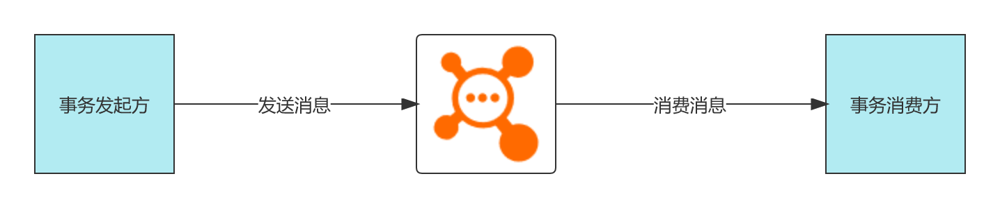
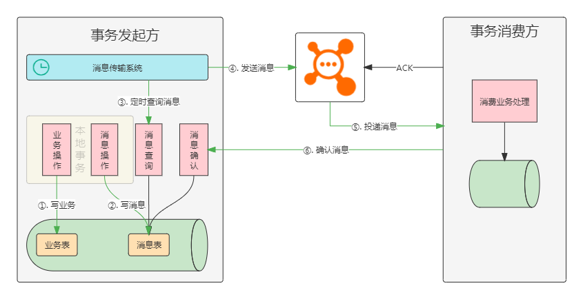
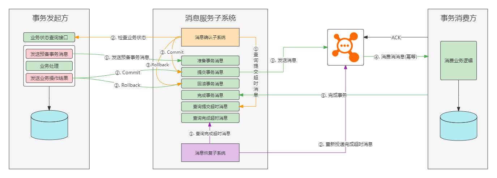
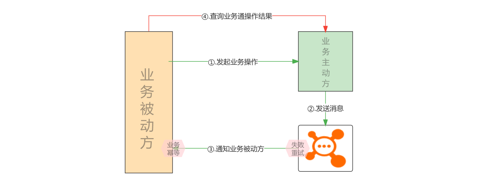
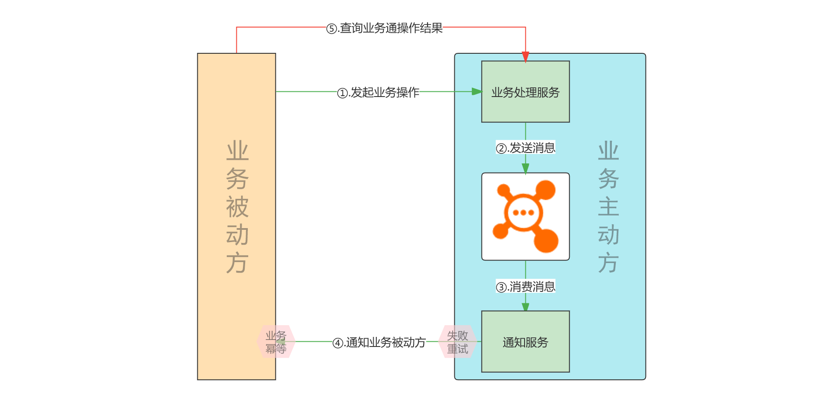

# 分布式事务

[TOC]

## 简介

随着互联网的发展，软件系统由原来的单体应用转变为分布式系统应用，将一个大的应用系统拆分为多个可以独立部署的应用服务，原来只需要本地事务可以完成的业务操作现在变成需要多个服务远程协作才能完成。而涉及到多个服务的事务称之为分布式事务。分布式事务会在3种场景下产生，分别是跨JVM进程，跨数据库实例，多服务访问单数据库。

- **跨JVM进程**

  将单体项目拆分为分布式、微服务项目之后，各个服务之间通过远程REST或者RPC调用来协调完成业务操作。

- **跨数据库实例**

  单体系统访问多个数据库实例，也就是跨数据源访问时会产生分布式事务。

- **多服务访问单数据库**

  多个微服务访问同一个数据库。本质上也就是通过不同的数据库会话来操作数据库，此时就会产生分布式事务。

## 事务特性

事务存在四大特性，检查ACID。

- **原子性（Atomic）**

  事务的原子性是指构成事务的所有操作要么全部执行成功，要么全部执行失败，不可能出现部分执行成功，部分执行失败的情况。

- **一致性（Consistency）**

  事务的一致性是指在事务执行之前和执行之后，数据始终处于一致的状态。

- **隔离性（Isolation）**

  事务的隔离性是指并发执行的两个事务之间互补干扰。即一个事务在执行过程中不能看到其他事务运行过程的中间状态。

- **持久建（Durability）**

  事务的持久性是指事务提交完成后，此事务对数据的更改操作会被持久化到数据库中，并且不会被回滚。

## CAP原理

CAP原则又称CAP定理，是一致性（Consistency）、可用性（Availability）和分区容错性（Partition tolerance）首字母的缩写。

- **一致性（C）**：在分布式系统中的所有数据备份，在同一时刻是否有同样的值。
- **可用性（A）**：在集群中一部分节点故障后，集群整体是否还能响应客户端的读写请求。
- **分区容错性（P）**：以实际效果而言，分区相当于对通信的时限要求。系统如果不能在一定时限内达成数据一致性，就意味着发生了分区的情况，必须就当前操作在C和A之间做出选择。

CAP定理是由加州大学伯克利分校Eric Brewer教授提出的，他指出这三个要素中最多只能同时实现两点，不可三者兼顾。例如，如果要允许P的存在，则一定存在Server之间的丢包，则不能保证C。因此在CAP只能两两选择。

**CA**

放弃分区容错性，追求系统的强一致性和可用性。此时系统不会进行分区，也不需要考虑网络不同和节点挂掉的问题。而此时系统就不在是一个分布式系统，当对于分布式系统而言，分区是始终会存在的。

**CP**

放弃可用性，追求系统的一致性和分区容错性。这种组合方式对于数据的一致性要求较高，追求的是强一致性。在实践当中，只有少量的场景追求CP，例如银行之间的跨行转账业务，不能允许B银行到账了，而A银行还没有扣钱。而在常规的业务系统当中，例如电商网站，是不能放弃可用性的，例如淘宝一段时间整个系统不能访问。

**AP**

放弃一致性，追求系统的可用性和分区容错性。在实践中，这时大部分分布式系统在架构设计时的选择。需要注意的是，放弃一致性，并不代表真的放弃了一致性，而是追的最终一致性，即允许多个节点之间的数据在一定的时间内存存在差异，最终会在一段时间后达到数据一致的状态。

## Base

Base理论是对CAP理论中AP的一个扩展，它通过牺牲强一致性来获得可用性。Base理论中的Base是基本可用（Basically Available）、软状态（Soft State）和最终一致性（Eventually Consistent）的缩写。当系统出现故障时，Base理论允许部分数据不可用，但是会保证核心功能可用；允许数据在一段时间内不一致，但是经过一段时间后，数据最终会达成一致。

**基本可用**

基本可用是指分布式系统出现故障时，允许其损失系统的部分可用性，但是要保证系统基本可用。例如在电商业务场景中，添加购物车和下单功能出现故障，但是商品浏览功能仍然正常可用。

**软状态**

软状态是指允许系统中存在中间状态，这些中间状态不会影响系统的整体可用性，只是允许系统各个节点之间的数据同步存在延迟。例如在电商业务场景中，订单中的“支付中”、"退款中"等状态就是中间状态，当经过一段时间后，就会变成"支付成功"和"退款成功"的状态。

**最终一致性**

最终一致性是指系统中各个节点的数据副本经过一段时间的同步，最终能够达到一致的状态。即业务的一致性约束可能不会立即得到满足，而是会在未来的某个时间点得到满足，并且一定会发生。

## 2PC

2PC协议又称为**两阶段提交协议**，是一种强一致性，**同步阻塞**协议分布式事务协议，协议将整个事务流程分为Prepare和Commit两个阶段。2PC中的2指两个阶段，P指Prepare，即准备，C指Commit，即提交。

- **Prepare**：Prepare阶段叫提交阶段或者叫投票阶段，该阶段的任务是确定相关参与者对于事务处理是否准备就绪，YES代表可以Commit，NO则反之。简而言之，在该阶段，参与者会开启本地事务，执行业务操作，完成之后并不会马上提交本地事务，而是先向协调者报告："我已经准备好了"，然后阻塞，等待协调者的消息。总之，在该阶段，除了提交之外，其他都已经做了。
- **Commit**：提交阶段，基于投票结果，由协调者决定提交或回滚事务，各事务参与者遵循指示，对本地事务做相应的动作。简而言之，在该阶段，如果协调者收到所有的参与者都回复OK，那么协调者就向参与者发起Commit请求，参与者提交各自的本地事务。如果有一个参与者回复NO，那么协调者就向参与者发起Rollback请求，参与者回滚各自的本地事务。

*2PC协议模型：*

2PC协议是一种**强一致性**的设计方案，并且是一种**同步阻塞**协议，它会等待Prepare阶段所有参与者响应之后才进行下一步。

**存在的问题**

- **同步阻塞问题**：在Prepare阶段，参与者执行完成之后会同步阻塞，需要等待其他参与者都执行完成并且接收到协调者的请求才会继续运行。

  > **协调者拥有超时机制**：向参与者发送Prepare消息超时没有响应，则认为该参与者准备失败，协调者将发起回滚请求。
  >
  > **参与者不能拥有超时机制**：因为参与者不知道此时是该提交还是该回滚。例如有部分参与者收到了消息，协调者才挂，或者协调者没挂，但是与其中部分参与者网络通信故障。假设设置了超时机制为超时回滚，但是成功与协调者通信的参与者收到的消息是Commit，那么超时回滚与正常提交的参与者之间数据就会不一致，反过来也是同样的道理。

- **单点故障问题**：如果协调者只有一个，当协调者宕机时，且参与者没有收到Commit或Rollback消息时，该参与者将会一直被阻塞。

  > 针对单点故障问题，可以通过Raft或Paxos算法选举一个新的协调者。并对参与者发起重试请求。

- **数据不一致问题**：在Commit阶段，协调者向参与者发送Commit请求，如果此时有一个参与者在Commit之前宕机了，而其他参与者都提交成功，这种情形就会引起数据不一致。

  > Commit时参与者宕机问题无法解决，因为在参与者接收到Commit请求之后宕机，不能确定它到底是在Commit之前宕机还是之后宕机。如果是在Commit之前宕机，那就意味着该事务被回滚了，但是其他参与者由于已经提交成功，此时数据就不一致，而这些提交成功的参与者也无法再回滚。

总结：2PC是一种强一致性，同步阻塞的分布式事务协议，分为两个阶段：Prepare和Commit阶段。主要有三个问题：同步阻塞问题、单点故障问题、数据不一致问题。其中数据不一致问题是不能避免的，虽然在实践中发生的概率较小，但一旦发生，就不好解决。而单点故障问题则可以通过选举一个新的协调者来解决。最主要的问题在于同步阻塞问题，不仅是效率问题，一旦出现异常，将会导致参与者永久苏阻塞，不能释放资源，这是绝对不可接受的。

**时序模型**

上面2PC协议模型是一个理论上的模型，还是比较抽象，下面给出一个交互的时序图。

参考资料：[bilibili - 分布式实战之大牛带你手写分布式事务框架](https://www.bilibili.com/video/BV1et41197e2?from=search&seid=14341688298406101471&spm_id_from=333.337.0.0)

## 3PC

3PC协议又称**三阶段提交协议**，是在2PC协议的基础上改进的版本，主要解决了2PC的同步阻塞和单点故障问题。3PC将2PC协议中的Prepare阶段一分为二，最终形成三个阶段：CanCommit，PreCommit和DoCommit阶段或DoRollback阶段。

- **CanCommit**：主要的工作是预留资源。

  例如从A账户向B账户转账，此阶段仅仅是将money从A账户扣除，而未向B账户转账。从A账户扣除的money存储在一张中间表T中作为预留的资源。

- **PreCommit**：主要的工作就是使用预留的资源。

  例如从中间表T中移除预留的资源，并向B账户增加money。注意，此阶段仅仅是基于本地事务执行了业务操作，而没有真正的提交事务。当这些工作都完成之后，阻塞，等待三阶段的消息。

- **DoCommit**：主要的工作就是真正提交事务。

  协调者向各参与者发送DoCommit消息，而各参与者提交本地事务。或者协调者向各参与者发送DoRollback消息，而各参与者回滚本地事务。

*3PC协议模型：*

流程

- 在CanCommit阶段，协调者向参与者发送CanCommit消息，参与者收到CanCommit消息后如果认为能够执行事务，则向协调者返回Yes，否则，返回No。
- 在PreCommit阶段，如果协调者收到所有的参与者都返回Yes，则向参与者发送PreCommit消息，如果至少有一个参与者响应No，则向参与者发送Abort消息。
- 在DoCommit阶段，协调者根据PreCommit阶段的结果向参与者发起DoCommit或DoRollback消息。

问题

与2PC模型相比，3PC模型主要解决了单点故障问题，并减少了事务执行过程中产生的阻塞现象。在3PC模型中，如果参与者无法及时收到来自协调者发出的消息，那么参与者将会执行提交本地事务的操作，而不是一直持有事务的资源并处于阻塞状态，但是这种机制会导致数据的不一致问题。

例如，协调者向参与者发送Abort消息，由于网络故障等原因，参与者将会在一段时间之后提交本地事务，这导致与其他接收到Abort消息并执行了事务回滚操作的参与者的数据不一致。

IMPORTENT:更多详细信息请参考[3PC](3PC.md)。

## DTP

DTP全称分布式事务处理（[Distributed Transaction Processing](https://publications.opengroup.org/c193)），它是由X/Open组织所定义的分布式事务处理模型。这个模型定义了分布式事务处理的一套规范和API，而具体的实现则由各个厂商负责。

DTP模型定义了三个软件组件：

- 应用程序（AP）定义事务的边界并指定构成事务的操作。
- 资源管理器（RM，例如数据库或文件系统）提供对共享资源的访问。
- 事务管理器（TM）为分支事务分配标识符，监视分支事务进度，并负责分支事务的完成和故障恢复。

X/Open DTP模型

### XA规范

XA规范是DTP模型所定义的标准，它定义了事务管理器（TM）和资源管理器（RM）之间的交互接口（如下图所示）。这些接口不是普通的应用程序编程接口（API），而是DTP软件组织内的系统级接口。这些接口由具体的厂商负责实现。

XA规范也属于两阶段提交协议。并且已经被许多数据库（Oracle、DB2、SQL server、MySQL）和中间件（CICS、Tuxedo等）实现。

IMPORTENT:更多详细信息请参考[DTP XA](DTP XA.md)。

## 可靠消息最终一致性

实现事务最终一致性的方案有两大类，分别是"事件通知模式"和"事务补偿模式"。

### 事件通知模式

事务发起方将消息发送到MQ，事务消费方订阅MQ消费事务消息。要求事务发起方一定能将将消息发送到MQ，事务消费方一定能消费到MQ中的消息。如下图所示：

模式很简单，问题在于，事务发起方、事务消费方和MQ之间存在网络通信，那么必然存在网络波动。要如何才能保证事务发起方一定能将将消息发送到MQ，事务消费方一定能消费到MQ中的消息呢。

对于事务发起方而言，消息的发送和本地事务的执行并不是原子性的。如果先执行消息发送，后执行本地事务，那么一旦消息发送成功，而本地事务执行失败，将导致数据的不一致。而如果是先执行本地事务，后发送事务消息，看似没有问题，例如事务消息发送失败，将导致本地事务回滚，貌似保证了原子性。问题在于，如果事务发起方将事务消息已经发送到了MQ，并且MQ已经接收成功并处理，但是由于网络超时，导致事务消息发送异常，因而回滚本地事务，而此时MQ已经接收并处理了消息，将导致数据不一致。

解决方式有两种：分别是**本地消息服务模式**和**独立消息服务模式**。

#### 本地消息服务

无法保证本地事务与消息发送的原子性。通过在事务发起方添加一个事务消息表，执行本地事务时，将业务操作和向事务消息表中添加事务消息放在同一个本地事务中，由本地事务保证它们的原子性。然后另起一定时任务，定时查询事务消息表中的事务消息并将其发送到MQ，如果发送失败，则重试，如果多次重试失败，则人工介入，从而保证事务消息一定能够发送成功。而对于事务消费方而言，则通过MQ的ACK机制保证一定消费成功。

本地消息服务模型

流程如下：

1. 开始执行本地事务，写业务表和事务消息表，以本地事务保证原子性。
2. 定时任务定时查询事务消息表中未发送的事务消息，然后发送。
3. 消息消费方订阅MQ中的事务消息，通过ACK机制，保证一定消费成功。
4. 事务消费方消费完消息之后，将会回调事务发起方，告知事务已经完成，事务发起方更新对应事务消息的状态。

> 第4步并不是必须的，对于主流的RocketMQ、RabbitMQ以及Kafka等，其消息中间本身提供了消息消费的ACK机制。之所以要定义第4项，是因为上面的模型模型中所定义的消息中间件，包含所有可以实现消息中间件功能的统称，例如可以通过Redis实现消息中间件，而Redis没有ACK确认机制。

#### 独立消息服务

本地消息服务模式保证了消息的发送与消息消费的原子性。但是它的一个缺点在于业务与事务之间存在耦合，即每次执行本地事务时，不仅需要执行业务数据表操作，还需额外负责事务消息表的操作，为数据库带来了压力，在高并发场景下，由于每一个业务操作都需要相应的事务消息表操作，几乎将数据库的可用吞吐量砍了一半，在追求高性能的场景下，这无疑是不可接受的。正因为这样的原因，本地消息服务模式进一步发展，产生了独立消息服务模式。

独立消息服务模式与本地消息服务模式的不同之处在于独立消息服务模式在本地消息服务模式的基础上将事务消息表以及对事务消息表操作的定时任务独立出来，形成一个单独的消息服务子系统。而事务发起方则通过RPC与消息服务子系统进行通信。

独立消息服务模式的原理如下图所示：

独立消息服务模型

1. 事务发起方在执行本地事务之前，向消息服务子系统发送half消息。消息服务子系统接收到half消息之后将其存储到事务消息表中，然后响应。
2. 事务发起方开始执行本地事务，根据事务的执行结果向消息服务子系统发送commit或rollback消息。
3. 消息服务子系统如果接收到的是commit消息，则读取对应的事务消息，将其发送到MQ。如果接收到的是rollback，则删除对应的事务消息，不发送到MQ。
4. 事务消费方消费事务消息，通过MQ的ACK机制保证一定消费成功。
5. 如果事务发起方开始执行本地事务失败，没有向消息服务子系统发送任何消息，那么在消息服务子系统中的事务消息将会超时，消息服务子系统定时查询超时的事务消息，然后向事务发起方发起回查请求，根据响应结果决定commit还是rollback。
6. 消息服务子系统向MQ发送消息时不一定能发送成功，消息服务子系统会定时查询所有提交超时的事务消息，发起重试。
7. 事务消费方消费完消息之后，将会回调消息服务子系统，告知事务已经完成，消息服务子系统更新对应事务消息的状态。（这一步不是必须的）

> 第7步并不是必须的，原因与本地消息服务模式一致。

案例实现：[sadness](https://github.com/xionglinpeng/sadness)

#### RocketMQ事务消息

RocketMQ事务消息所采用的思想与"独立消息服务"完全一致，不同之处在于，独立消息服务模式需要我们自己实现消息的管理（消息发送，消息回查），而RocketMQ做为一个第三方消息中间件为开发者提供了独立消息服务功能的实现。

RocketMQ分布式事务消息原理如下图所示：

流程如下：

1. 事务发送方向RocketMQ发送"待确认"（half）消息。
2. RocketMQ将收到的"待确认"消息持久化。
3. RocketMQ向事务发送方回复"待确认"消息已发送成功。
4. 事务发送方开始执行本地事务。
5. 事务发送方根据本地事务的执行结果向RocketMQ发送Commit或Rollback消息。如果RocketMQ收到Commit消息，则将之前的"待确认"消息标记为可投递，订阅方将能够收到该消息。如果RocketMQ收到Rollback消息，则删除之前的"待确认"消息，订阅方接受不到该消息。
6. 若RocketMQ超时未收到事务发送方的Commit或Rollback消息，则回调事务发送方，发起回查请求，以确认当前事务消息是否投递。
7. 事务发送方查询事务状态。
8. 事务发送方根据查询到的事务状态向RocketMQ返回Commit或Rollback消息。
9. RocketMQ接收到回查请求的响应后，按照步骤5执行。

> 事务发送方能否执行成功由本地事务保证。
>
> 事务订阅方能够消费成功由MQ保证。

更多详细信息请参考[RocketMQ事务消息](RocketMQ事务消息.md)。

#### 最大努力通知

上面的三种模式均可以保证事件消息可靠地投递到下游服务哪儿去，但有些场景是允许一定程度地丢消息。于是就发展出事件最大努力通知模式。最大努力通知分为业务被动方和业务主动方，模型的特点是，业务主动方在提交事务后，向业务被动方进行有限次数（设置最大次数限制）的消息通知，比如发送三次通知，若三次通知都发送失败，则不再继续发送。而业务主动方需要提供业务查询接口给业务被动方，用来恢复丢失的消息。

最大努力通知模型对于时效性的保证比较差（可能出现长时间的软状态），所以不适用于对实时性有要求的系统。最大努力通知模型通常使用在不同业务平台服务或者对于第三方业务服务的通知，如果微信通知、银行通知、商户通知等。

最大努力通知模型1：

流程如下：

1. 业务被动方向业务主动方发起业务操作。
2. 业务主动方完成本地事务之后向MQ发送消息。
3. 业务被动方订阅并消费MQ的事务消息，如果消费失败，MQ则发起重试。
4. 业务被动方如果没有接收到业务被动方的通知请求，或者业务被动方处理通知请求失败，则根据需要向业务主动方发起业务操作结果的查询请求，而业务主动方需要提供业务操作结果查询的接口。

适用性：适用于系统内部服务之间的通知。

最大努力通知模型2：

流程如下：

1. 业务被动方向业务主动方发起业务操作。
2. 业务主动方完成本地事务之后向MQ发送消息。
3. 通知服务消费消息，并存储。
4. 通知服务向业务被动方发起有限次数的业务通知请求。例如最多发送三次，若三次都失败，就不在发送。
5. 业务被动方如果没有接收到业务被动方的通知请求，或者业务被动方处理通知请求失败，则根据需要向业务主动方发起业务操作结果的查询请求，而业务主动方需要提供业务操作结果查询的接口。

适用性：不同业务平台服务或者对于第三方业务服务的通知。

------

案例实现：

### 事务补偿模式

#### TCC

TCC是一种优化了的**业务补偿模式**，它可以做到完全补偿，既进行补偿后不留下补偿的纪录，就好像什么事情都没有发生过一样。同时，TCC的软状态时间很短，原因是因为TCC是一种两阶段型模式，只有在所有的服务的第一阶段（try）都成功的时候才进行第二阶段确认（Confirm）操作，否则进行补偿(Cancel)操作，而在try阶段是不会进行真正的业务处理的。关于TCC的概念，最早是由Pat Helland与2007年发表的一篇名为《Life beyond Distributed Transactions:an Apostate’s Opinion》的论文提出。TCC是Try、Confirm和Cancel三个首字母的缩写。

Try，Confirm和Cancel的职责

- **Try**
  1. 完成所有业务的一致性检查。
  2. 预留必要的业务资源，并需要与其他操作隔离。
- **Confirm**
  1. 此阶段会真正执行业务操作。
  2. 因为在Try阶段已经完成了业务的一致性检查，所以此阶段不会做任何业务检查。
  3. 只用Try阶段预留的业务资源进行操作。
  4. 此阶段的操作需要满足幂等性。
- **Cancel**
  1. 释放Try阶段预留的业务资源。
  2. 此阶段的操作需要满足幂等性。

TCC模型

TCC流程

TCC的具体流程分为二个阶段

1. 在Try阶段完成所有业务的一致性检查，并预留必要的资源。所谓预留资源是指将需要进行业务操作的资源进行单独隔离，锁定，使其无法被其他任务操作，同时这些资源也没有被真正的使用，处于一个中间状态，即Base理论的软状态。例如从A账户向B账户转账，此阶段仅仅是将money从A账户扣除，而未向B账户转账。从A账户扣除的money存储在一张中间表T中作为预留的资源，然后给它一个状态，比如"转账中"。
2. 第二阶段根据Try阶段的执行结果决定是执行Confirm操作，还是执行Cancel操作。如果Try节点中所有的分支事务都执行成功，就执行Confirm操作，而在Confirm操作中不做任何业务检查（因为Try阶段已经做了），只用Try阶段预留的资源进行业务处理。如果有一个分支事务执行失败，就执行Cancel操作，Cancel释放或者说回滚Try阶段预留的资源。

问题

- **幂等**由于服务宕机，应用崩溃，网络延迟等原因，可能会导致TCC事务管理器调用Confirm和Cancel失败，为了保证Confirm和Cancel的正确执行，需要加入超时重试机制，将会对Confirm或Cancel发起重试请求，因此Confirm和Cancel方法需要具备幂等性。

- **空回滚**如果分支事务因为宕机或者Try阶段执行失败导致本地事务回滚等原因，导致Try阶段调用失败，则TCC事务管理器会触发Cancel阶段的操作，如果此时恰好宕机服务重启，将会触发Cancel阶段的回滚操作，但由于Try阶段并未真正执行，因此Cancel阶段将会回滚未预留的资源，将这种情形称之为**空回滚**。

  解决方案

  判断是否执行了Try阶段的方法。如果执行了Try阶段的方法，就没有空回滚，反之，就有回滚。

- **悬挂**悬挂是指先执行了Confirm或Cancel方法，后执行Try阶段的方法。由于服务宕机，应用崩溃，网络延迟等原因，RPC调用分支事务超时，此时TCC事务管理器会触发Confirm或Cancel阶段方法的调用。可能Confirm或Cancel执行完成之后，请求到分支事务Try方法的RPC请求才真正到达，因为此时事务已经提交或回滚，所以在Try阶段预留的资源就无法释放了。而这种情况就称之为悬挂。

  解决方案

  在执行Try阶段时，首先判断是否已经执行了Confirm或Cancel阶段的方法，如果已经执行了，则什么也不做，反之，则正常执行。

------

上述幂等、空回滚和悬挂三个问题都可以在Try，Confirm和Cancel三个阶段由开发人员编写相应的代码检查。不过一般情况下，开源的TCC分布式事务框架都提供了通用的解决方案。其解决办法是增加分支事务记录表，在Try，Confirm和Cancel方法之前，都需要检查分支事务记录表中的数据和状态，符合要求，就向分支事务记录表插入相应的数据或更新其状态，通过乐观锁和唯一索引保证并发的安全性，然后正常执行对应的Try，Confirm和Cancel方法。

**如果Confirm或Cancel执行失败**

从表面上看，TCC模型并不能保证事务的一致性，因为它是一种一种两阶段型模式，那么2PC协议有的问题，TCC应该同样有，即"数据不一致"问题。例如所有分支事务的Try都指向成功，然后执行Confirm操作，但是有的执行成功，有的执行失败。这确实是一个问题。所以在理论上，Confirm和Cancel阶段需要保证一定执行成功（凭什么保证一定执行成功？），如果执行失败，那么事务管理器就需要发起重试，如果多次重试还是失败，就需要人工介入，总之，需要保证它一定执行成功。

缺点

TCC的缺点也很明显，就是需要程序员写很多额外的Confirm和Cancel的补偿代码，不仅增加了工作量，并且也提高了对程序员的要求。

参考资料： [bilibili - SpringCloud 亿级账户系统 TCC 分布式事务实战](https://www.bilibili.com/video/BV1WN411o7P1?p=7&spm_id_from=pageDriver)

#### ？Sage

Saga一词最早于八十年代晚期由普林斯顿大学针对长事务（Long Lived Transactions）提出，本身实际就是表示一组由多个子事务构成的全局事务，这些子事务之间没有强依赖关系。

Saga通过协调每个子事务Ti的调用完成整个事务，通过定义每个子事务Ti对应的补偿事务Ci来完成回滚操作。假设一个全局事务应该由T1...Tn构成，当执行至第Tm(m<=n)个事务时发生了异常，则Saga协调所有补偿事务完成整体回滚操作，从整体上看，执行顺序可能是T1...Tm,Cm...C1（这里如果没有强依赖关系，Cm到C1的取消无需严格按照T1至Tm的调用顺序进行反向操作）。

Saga的可以分为两种实现方式：**协调模式**和**编排模式**。这两种模式的实现中都需要引入稳定、可靠的消息服务，整体事务的可靠性依赖于消息服务的可用性等级。

协调模式下，各个事务参与方向消息服务发布自己的子事务成功或者失败的消息，其他事务参与方对自己感兴趣的事务进行订阅，由消息驱动整个事务的最终完成或者回滚。

编排模式引入编排器来完成整个事务的调度，编排器在事务的各个阶段发布消息，由事务参与方消费消息并向编排器返回执行结果，编排器根据结果选择进行下一阶段调度或者回滚事务。

Saga是一种纯业务补偿模式，其设计理念为，业务在调用的时候正常提交，当一个服务失败的时候，所有其依赖的上游服务都进行业务补偿操作。

业务补偿模式要求每个服务都提供补偿接口，且这种补偿一般来说是不完全补偿，既即使进行了补偿操作，那条取消的火车票记录还是一直存在数据库中可以被追踪（一般是有相信的状态字段“已取消”作为标记），毕竟已经提交的线上数据一般是不能进行物理删除的。

业务补偿模式最大的缺点是软状态的时间比较长，既数据一致性的时效性很低，多个服务常常可能处于数据不一致的情况。

这种方案我以前在项目中深入实践中，可以看看这些文章：servicecomb-saga开发实战、servicecomb-saga源码解读。

## 子事务屏障

子事务屏障技术是用于解决TCC，Saga等分布式事务解决方案的幂等，悬挂，空回滚等问题，也可以延伸到其他领域。

子事务屏障模型：

所有这些请求，在到达子事务屏障后：不正常的请求会被过滤，而正常的请求则通过屏障。使用子事务屏障，所有的幂等，悬挂，空回滚等问题都会被妥善处理，因而在实际开发中只需要关注业务逻辑即可。开发TCC或者Saga等的负担大大降低。

原理

子事务屏障技术的原理是，在本地数据库建立分支操作状态表`barrier`，以全局事务id（`gid`），分支事务id（`branchId`），分支操作（op：例如TCC的try|confirm|cancel）作为唯一建。

流程如下：

1. 开始本地事务。
2. 对于当前操作op（try|confirm|cancel），插入一条数据`gid-branchId-op`，如果插入**不成功**，则提交事务返回成功（幂等控制）。
3. 如果当前操作是Cancel，那么插入一条数据`gid-branchId-try`，如果插入**成功**，则提交事务返回成功。
4. 调用屏障内的业务逻辑，如果业务返回成功，则提交事务返回成功；如果业务返回失败，则回滚事务返回失败。

解决乱序问题：

- **空回滚控制**：如果Try没有执行，直接执行了Cancel，那么3中的Cancel插入`gid-branchId-try`会成功，因此不走屏障内的逻辑，保证了空回滚的控制。
- **幂等控制**：2中任何一个操作都无法重复插入唯一建，保证了不会重复执行。
- **悬挂控制**：Try在Cancel之后执行，Cancel会在3中插入`gid-branchId-try`，导致Try在2中插入不成功，因此就不会执行屏障内的逻辑，保证了悬挂的控制。

总结

子事务屏障技术为[DTM](https://github.com/dtm-labs/dtm)首创，它的意义在于设计简单易实现的算法，以及简单易用的接口，使开发人员彻底地从网络异常的处理中解放出来。另外Seata在1.4.2以上版本也提供了TCC模式的子事务屏障机制。

## 分布式事务对比

| 事务模式     | 一致性     | 吞吐量 | 复杂度 |
| ------------ | ---------- | ------ | ------ |
| 2PC          | 强一致性   | 低     | 容易   |
| TCC          | 最终一致性 | 中     | 高     |
| 可靠消息     | 最终一致性 | 高     | 中     |
| 最大努力通知 | 最终一致性 | 高     | 容易   |

