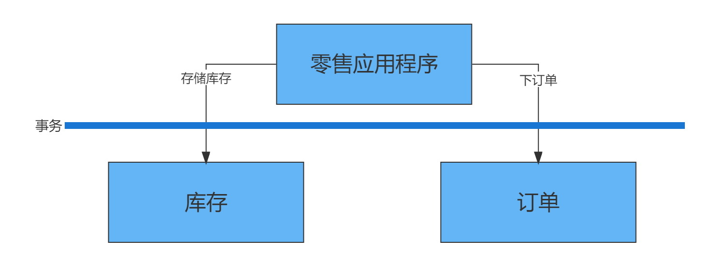
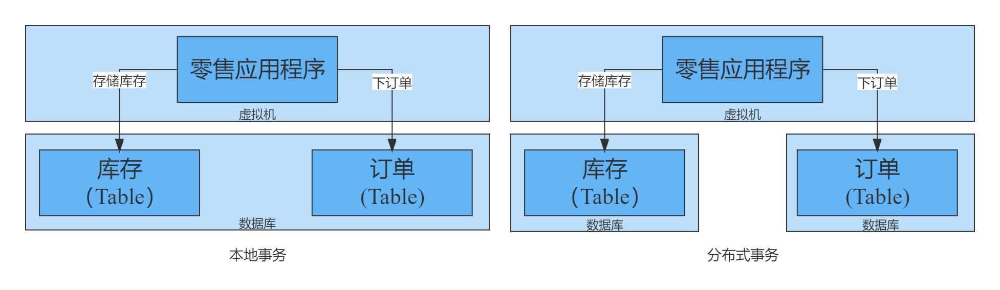
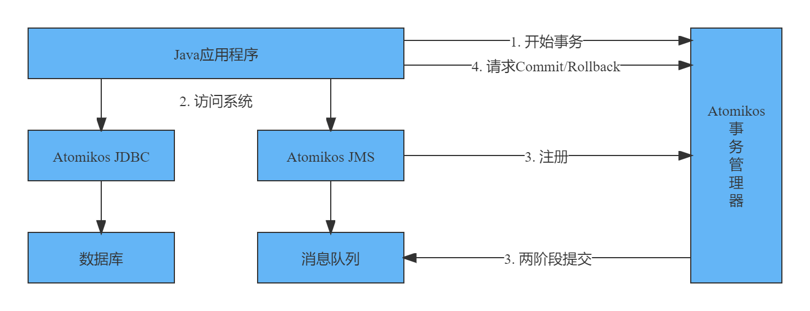

# 分布式事务与Atomikos

## 1. 简介

Atomikos是一个用于Java应用程序的事务库。在本教程中，我们将了解为什么以及如何使用Atomikos。

在此过程中，我们还将介绍事务的基础知识以及我们为什么需要它们。

然后，我们将创建一个简单的应用程序，其中的事务利用来自Atomikos的不同api。

## 2. 基础知识

在讨论Atomikos之前，让我们了解一下事务到底是什么以及与之相关的一些概念。简单地说，事务是一个逻辑工作单元，它的效果在事务外部是完全可见的，或者根本不可见。

让我们举个例子来更好地理解它。典型的零售应用程序扣减库存，然后下订单：



### 2.1. 本地事务vs分布式事务

一个事务可以包含多个独立的操作。这些操作可以在相同的或不同的资源上执行。这里，我们将在一个事务中涉及的参与组件（如数据库）称为资源。

单个资源中的事务称为本地事务，而跨多个资源的事务称为分布式事务或“全局事务”：



### 2.2. XA规范和Java事务API（JTA）

XA是扩展结构，它是分布式事务处理（DTP）的规范。XA的目标是在全局事务异构组件中提供原子性。

XA规范通过被称为是两阶段提交的协议提供完整性。 两阶段提交是一种使用广泛的分布式算法，使提交或回滚分布式事务的决策更加容易。

Java事务API (JTA)是在Java社区进程下开发的Java企业版API。它使Java应用程序和应用程序服务器能够跨XA资源执行分布式事务。

JTA是围绕XA结构建模的，利用了两阶段提交。JTA在事务管理器和分布式事务中的资源之间指定的标准Java接口。

## 3. Atomikos概述

现在我们已经了解了事务的基础知识，我们准备学习Atomikos。在本节中，我们将获悉Atomikos到底是什么，以及它与XA和JTA等概念的关系。我们还将了解Atomikos的架构，并详细介绍其产品。

### 3.1. 什么是Atomikos

正如我们所看到的，JTA为使用分布式事务构建的应用程序提供了Java接口。现在，JTA只是一个规范，不提供任何实现。要运行利用JTA的应用程序，我们需要一个JTA的实现。这样的实现称为事务管理器。

通常，应用程序服务器提供事务管理器的默认实现。例如，在企业Java bean (EJB)的情况下，EJB容器管理事务行为，无需应用程序开发人员的任何显式干预。然而，在许多情况下，这可能不是理想的，我们可能需要独立于应用程序服务器直接控制事务。

Atomikos是一个轻量级的Java事务管理器，它允许使用分布式事务的应用程序是自包含的。本质上，我们的应用程序不需要依赖重量级组件(如应用服务器)来处理事务。这使得分布式事务的概念更接近于云原生架构。

### 3.2. Atomikos架构

Atomikos主要构建为JTA事务管理器，因此，使用两阶段提交协议实现了XA体系结构。让我们看看Atomikos的高级架构：



在这里，Atomikos使跨数据库和消息队列基于两阶段提交的事务更加容易。

### 3.3. Atomikos产品

Atomikos是一个分布式事务管理器，它提供了比JTA/XA命令更多的特性。它有一个开源产品和一个更全面的商业产品：

- **TransactionsEssentials**：Atomikos的开源产品，为使用数据库和消息队列的Java应用程序提供JTA/XA事务管理器。 这对于测试和评估非常有用。  

- **ExtremeTransactions**: Atomikos的商业产品，它提供跨复合应用程序的分布式事务，包括数据库和消息队列之外的REST服务。这对于构建执行极端事务处理(XTP)的应用程序非常有用。

在本教程中，我们将使用TransactionsEssentials库来构建和演示Atomikos的功能。

## 4. 设置Atomikos

如前所述，Atomikos的其中一个亮点是它是一个嵌入式事务服务，这个意味着我们可以在应用程序相同的JVM中允许它。因此，设置Atomikos非常简单。

### 4.1. 依赖

首先，我们需要设置依赖。这里，我需要做的就是在Maven的pom.xml文件中声明`dependencies`。

```xml
<dependency>
    <groupId>com.atomikos</groupId>
    <artifactId>transactions-jdbc</artifactId>
    <version>5.0.9</version>
</dependency>
<dependency>
    <groupId>com.atomikos</groupId>
    <artifactId>transactions-jms</artifactId>
    <version>5.0.9</version>
</dependency>
```

在这种情况下，我们使用Atomikos的JDBC和JMS依赖，但是其他XA-compliant资源也有类似的依赖关系。

### 4.2. 配置

Atomikos提供了几个配置参数，并为每个参数提供了合理的默认值。覆盖这些参数的简单方式是在classpath中提供一个`transactions.properties`文件。我们可以为事务服务的初始化和操作添加几个参数。让我们看一个简单的配置来覆盖创建日志文件的目录：

```properties
com.atomikos.icatch.file=path_to_your_file
```

### 4.3. 数据库

在本教程中，我们将构建一个简单的零售应用程序，就像我们前面描述的那样，预留库存，然后下订单。为简单起见，我们将使用关系型数据库。此外，我们将使用多个数据库来演示分布式事务。另外，这可以很好的扩展其它XA-complaint资源，如消费队列和主题。我们的库存数据库将有一个简单的表来承载产品库存：

```sql
CREATE TABLE INVENTORY (
    product_id VARCHAR(100) PRIMARY KEY,
    balance INT
);
```

并且，我们的订单数据库将有一个简单的表来承载已下单的订单：

```sql
CREATE TABLE ORDERS (
    order_id VARCHAR(100) PRIMARY KEY,
    product_id VARCHAR(100),
    amount INT NOT NULL CHECK (amount <= 5)
);  
```

这是一个非常基本的数据库模式，只对演示有用。但是，需要注意的是，我们的模式约束不允许任何订单的产品数量超过5。

## 5. Atomikos实践

现在，我们准备使用一个Atomikos库来构建我们的分布式事务应用程序。在下面的小节中，我们将使用内置的Atomikos资源适配器来连接后端数据库系统。这是开始使用Atomikos最快最简单的方法。

### 5.1. 实例化UserTransaction

我们将利用JTA `UserTransaction`来划分事务边界。**所有其他与事务服务相关的步骤都将自动处理**。这包括事务服务的注册和删除资源。

首先，我们需要从Atomikos中实例化一个`UserTransaction`：

```java
UserTransactionImp utx = new UserTransactionImp();
```

### 5.2. 实例化Datasource

然后，我们需要从Atomikos中实例化一个`DataSource`。Atomikos提供了两个可用的`DataSource`版本。

第一个是`AtomikosDataSourceBean`，它封装了底层的`XADataSource`：

```java
AtomikosDataSourceBean dataSource = new AtomikosDataSourceBean(); 
```

而`AtomikosNonXADataSourceBean`使用任何常规的JDBC驱动程序类：

```java
AtomikosNonXADataSourceBean dataSource = new AtomikosNonXADataSourceBean();
```

像它的名称所显示的一样，`AtomikosNonXADataSource`是不兼容XA的。因此，使用这样的数据源执行事务是不能保证原子性的。我们为什么使用这个呢？我们可能有一些数据库不支持XA规范。Atomikos并不禁止我们使用这样的数据源，如果在事务中有一个这样的数据源，仍然会尝试提供原子性。这个技术类似于最后的资源策略（Last Resource Gambit），它是二阶段提交过程的变体。

另外，我们需要根据数据库和驱动配置适当的`DataSource`。

### 5.3. 执行数据库操作

一旦配置完成，在我们的应用程序事务上下文中使用DataSource就相当容易了：

```java
public void placeOrder(String productId, int amount) throws Exception {
    String orderId = UUID.randomUUID().toString();
    boolean rollback = false;  

    try {
        utx.begin();
        Connection inventoryConnection = inventoryDataSource.getConnection();
        Connection orderConnection = orderDataSource.getConnection();
        Statement s1 = inventoryConnection.createStatement();
        String q1 = "update Inventory set balance = balance - " + amount + " where product_id ='" + productId + "'";
        s1.executeUpdate(q1);
        s1.close();
        Statement s2 = orderConnection.createStatement();
        String q2 = "insert into Orders values ( '" + orderId + "', '" + productId + "', " + amount + " )";
        s2.executeUpdate(q2);
        s2.close();
        inventoryConnection.close();
        orderConnection.close();
    } catch (Exception e) {
        rollback = true;
    } finally {
        if (!rollback)
            utx.commit();
        else
            utx.rollback();
    }
}
```

这里，我们在事务边界内更新库存和订单的数据库表。这自动提供了这些操作以原子性执行的好处。

### 5.4. 测试事务行为

最后，我们必须能够通过简单的单元测试来测试我们的应用程序，以验证事务行为是否符合预期：

```java
@Test
public void testPlaceOrderSuccess() throws Exception {
    int amount = 1;
    long initialBalance = getBalance(inventoryDataSource, productId);
    Application application = new Application(inventoryDataSource, orderDataSource);
    application.placeOrder(productId, amount);
    long finalBalance = getBalance(inventoryDataSource, productId);
    assertEquals(initialBalance - amount, finalBalance);
}

@Test
public void testPlaceOrderFailure() throws Exception {
    int amount = 10;  
    long initialBalance = getBalance(inventoryDataSource, productId);
    Application application = new Application(inventoryDataSource, orderDataSource);
    application.placeOrder(productId, amount);
    long finalBalance = getBalance(inventoryDataSource, productId);
    assertEquals(initialBalance, finalBalance);
}
```

这里，我们期望一个有效的订单来减少库存，而我们期望一个无效的订单来保持库存不变。请注意，根据我们的数据库约束，任何数量超过五种产品的订单都被认为是无效订单。

这里，我们定义了一个有效的订单来减少库存，一个无效的订单来保持库存不变。请注意，根据我们的数据表约束，任何产品数量超过5的订单被认为是无效订单。

### 5.5. 增强Atomikos使用

上面的示例是使用Atomikos最简单的方法，可能足以满足大多数需求。但是，还有其它方法可以使用Atomikos来构建我们的应用程序。虽然有一些选项使Atomikos易于使用，但其他选项提供了更大的灵活性。选择取决于我们的需求。

当然，JDBC/JMS不一定总是使用Atomikos适配器。我可以选择使用Atomikos事务管理器，同时直接使用`XAResource`。但是，在这种情况下，我们必须显示地使用事务服务来注册和删除XAResource实例。

Atomikos还可以通过专有接口`UserTransactionService`使用更多高级特性。使用这个接口，我们可以显示地注册资源用于恢复。这使我们能够细粒度地控制应该恢复什么资源，如何恢复资源以及何时恢复资源。

## 6. 集成Atomikos

虽然Atomikos提供了对分布式事务的优秀支持，但使用这种低级API并不总是很方便。为了专注于业务领域并避免样板代码的混乱，我们经常需要不同的框架和库的支持。Atomikos支持许多与后端集成相关的流行Java框架。我们将在这里探讨其中一些。

### 6.1. Atomikos与Spring和Datasource

Spring是Java中流行的框架之一，它提供了控制反转（IoC）容器。值得注意的是，它对事务也有极好的支持。它使用面向方面编程（AOP）技术提供了声明性事务管理。

Spring支持多种事务API，包括用于分布式事务的JTA。我们可以在Spring中使用Atomikos作为我们的JTA事务管理器，而不需要付出太多努力。最重要的是，由于Spring，让我们的应用程序对Atomikos几乎是不可知的。

让我们看看如何解决前面的问题，这次是利用Spring。我们将从重写`Application`类开始：

```java
public class Application {
    private DataSource inventoryDataSource;
    private DataSource orderDataSource;
    public Application(DataSource inventoryDataSource, DataSource orderDataSource) {
        this.inventoryDataSource = inventoryDataSource;
        this.orderDataSource = orderDataSource;
    }
    @Transactional(rollbackFor = Exception.class)
    public void placeOrder(String productId, int amount) throws Exception {
        String orderId = UUID.randomUUID().toString();
        Connection inventoryConnection = inventoryDataSource.getConnection();
        Connection orderConnection = orderDataSource.getConnection();
        Statement s1 = inventoryConnection.createStatement();
        String q1 = "update Inventory set balance = balance - " + amount + " where productId ='" +
            productId + "'";
        s1.executeUpdate(q1);
        s1.close();
        Statement s2 = orderConnection.createStatement();
        String q2 = "insert into Orders values ( '" + orderId + "', '" + productId + "', " + amount + " )";
        s2.executeUpdate(q2);
        s2.close();
        inventoryConnection.close();
        orderConnection.close();
    }
}
```

正如我们在这里看到的，大多数与事务相关的样板代码已经被方法级别的单个注释所取代。此外，Spring负责实例化和注入`DataSource`，这是我们的应用程序所依赖的。

当然，我们必须为Spring提供相关配置。我们可以使用一个简单的Java类来配置这些元素:

```java
@Configuration
@EnableTransactionManagement
public class Config {
    @Bean(initMethod = "init", destroyMethod = "close")
    public AtomikosDataSourceBean inventoryDataSource() {
        AtomikosDataSourceBean dataSource = new AtomikosDataSourceBean();

        // Configure database holding order data
        return dataSource;
    }
    @Bean(initMethod = "init", destroyMethod = "close")
    public AtomikosDataSourceBean orderDataSource() {
        AtomikosDataSourceBean dataSource = new AtomikosDataSourceBean();
        // Configure database holding order data
        return dataSource;
    }
    @Bean(initMethod = "init", destroyMethod = "close")
    public UserTransactionManager userTransactionManager() throws SystemException {
        UserTransactionManager userTransactionManager = new UserTransactionManager();
        userTransactionManager.setTransactionTimeout(300);
        userTransactionManager.setForceShutdown(true);
        return userTransactionManager;
    }
    @Bean
    public JtaTransactionManager jtaTransactionManager() throws SystemException {
        JtaTransactionManager jtaTransactionManager = new JtaTransactionManager();
        jtaTransactionManager.setTransactionManager(userTransactionManager());
        jtaTransactionManager.setUserTransaction(userTransactionManager());
        return jtaTransactionManager;
    }
    @Bean
    public Application application() {
        return new Application(inventoryDataSource(), orderDataSource());
    }
}
```

这里，我们为保存库存和订单数据的两个不同数据库配置`AtomikosDataSourceBean`。此外，我们还为JTA事务管理器提供了必要的配置。

现在，我们可以像以前一样测试应用程序的事务行为。同样，我们应该验证有效的订单减少了库存余额，而无效的订单保持不变。

### 6.2. Atomikos与Spring, JPA, 和Hibernate

虽然Spring在一定程度上帮助我们减少了样板代码，但它仍然相当冗长。有些工具可以使在Java中使用关系数据库更加容易。Java Persistence API (JPA)是一个描述Java应用程序中关系数据管理的规范。这在很大程度上简化了数据访问和操作代码。

Hibernate是JPA规范最流行的实现之一。Atomikos很好地支持多种JPA实现，包括Hibernate。和以前一样，我们的应用程序仍然不知道Atomikos和Hibernate，这要感谢Spring和JPA！让我们看看Spring、JPA和Hibernate如何使我们的应用程序更加简洁，同时通过Atomikos提供分布式事务的能力。和之前一样，我们将从重写Application类开始：

```java
public class Application {
    @Autowired
    private InventoryRepository inventoryRepository;
    @Autowired
    private OrderRepository orderRepository;
    @Transactional(rollbackFor = Exception.class)
    public void placeOrder(String productId, int amount) throws SQLException {
        String orderId = UUID.randomUUID().toString();
        Inventory inventory = inventoryRepository.findOne(productId);
        inventory.setBalance(inventory.getBalance() - amount);
        inventoryRepository.save(inventory);
        Order order = new Order();
        order.setOrderId(orderId);
        order.setProductId(productId);
        order.setAmount(new Long(amount));
        orderRepository.save(order);
    }
}
```

正如我们所看到的，我们现在不需要处理任何底层数据库API。然而，要使这个功能发挥作用，我们还需要配置Spring Data JPA类和configuration。我们将从定义我们的领域实体开始：

```java
@Entity
@Table(name = "INVENTORY")
public class Inventory {
    @Id
    private String productId;
    private Long balance;
    // Getters and Setters
}
@Entity
@Table(name = "ORDERS")
public class Order {
    @Id
    private String orderId;
    private String productId;
    @Max(5)
    private Long amount;
    // Getters and Setters
}  
```

接下来，我们需要为这些实体提供存储库：

```java
@Repository
public interface InventoryRepository extends JpaRepository<Inventory, String> {
}
@Repository
public interface OrderRepository extends JpaRepository<Order, String> {
}
```

这些是非常简单的接口，Spring Data使用实际的代码来处理这些接口，以处理数据库实体。

最后，我们需要为库存和订单数据库以及事务管理器提供数据源的相关配置：

```java
@Configuration
@EnableJpaRepositories(basePackages = "com.baeldung.atomikos.spring.jpa.inventory",
                       entityManagerFactoryRef = "inventoryEntityManager", transactionManagerRef =
                       "transactionManager")
public class InventoryConfig {
    @Bean(initMethod = "init", destroyMethod = "close")
    public AtomikosDataSourceBean inventoryDataSource() {
        AtomikosDataSourceBean dataSource = new AtomikosDataSourceBean();
        // Configure the data source
        return dataSource;
    }
    @Bean
    public EntityManagerFactory inventoryEntityManager() {
        HibernateJpaVendorAdapter vendorAdapter = new HibernateJpaVendorAdapter();
        LocalContainerEntityManagerFactoryBean factory = new
            LocalContainerEntityManagerFactoryBean();
        factory.setJpaVendorAdapter(vendorAdapter);
        // Configure the entity manager factory
        return factory.getObject();
    }
}
@Configuration
@EnableJpaRepositories(basePackages = "com.baeldung.atomikos.spring.jpa.order",
                       entityManagerFactoryRef = "orderEntityManager", transactionManagerRef =
                       "transactionManager")
public class OrderConfig {
    @Bean(initMethod = "init", destroyMethod = "close")
    public AtomikosDataSourceBean orderDataSource() {
        AtomikosDataSourceBean dataSource = new AtomikosDataSourceBean();
        // Configure the data source
        return dataSource;
    }
    @Bean
    public EntityManagerFactory orderEntityManager() {
        HibernateJpaVendorAdapter vendorAdapter = new HibernateJpaVendorAdapter();  

        LocalContainerEntityManagerFactoryBean factory = new
            LocalContainerEntityManagerFactoryBean();
        factory.setJpaVendorAdapter(vendorAdapter);
        // Configure the entity manager factory
        return factory.getObject();
    }
}
@Configuration
@EnableTransactionManagement
public class Config {
    @Bean(initMethod = "init", destroyMethod = "close")
    public UserTransactionManager userTransactionManager() throws SystemException {
        UserTransactionManager userTransactionManager = new UserTransactionManager();
        userTransactionManager.setTransactionTimeout(300);
        userTransactionManager.setForceShutdown(true);
        return userTransactionManager;
    }
    @Bean
    public JtaTransactionManager transactionManager() throws SystemException {
        JtaTransactionManager jtaTransactionManager = new JtaTransactionManager();
        jtaTransactionManager.setTransactionManager(userTransactionManager());
        jtaTransactionManager.setUserTransaction(userTransactionManager());
        return jtaTransactionManager;
    }
    @Bean
    public Application application() {
        return new Application();
    }
}
```

这仍然是需要我们做的很多配置。部分原因是我们为两个独立的数据库配置了Spring JPA。此外，我们还可以通过Spring Boot进一步减少这些配置，但这超出了本教程的范围。

跟以前一样，我们可以测试应用程序的相同事务行为。这次没有什么新内容，除了我们现在在Hibernate中使用Spring Data JPA这一事实。

## 7. Atomikos除了JTA

虽然JTA为分布式系统提供了优秀的事务支持，这些系统必须像大多数相关的数据库或消息队列一样是XA-complaint。但是，**如果这些系统中有一个不支持二阶段提交协议的XA规范，JTA就没用了**。有几个资源属于这个类目，特别是在微服务体系结构中。

有几个替代协议支持分布式事务。其中的一个是使用补偿机制的二阶段提交协议的变体。此类事务具有宽松的隔离保证，称为基于补偿的事务。参与者在第一阶段本身提交事务的各个部分，为第二阶段可能的回滚提供补偿处理。

有几种设计模式和算法实现了基于补偿的事务。例如，Sagas就是这样一种优秀的设计模式。然而，它们通常实现起来很复杂，而且容易出错。

Atomikos提供了一种基于补偿事务的变体，称为Try-Confirm/Cancel(TCC)。TCC为事务下的实体提供了更好的业务语义，然而，这只有在参与者提供高级体系结构支持的情况下才可能实现。

## 8. 替代Atomikos

我们已经学习了足够多的Atomikos所提供的特性。此外，Atomikos还提供了一款具有更强大功能的商业产品。然而，在选择JTA事务管理器时，Atomikos并不是唯一的选择。还有其他一些可靠的选择可供选择。让我们看看它们对Atomikos的表现。

### 8.1. Narayana

[Narayana](https://www.narayana.io/)可能是最古老的开源分布式事务管理器之一，目前由Red Hat管理。它已经在整个行业中广泛使用，并且通过社区支持不断发展，并影响了数个规范和标准。

Narayana提供了对各种事务协议的支持，比如JTA、JTS、WebServices和REST等。此外，Narayana可以被嵌入到各种各样的容器中。

与Atomikos相比，Narayana几乎提供了分布式事务管理器的所有特性。在许多情况下，Narayana在应用程序中集成和使用起来更加灵活。例如，Narayana有针对C/C++和Java的语言绑定。然而，这是以增加复杂性为代价的，Atomikos相对更容易配置和使用。

### 8.2. Bitronix

[Bitronix](https://github.com/bitronix/btm)是一个完全的XA事务管理器，提供了JTA API所需的所有服务。重要的是，Bitronix是一个可嵌入的事务库，提供了广泛而有用的错误报告和日志记录。对于分布式事务，这使得检查故障更加容易。此外，它对Spring的事务功能有出色的支持，并且只需要很少的配置。

与Atomikos相比，Bitronix是一个开源项目，没有提供商业上的产品支持。Atomikos商业产品的关键特性是Bitronix所缺乏的，包括对微服务的支持和声明式弹性伸缩能力。

## 9. 总结

总之，在本教程中，我们了解了事务的基本细节。我们了解了什么是分布式事务，以及像Atomikos这样的库如何方便地使用它们。在此过程中，我们利用Atomikos API创建了一个具有分布式事务的简单应用程序。

我们还了解了Atomikos如何与其他流行的Java框架和库一起工作。最后，我们介绍了Atomikos的一些可用替代方案。

本教程的源代码可以在[GitHub](https://github.com/eugenp/tutorials/tree/master/atomikos)上找到。