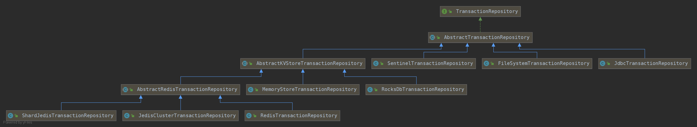

# TCC-transaction

[TOC]

> Note：本文档对tcc-transaction的描述基于spring-cloud实现。

## 快速开始

1、添加依赖

```xml
<dependency>
    <groupId>org.mengyun.ha</groupId>
    <artifactId>tcc-transaction-ha-spring</artifactId>
    <version>1.8.1</version>
</dependency>
```

2、启用`TccTransaction`

```java
@EnableTccTransaction
```

3、配置`TransactionRepository` Bean

```java
@Configuration
public class TccTransactionConfiguration {
    @Bean
    public TransactionRepository transactionRepository(){
        MemoryStoreTransactionRepository repository = new MemoryStoreTransactionRepository();
        repository.setDomain("TCC:FEIGN:CAPITAL:");
        return repository;
    }
}
```

上述3个步骤每个服务都需要配置。

### Order服务

   在`OrderServiceImpl`实现类的Try方法上添加`@Compensable`，并指定confirm方法和cancel方法。

   ```java
@Service
public class OrderServiceImpl extends ServiceImpl<OrderMapper, Order> implements IOrderService {

    @Autowired
    private AccountFeign accountFeign;

    @Autowired
    private IntegralFeign integralFeign;

    @Override
    @Compensable(confirmMethod = "confirmCreateOrder",cancelMethod = "cancelCreateOrder")
    @Transactional
    public void createOrder() {
        accountFeign.deductAmount(null);
        integralFeign.addIntegral(null);
        System.out.println("Order try");
    }

    @Transactional
    public void confirmCreateOrder(){
        System.out.println("Order confirm");
    }
	
    @Transactional
    public void cancelCreateOrder(){
        System.out.println("Order cancel");
    }
}
   ```

 账户服务RPC(Feign)接口

```java
@FeignClient("sadness-tcc-account")
@RequestMapping("/account")
public interface AccountFeign {

    @PutMapping("/deduct")
    void deductAmount(TransactionContext context);
}
```

积分服务RPC(Feign)接口

```java
@FeignClient("sadness-tcc-integral")
@RequestMapping("/integral")
public interface IntegralFeign {

    @PostMapping
    void addIntegral(TransactionContext context);
}
```

### 积分服务

在积分服务的接口`/integral`接收订单服务传递的`TransactionContext`参数，必须声明为`@RequestBody`。

```java
@RestController
@RequestMapping("/integral")
public class IntegralController {

    @Autowired
    private IIntegralService iIntegralService;

    @PostMapping
    public void addIntegral(@RequestBody TransactionContext context){
        iIntegralService.addIntegral(context);
    }
}
```

在`IntegralServiceImpl`实现类的Try方法上添加`@Compensable`，并指定confirm方法和cancel方法。

```java
@Service
public class IntegralServiceImpl extends ServiceImpl<IntegralMapper, Integral> implements IIntegralService {

    @Override
    @Compensable(confirmMethod = "confirmAddIntegral",cancelMethod = "cancelAddIntegral")
    @Transactional
    public void addIntegral(TransactionContext context) {
        System.out.println("Integral try");
    }

    @Transactional
    public void confirmAddIntegral(TransactionContext context) {
        System.out.println("Integral confirm");
    }
	
    @Transactional
    public void cancelAddIntegral(TransactionContext context) {
        System.out.println("Integral cancel");
    }
}
```

### 账户服务

在积分服务的接口`/account/deduct`接收订单服务传递的`TransactionContext`参数，必须声明为`@RequestBody`。

```java
@RestController
@RequestMapping("/account")
public class AccountController {

    @Autowired
    private IAccountService iAccountService;

    @PutMapping("/deduct")
    public void deductAmount(@RequestBody TransactionContext context){
        iAccountService.deductAmount(context);
    }
}
```

在`AccountServiceImpl`实现类的Try方法上添加`@Compensable`，并指定confirm方法和cancel方法。

```java
@Service
public class AccountServiceImpl extends ServiceImpl<AccountMapper, Account> implements IAccountService {

    @Override
    @Compensable(confirmMethod = "confirmDeductAmount",cancelMethod = "cancelDeductAmount")
    @Transactional
    public void deductAmount(TransactionContext context) {
        System.out.println("Account try");
    }
	
    @Transactional
    public void confirmDeductAmount(TransactionContext context) {
        System.out.println("Account confirm");
    }

    @Transactional
    public void cancelDeductAmount(TransactionContext context) {
        System.out.println("Account cancel");
    }
}
```

## tcc-transaction依赖

由于tcc-transaction开源框架没有发布到公共的Maven仓库，因此需要下载源码打包。打包完成之后只需要依赖`tcc-transaction-ha-spring`包即可。

```xml
<dependency>
    <groupId>org.mengyun.ha</groupId>
    <artifactId>tcc-transaction-ha-spring</artifactId>
    <version>1.8.1</version>
</dependency>
```

其他依赖的包会间接引入。

> 间接依赖：
> - tcc-transaction-ha-core
> - tcc-transaction-ha-zookeeper
> - tcc-transaction-core
> - tcc-transaction-spring
> - tcc-transaction-api

## TransactionRepository

`TransactionRepository`是用来保存事务日志，tcc-transaction框架提供了多种Transaction Repository：

1. `SentinelTransactionRepository`：
2. `FileSystemTransactionRepository`：
3. `JdbcTransactionRepository`：
4. `MemoryStoreTransactionRepository`：
5. `RocksDbTransactionRepository`：
6. `RedisTransactionRepository`：
7. `JedisClusterTransactionRepository`：
8. `ShardJedisTransactionRepository`：

框架提供了8种保存事务日志的策略，一般情况下，我们常用的是JdbcTransactionRepository。

类层级结构：

  ```
- AbstractTransactionRepository
  - SentinelTransactionRepository
  - FileSystemTransactionRepository
  - JdbcTransactionRepository
  - AbstractKVStoreTransactionRepository
    - MemoryStoreTransactionRepository
    - RocksDbTransactionRepository
    - AbstractRedisTransactionRepository
      - RedisTransactionRepository
      - JedisClusterTransactionRepository
      - ShardJedisTransactionRepository
  ```

UML图



## RecoverFrequency

`RecoverFrequency`用来通过事务日志恢复执行失败的事务。

TCC-transaction框架提供了`TransactionRecovery`类来执行恢复操作。并提供了`RecoverFrequency`接口设置恢复策略，默认实现`DefaultRecoverFrequency`。

框架通过`@EnableTccTransaction`注解启动恢复任务(定时)，实现策略为`DefaultRecoverFrequency`。开发人员可以创建自定义`RecoverFrequency` Bean覆盖默认恢复策略。

*RecoverFrequency Bean：*

```java
@Bean
public RecoverFrequency recoverFrequency() {
    DefaultRecoverFrequency recoverFrequency = new DefaultRecoverFrequency();
    recoverFrequency.setMaxRetryCount(30);
    recoverFrequency.setRecoverDuration(30);
    recoverFrequency.setCronExpression("0/15 * * * * ? ");
    recoverFrequency.setConcurrentRecoveryThreadCount(
        				Runtime.getRuntime().availableProcessors() * 2);
    recoverFrequency.setFetchPageSize(500);
    return recoverFrequency;
}
```

属性说明：

- **maxRetryCount**

  定时恢复任务对一个事务执行恢复操作的最大重试次数，超过该次数就不会继续重试了，需要人工干预。默认30次。

- **recoverDuration**

  某一事务日志超过recoverDuration时间后没有更新，定时恢复任务尝试对该事务日志进行恢复，根据事务的状态进行Commit或Rollback。默认30s。

- **cronExpression**

  定时恢复任务的执行周期，使用Quartz框架进行任务触发。cronExpression的值为Cron表达式。默认`0/15 * * * * ?`，即每15s执行一次。

- **fetchPageSize**

  定时恢复任务每次以分页的方式从事务日志存储中获取事务日志进行恢复，fetchPageSize设置为每次分页获取的最大事务日志数，默认500。

- **concurrentRecoveryThreadCount**

  定时恢复任务每次分页查询出需要恢复的事务日志时就会开启一个线程执行恢复操作，最多能开启concurrentRecoveryThreadCount个线程。默认`Runtime.getRuntime().availableProcessors() * 2`个，即机器CPU数量的2倍。

  > 框架内部是创建了concurrentRecoveryThreadCount个大小的固定线程池。


## 幂等，空回滚，悬挂


## DashBoard


## 核心实现


- tcc-transaction-admin-web
- tcc-transaction-api
- tcc-transaction-bom
- tcc-transaction-core
- tcc-transaction-dashboard
- tcc-transaction-dependencies
- tcc-transaction-dubbo
- tcc-transaction-ha
- tcc-transaction-parent
- tcc-transaction-spring
- tcc-transaction-tutorial-sample
- tcc-transaction-unit-test


