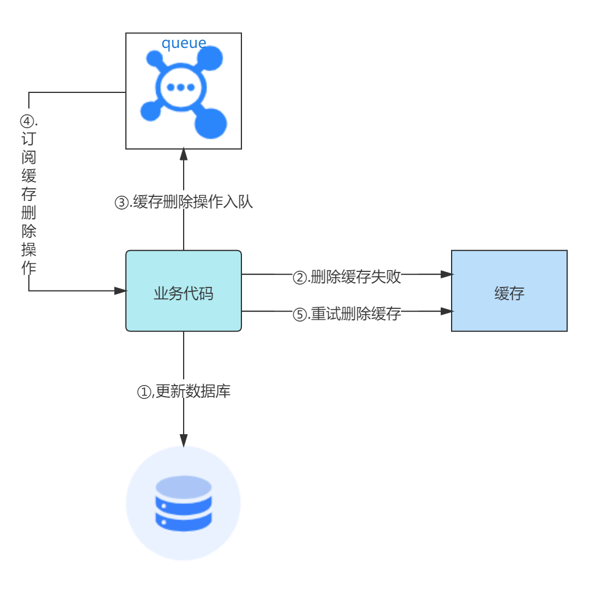
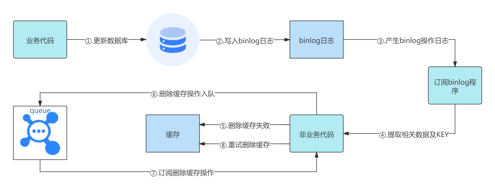
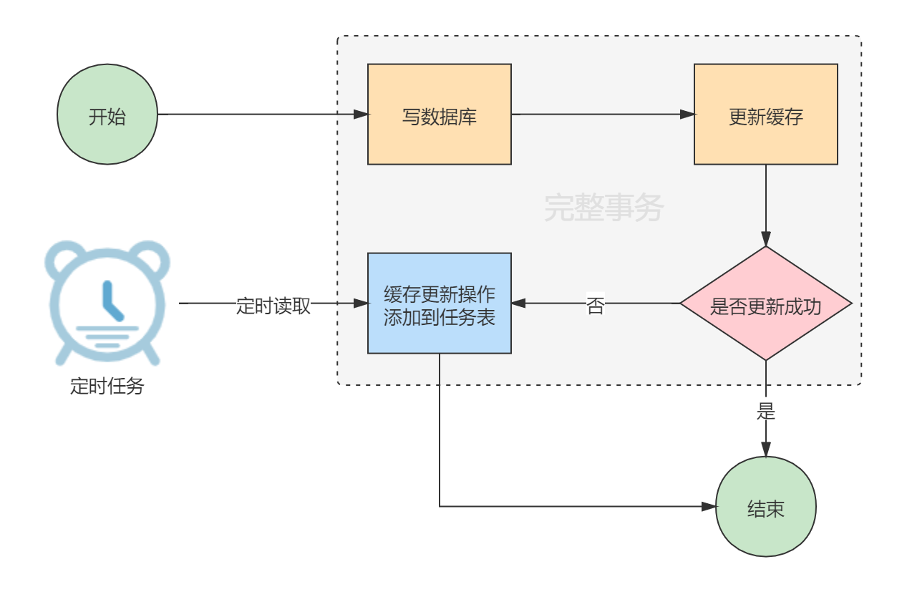
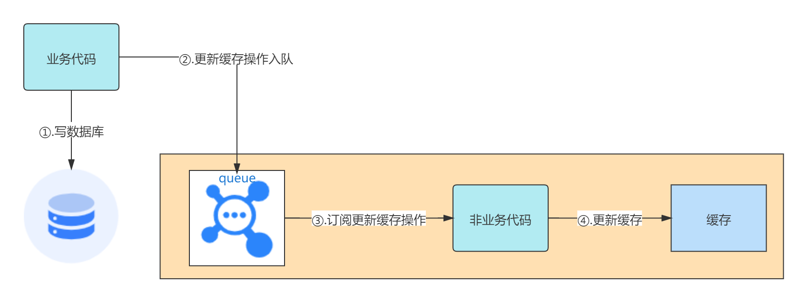

# 分布式缓存一致性

在高并发的系统中，为了提升服务效率，常常会引入缓存银弹。缓存有各种各样的工具及方式，比较耳熟能详的是一些分布式缓存：`Redis`和`Memcached`等。

在缓存与数据库之间不存在事务，引入分布式缓存，就必然会带来一个问题，即如何保证缓存与数据库的一致性，因此我们就需要一些策略来达成这个目标。而要达成这个目标，就必须要考虑一些问题：

- 删除缓存还是更新缓存？
- 先操作缓存还是先操作数据库？
- 如果缓存或者数据库操作失败怎么办？

对于缓存和数据库的操作有三种方式：
1. 先更新数据库，再更新缓存。
2. 先更新数据库，再删除缓存。
3. 先删除缓存，再更新数据库。

## 更新缓存还是删除缓存

更新缓存还是删除缓存？&emsp;&emsp;&emsp;—— **删除缓存**。

**Why?**&emsp;&emsp;有两个方面的考虑：

一、线程不安全

1. 线程A更新了数据库。
2. 线程B更新了数据库。
3. 线程B更新了缓存。
4. 线程A更新了缓存。

线程B后于线程A更新数据库，也就是说线程B所更新数据的才是最新的数据，但是因为并发的原因，线程B先于线程A更新缓存，最终缓存中的数据是旧的数据，此时缓存与数据库就一致了。

二、复杂缓存场景

- 更新了某一个表的字段，但其对应的缓存是由多个表计算而来，如果每次都更新缓存，就会导致性能上的浪费。
- 写多读少的业务场景下，如果每次都更新缓存，就会导致数据没有被读到，但是缓存却被频繁更新。

> 如果业务非常简单，只是对缓存少量值进行简单的更新，那么选择更新缓存也是可以的。但相对而言，删除缓存整体操作上更加简单，并且带来的副作用只是增加了一次Cache miss，因此建议作为通用的处理方式。

## 先操作缓存还是先操作数据库

先操作缓存还是先操作数据库并不是绝对的，不管怎样，先分析一下其所存在的问题，然后在根据实际的场景去决定采用哪种方式。

### 从对业务影响的角度来看

对一个不能保证事务性的操作而言，一定涉及“那个任务先做，那个任务后做”的问题，解决这个问题的方向是：**如果出现不一致，谁先做对业务影响相对较小，谁就先执行。**

先操作缓存还是先操作数据库的不同影响：
- 先删除缓存，再更新数据库：先删除缓存成功，再更新数据库失败，只会引发一次Cache miss。
- 先更新数据库，再删除缓存：先更新数据库成功，再删除缓存失败，则会出现DB中是最新数据，Cache中是旧数据，数据不一致。

从上述对业务影响的角度来看，应该选择“先删除缓存，再更新数据库”。但问题在于缓存与数据库之间的操作不能保证事务性，存在并发问题。因此“先删除缓存，再更新数据库”不一定就是相对较好的选择。

### 从并发角度来看

- 先删除缓存，在更新数据库：
   1. 线程A进行写操作，首先删除了缓存。
   2. 线程B查询发现缓存不存在。
   3. 线程B回源到DB中查询数据。
   4. 线程B将数据写入到缓存中。
   5. 线程A将新值写入数据库。

- 先更新数据库，在删除缓存：
   1. 缓存刚好失效。
   2. 线程A查询发现缓存不存在，回源到DB中，得到一个旧值。
   3. 线程B将新值写入数据库。
   4. 线程B删除缓存。
   5. 线程A将旧值写入缓存。

无论是先操作缓存还是先操作数据库，都会出现并发问题。相对而言“先删除缓存，在更新数据库”出现并发问题的概率远大于“先更新数据库，在删除缓存”，在高并发读写的情况下，“先删除缓存，再更新数据库”出现并发问题基本上是100%的，而“先更新数据库，再删除缓存”则只有在缓存刚好失效的这个时间窗口下才可能出现并发问题。

所以，从并发角度来看，应该采用“先更新数据库，在删除缓存”的策略。

---

到底应该采用哪种策略：

从对业务的影响角度而言，应该采用“先删除缓存，再更新数据库”策略，但其带来的并发问题使它对业务影响较小的优势荡然无存。虽然“先更新数据库，再删除缓存”策略也存在并发问题，但它出现并发问题有两个限制：
1. 刚好处在缓存失效的这个时间窗口下。
2. 步骤3（写）的写数据库操作比步骤2（读）读数据库操作耗时更短。
    只有耗时更短的情况下，才有可能使得步骤4（删除缓存）先于步骤5（写缓存）。一般情况下，数据库的读操作速度远大于写操作（参考读写分离的目的），因此步骤3比步骤2耗时更短的情形很难出现。

因此，**在不想做过多设计，增加太多工作量的情况下，优先选择“先更新数据库，在删除缓存”策略**。

> “先更新数据库，再删除缓存”策略的并发问题发生概率虽然比较小，但并不是绝对不发生，因此，需要为缓存设置过期时间，以使其能够保证最终一致性，是一个托底策略。
>
> 结合托底策略，也可以得出优先选择“先更新数据库，在删除缓存”策略。如果选择“先删除缓存，再更新数据库”策略，出现缓存与数据库不一致的情形频繁出现，虽然有过期时间进行托底，但对程序的影响还是很大。

### 数据库读写分离情况下的并发安全

先删除缓存，在更新数据库：

1. 线程A进行写操作，首先删除了缓存。
2. 线程A将新值写入数据库。
3. 线程B查询发现缓存不存在。
4. 线程B回源到从库DB中查询数据，此时还没有完成主从同步，得到的是旧值。
5. 线程B将数据写入到缓存中。
6. 数据库完成主从同步，从库变为新值。

步骤1和步骤2可以替换过来，就变成了 —— 先更新数据库，在删除缓存：

1. 线程A进行写操作，将新值写入数据库。
2. 线程A删除了缓存。

在数据库读写分离的情况下，无论哪种方式，由主从同步造成的并发安全，都没有太大区别。因此基于数据库读写分离的情况的分析就不能确定该选择哪一种方式比较好了。*关于该情形的解决方案，会在后续的"延时双删"和"删除缓存失败"一节进行说明，不会特指，但基于数据库读写分离的情况下所产生的并发问题可以套用*。

## 延时双删

分析了两种策略的利弊，结论是优先选择“先更新数据库，再删除缓存”策略，但这并不表示“先删除缓存，再更新数据库”策略就是不可行的。有了托底策略，我们只需要**降低其并发问题发生的概率**，也是可以选择“先删除缓存，再更新数据库”策略。

**延时双删策略**

**先删除缓存，再更新数据库：**

1. 先删除缓存
2. 再更新数据库
3. 延时1秒，再次删除缓存

并发流程
   1. 线程A进行写操作，首先删除了缓存。
   2. 线程B查询发现缓存不存在。
   3. 线程B回源到DB中查询数据。
   4. 线程B将数据写入到缓存中。
   5. 线程A将新值写入数据库。
   6. 线程A延时了1秒，再次删除缓存。

> 步骤4和步骤5可以交换。

**先更新数据库，再删除缓存：**

1. 先更新数据库
2. 再删除缓存
3. 延时1秒，再次删除缓存

并发流程
   1. 缓存刚好失效。
   2. 线程A查询发现缓存不存在，回源到DB中，得到一个旧值。
   3. 线程B将新值写入数据库。
   4. 线程B删除缓存。
   5. 线程A将旧值写入缓存。
   6. 线程B延时1秒，再次删除缓存。

> **注意**
>
> 延时双删策略仅仅是降低了并发问题产生的概率，但只要不能保证事务性，并发问题就一定会产生的。延时双删策略是有托底策略保障最终一致性的。
>
> 下面是采用了延时双删策略也出现并发问题的情形：
>
> - 先删除缓存，再更新数据库
>    1. 线程A进行写操作，首先删除了缓存。
>    2. 线程B查询发现缓存不存在。
>    3. 线程B回源到DB中查询数据。
>    4. 线程A将新值写入数据库。
>    5. 线程A延时了1秒，再次删除缓存。
>    6. 线程B将数据写入到缓存中。
>
> 不知道啥原因，线程B就是很慢，线程A即使延迟删除了，线程B也在线程A延迟删除之后才进行写缓存操作。
>
> - 先更新数据库，再删除缓存
>    1. 缓存刚好失效。
>    2. 线程A查询发现缓存不存在，回源到DB中，得到一个旧值。
>    3. 线程B将新值写入数据库。
>    4. 线程B删除缓存。
>    5. 线程B延时1秒，再次删除缓存。
>    6. 线程A将旧值写入缓存。
>
> 也是不知道啥原因，线程A就是很慢，线程B即使延迟删除了，线程A也在线程B延迟删除之后才进行写缓存操作。

**问题**
1. 延时时间如何确定？
    需要自行评估读操作的逻辑耗时，然后写操作的休眠时间在读操作的逻辑耗时的基础上再加上几百毫秒即可。如果数据库是读写分离，那么还要加上数据库主从同步的耗时评估。
    
2. 同步延时双删策略，吞吐量降低如何处理？
    第二次删除操作新启一线程异步处理。

## 后删除缓存解决方案

到目前为止，我们通过延时双删降低了并发问题产生的概率，并且提供了托底策略保证了最终一致性。虽然不能保证强一致性，但看起来问题已经解决了。但还有一个很关键的问题没有考虑到：如果缓存删除失败了怎么办？缓存删除失败在集群节点较多的情况下出现的概率也是很高的，比如节点宕机，网络抖动等。

有两种解决方案：
1. 异步消息队列。
2. MySQL binlog订阅。

### 异步消息队列

异步消息队列方案流程图如下：

异步消息队列方案流程：
1. 更新数据库数据，然后删除缓存。
2. 因为未知原因，删除缓存失败。
3. 将需要删除的缓存Key及相关信息发送至MQ队列。
4. 应用程序订阅该消息进行消费。
5. 继续重试缓存删除操作，直到成功。

缺点：

- 对业务代码造成大量入侵。虽然可以将订阅MQ和重试的操作另起服务完成，但检测缓存删除失败和发送缓存Ket至MQ队列的操作是必须要嵌入到业务代码中。
- 如果删除缓存失败，在将消息发送到MQ之前，恰好此时应用重启了，那么将丢失此缓存删除消息。

### MySQL binlog订阅

MySQL binlog方案流程图如下：

MySQL binlog方案流程：
1. 更新数据库数据。
2. MySQL写入binlog日志。
3. 订阅binlog日志，提取出需要执行删除缓存操作相关的数据以及Ker。
4. 另起一段非业务应用程序，读取该信息。
5. 尝试删除缓存操作。
6. 如果缓存删除成功，操作结束。
7. 缓存删除失败，将需要删除的缓存Key发送至MQ队列。
8. 非业务应用程序订阅该消息进行消费。
9. 继续重试缓存删除操作，直到成功。

此方案相对较重，但对于研发人员而言可以不用关注缓存层面，容易形成统一的解决方案。

## 更新缓存解决方案

虽然我们在已经在“更新缓存还是删除缓存”一节已经说明了一般情况下应该采用删除缓存策略，因为这样更简单，问题更少。但并不表示更新缓存就一定是不好的，在有些业务场景下，例如高并发的秒杀系统，如果采用删除缓存策略，那么可能存在的一个情况是：一个写操作删除了缓存，此时大量的读请求发现缓存不存在，然后回源到数据库，造成了缓存击穿，结果数据库压力增大或崩溃了。在这种情况下，采用更新缓存策略就是必要的。

### 基于定时任务实现

增加一个缓存更新任务表，用于记录要更新的缓存操作，然后通过定时任务读取该表，更新缓存。

流程图：

流程：

1. 写数据库。
2. 尝试更新缓存。
3. 如果缓存更新成功，则操作完成。
4. 如果缓存更新失败，则将缓存更新操作添加到任务表。
5. 定时任务读取任务表，更新缓存，如果失败则重试。

> **注意：**
>
> - 写数据库和添加到任务表要是一个完整的事务。
>
> - 写操作1先于写操作2，假设都更新缓存失败，要写入任务表，在并发情况下，写操作2可能先于写操作1写入任务表，定时任务读取时就会产生错误顺序，导致缓存脏数据。
>
>   解决方案：
>
>   写数据库（更新-写操作）时，要基于乐观锁进行更新，当缓存更新失败要写入任务表时，要带上对应的版本号，然后定时任务根据版本号来决定是否要执行当前更新缓存的操作（与缓存的版本号对比）。

### 基于消息队列实现

流程图：

流程：

1. 写数据库。
2. 将更新缓存的相关信息入队。
3. 缓存更新代码订阅MQ消息。
4. 更新缓存。

> **注意：**
>
> 消息队列可以保证缓存一定更新成功，但是又带来了新的问题：
>
> 写操作1先于写操作2，但因为网络抖动等原因，写操作2先于写操作1入队，消费消息的时候，先消费写操作2的缓存更新，再消费写操作1的缓存更新，产生了脏数据库。
>
> 解决方案：
>
> 1. 缓存值携带数据版本号或者时间戳。
> 2. 更新缓存的消息中携带数据版本号或者时间戳。
> 3. 更新缓存时，先读取缓存，只有当MQ消息中的数据版本号或者时间戳大于缓存值的数据版本号或者时间戳时，才进行缓存更新。

基于消息队列的实现不在业务代码中尝试更新缓存。之所以基于定时任务的实现会在业务代码中尝试更新缓存，是因为当缓存更新失败要插入任务表，而缓存的更新操作和插入任务表的操作之间的效率及性能实在说不上谁更好，因此尝试更新缓存是一个更优的操作，因为大部分情况下更新缓存操作都能够成功的，与直接插入任务表相比，它的实时性更高。而基于消息队列的实现就不一样了，发送消息队列的性能更高，是一个真正意义上的异步操作，在这里是要追求性能是更优的选择。

> 消息队列不是特指MQ，也可以是基于堆内存的任务队列。

### 异步更新缓存的并发问题

无论是基于定时任务实现，还是基于基于消息队列实现，最终都需要异步的对缓存进行更新，前面已经通过版本号解决了并发下的顺序问题。然而在更新缓存的时候都是**先读取缓存，对比版本号或时间戳，大于才进行更新**，这里有三步：读取，对比，更新是不具有事务性和原子性的，因此也会有并发问题。

出现问题的流程如下：

1. 现有缓存值`user=Xaver[version:2]`。
2. 线程1消费MQ消息`user=Xaver[version:3]`更新缓存。
3. 线程2消费MQ消息`user=Xaver[version:4]`更新缓存。
4. 线程1和线程2都同时读取到缓存值`user=Xaver[version:2]`。
5. 线程1判断版本号3大于2；线程2判断版本号4大于2；
6. 线程2更新缓存`user=Xaver[version:4]`。
7. 线程1更新缓存`user=Xaver[version:3]`。
8. 最终结果`user=Xaver[version:3]`。

正确的结果应该是`user=Xaver[version:4]`，但却是`user=Xaver[version:3]`。因此**还是需要引入分布式锁或`CAS`**保证并发安全（Redis可以通过`Lua`脚本完成版本比较和更新操作）。

## 先删除缓存解决方案

对于“先删除缓存，在更新数据库”策略来说，不用考虑删除缓存删除失败的问题，因为只会造成一次cache miss。但其并发问题却不能不考虑，虽然前面已经提供了“延时双删”的解决方案，但此方案的目的仅仅降低并发问题产生的概率，不能完全避免。而后删除缓存和更新缓存的策略都有相应的解决方案，虽然也只是保证最终一致性，但不管怎样，并发问题是解决了。对于先删除缓存的策略而言，“延时双删”虽然降低了概率，但一旦产生了缓存不一致的问题，就只能等待缓存时间过期而达到最终一致了，如果缓存是无有效期的，那这个问题就很严重了。而异步重试方案是没有意义的（它的语义可以理解为缓存一定会删除成功，但对于其相关的并发问题没有任何改善），因此基于互斥锁的同步读写方案就是必要的解决方式：

- 写操作时，在删除缓存之前获取分布式锁。
- 读操作时，如果缓存值不存在，获取分布式锁。

当然，互斥同步的效率自然可想而知。

## 最终一致性

一致性就是数据保持一致，在分布式系统中，可以理解为多个节点中数据的值是一致的。同时，一致性也是指事务的基本特征或特性相同，其他特性或特征相类似

一致性又可以分为强一致性与弱一致性。

1. 强一致性
   强一致性可以理解为在任意时刻，所有节点中的数据是一样的。同一时间点，你在节点A中获取到key1的值与在节点B中获取到key1的值应该都是一样的。
2. 弱一致性
   弱一致性包含很多种不同的实现，分布式系统中广泛实现的是最终一致性。
3. 最终一致性
   所谓最终一致性，是弱一致性的一种特例，保证用户最终能够读取到某操作对系统特定数据的更新。随着时间的迁移，不同节点上的同一份数据总是在向趋同的方向变化。也可以简单的理解为在一段时间后，节点间的数据会最终达到一致的状态。对于最终一致性最好的例子就是DNS系统，由于DNS多级缓存的实现，所以修改DNS记录后不会在全球所有DNS服务节点生效，需要等待DNS服务器缓存过期后向源服务器更新新的记录才能实现。只要求一个对象的全部副本的最后结果是相同的和正确的，而不要求其中间状态是一致的。

## 总结
- 在不想做过多设计，增加太多工作量的情况下，优先采用“先更新数据库，在删除缓存”策略。
- 为缓存设置过期时间，保障最终一致性。
- 如果不考虑缓存删除失败的问题，建议增加延时双删策略。
- 如果要考虑缓存删除失败的问题，建议采用MySQL binlog策略。

## 参考资料
[Redis数据更新，是先更新数据库还是先更新缓存？](https://mp.weixin.qq.com/s/m_xjZC2pkmvMUakURtug0g)

[如何保证缓存与数据库的双写一致性？](https://mp.weixin.qq.com/s/Tjedp_4OVk1b7vKz5Tk0sA)

[缓存更新的套路](https://coolshell.cn/articles/17416.html)

