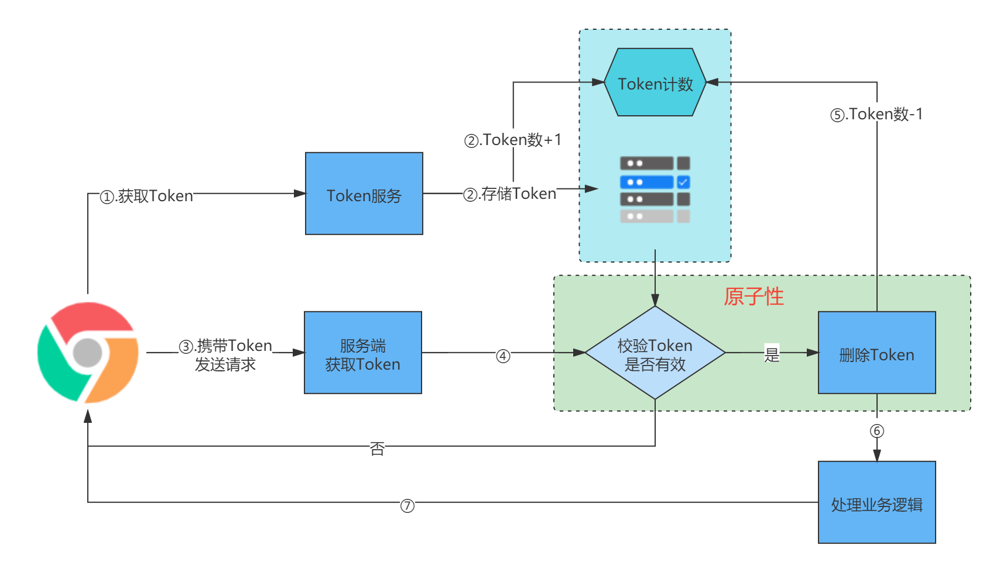

# 幂等性设计

## 什么是幂等？

幂等（idempotent、idempotence）是一个数学与计算机学概念，常见于抽象代数中。

在编程中，一个幂等操作的特点是其任意多次执行所产生的影响均与一次执行的影响相同。幂等函数或幂等方法，是指可以使用相同的参数重复执行，并能获得相同结果的函数。这些函数不会影响系统状态，也不用担心重复执行会对系统造成改变。例如“`setTure()`”函数就是一个幂等函数，无论多少次执行，其结果都是一样的。更复杂的操作的幂等保证是利用唯一交易号（流水号）实现。

## 为什么要做幂等？

考虑如下场景：

- 场景1：在高并发场景下，订单的创建常常会通过MQ消息的形式进行异步调用，由另外的业务服务订阅该消息，创建订单。像这样的分布式系统一定存在网络问题，此时，业务服务消费消息创建订单，并且消费成功，但由于网络抖动的原因，没有响应给MQ处理成功的反馈，MQ认为业务服务没有消费成功，然后业务服务又消费一次 —— 显然，不能再创建订单了。

- 场景2：用户点击按钮发布一个评论，由于用户的网络不是很好，第一次点击按钮发布评论迟迟没有响应，然后用户又连续点击了好几次才创建成功 —— 虽然点击了好几次，但显然不能创建好几个相同的评论。

如果不做幂等，就会创建两个相同的订单，发布好几个相同的评论。因此，**幂等性是在我们做系统设计时必须要考虑的问题**。

---

需要幂等性的场景：
- 网络波动
- MQ消息重试
- 用户重复点击
- 应用失败或超时重试机制

## 如何实现幂等？

对于如何实现幂等，没有一个银弹来保证所有操作的幂等性，还是要具体问题具体分析。不过在软件实践中，对一些常出现的场景也有一些解决方案。下面将会列举一些具体天然幂等性的场景以及一些幂等性的解决方案。

HTTP协议幂等性（天然具有幂等性）：

1. 查询操作（`GET`），天然具有幂等性。无论是查询1次还是查询N次，都不会影响系统的状态，所以是幂等的。
2. 删除操作（`DELETE`），天然具有幂等性。无论是删除1次还是查询N次，最终结果都是一样的，所以是幂等的。
3. `PUT`操作，在HTTP协议中，PUT操作的语义是创建否则更新 —— 如果对应的数据不存在，则创建，否则更新。无论是PUT 1次还是PUT N次，最终结果都是一样的，所以是幂等的。

***

一些幂等性的解决方案：

_前端层面的控制_
1. 按钮只能点击一次
   
   用户点击按钮之后按钮变灰或者显示Loading，防止用户重复点击。

1. 重定向

   用户点击按钮提交之后跳转到另一个成功或失败的页面，避免用户刷新页面重复提交。

1. 客户端Token控制

   Token机制可以防止页面重复提交，防止产生脏数据或者乱数据，也可以减少并发量，实乃十分有益的一件事。

   场景：例如由于页面迟迟不能响应，用户快速重复点击按钮。

   方案：
   1. 数据提交之前向服务端申请Token。
   2. 服务端生成Token，并将Token存储在缓存中，然后向客户端响应Token。
   3. 客户端携带Token发送请求。
   4. 服务端校验Token是否有效，并删除Token（验证和删除要保证原子性）。
   5. 处理业务逻辑 - 成功或失败。

   架构图：
   
   
   
   >    **注意事项：**
   >    - Token控制不仅可以用于客户端与服务端，也可以应用与服务端与服务端。
   >    - Token需要有数量限制，避免有恶意请求无限量获取Token，占用资源。
   >    - 验证和删除Token要保证原子性，因为在并发情况下，如果不保证原子性，可能出现多个请求都验证成功。在使用Redis存储Token时，可以通过删除操作来校验Token，删除成功即代表校验通过。
   >    - 最后处理业务逻辑无论成功或失败都不要再返回新的Token。因为客户端的需求不同，有些需求只能请求一次，自然不需要再返回新的Token；而有些需求可以再次请求（不是重复请求），那么重新获取Token，走一遍流程即可。
   >    - Token需要设置过期时间，以保证异常情况下数据最终能够被清理。

***

_后端层面的控制_
1. 唯一索引

   使用唯一索引避免数据重复插入，可以避免脏数据。 

2. 防重表

   增加一张防重表，防重表中包含了当前插入数据的唯一标识，并为其设置唯一索引。在执行业务操作时，首先向防重表中插入数据，然后处理业务逻辑，处理完成之后删除防重表中的数据。如果在处理过程中，有相同的数据过来，因为防重表中已经存在该唯一标识的数据，由于唯一索引，将插入失败，因此直接返回，从而保证了幂等性。实际上应用的是数据库的唯一索引和插入操作的排他锁特性。

   > 适用于当需要去重的地方比较多，可以增加一个防重表为它们提供防重功能。

1. 乐观锁

   乐观锁主要针对更新数据的幂等性控制，为每一条需要更新的数据携带一个版本号，更新的时候只有当对应数据的版本号小于或等于当前数据携带的版本号时，才能真正更新成功。如果对应数据的版本号大于数据携带的版本号时，表明当前数据是旧的数据，直接拒绝后续操作。

   _数据库乐观锁操作SQL：_
   ```sql
   UPDATE table_name SET field='value',`version`=`version`+1 WHERE id=#{id} and version <= #{version};
   ```
   
1. 悲观锁

   通过悲观锁保证原子性。例如Java语言特性的`synchronized`关键字，`ReentrantLock`可重入锁，`AQS`，`CAS`等。

1. 分布式锁

   在分布式系统中，基于唯一索引，单机下的悲观锁等特性的方案就无效了，因此可以引入分布式锁，保证其原子性。

6. 状态机（待完善）

   在设计单据相关的业务，或者是任务相关的业务，肯定会涉及到状态机，就是业务单据上面有个状态，状态在不同的情况下会发生变更，一般情况下存在有限状态机，这时候，如果状态机已经处于下一个状态，这时候来了一个上一个状态的变更，理论上是不能够变更的，这样的话，保证了有限状态机的幂等。

7. select → compare

   查询并比较，一般我们避免重复操作的逻辑是：
   1. 查询对应的状态是否是未操作的状态。
   2. 如果是未操作的状态，则进行操作。
   3. 如果不是未操作的状态，则直接返回。

   > 这里所说的“操作”比较笼统，可以指代任何对应的场景。例如插入操作，为避免重复插入，先查询对应的数据是否存在，如果不存在，则插入，反之，则返回。

   避免重复操作的流程从逻辑上来说，是可以保证幂等的，但是在高并发场景下，幂等性就被破坏了。因为整个流程是*查询-判断-操作*三步操作，三个步骤并不具有原子性。当并发时，可能出现两个请求都查询并判断对应的数据不存在，从而插入重复的脏数据，破坏了幂等性。因此我们可以通过保证其原子性进而保证其幂等性，即结合方案Token控制、防重表、状态机、悲观锁和分布式锁等方案。

## 总结

**幂等性设计是在做一个软件设计时首要考虑的问题**。尤其是像支付宝，互联网金融公司等涉及资金的系统，既要保证高效，也要保证准确，不能出现重复扣款，汇款等情况。

**对于幂等性的控制，没有一个银弹来解决所有问题，还是要具体问题具体分析**。

## 参考资料

* [瞬间几千次的重复提交，我用 SpringBoot+Redis 扛住了！](https://mp.weixin.qq.com/s/go98iyx4JrBNPhMm8HlyPg) —— Token的校验和删除之间不具有原子性，存在并发问题。