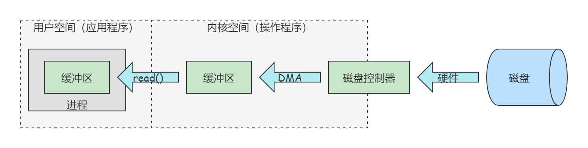
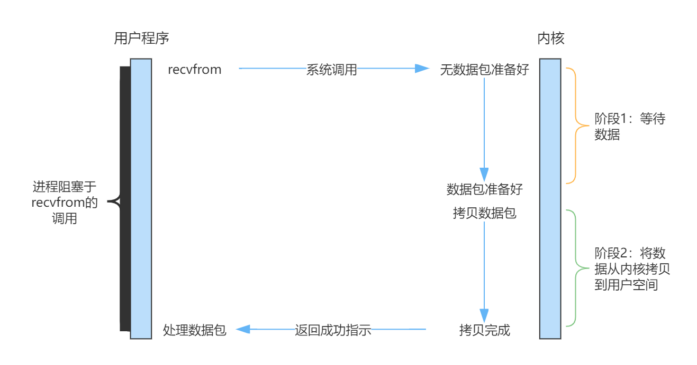
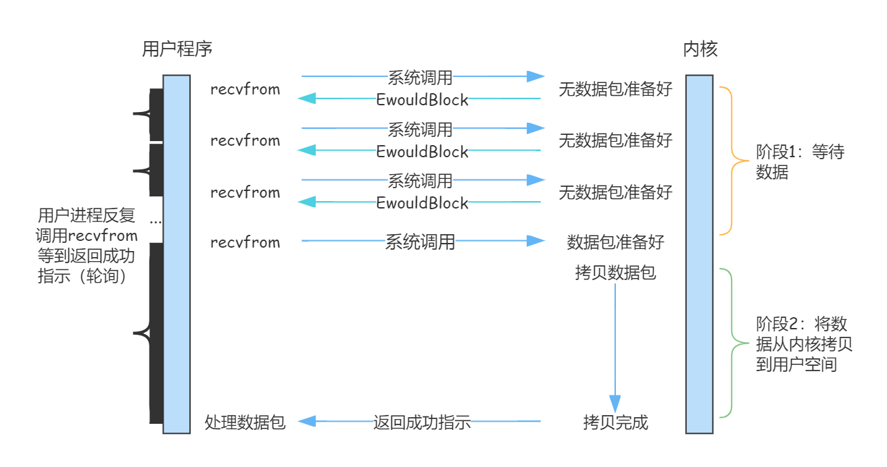
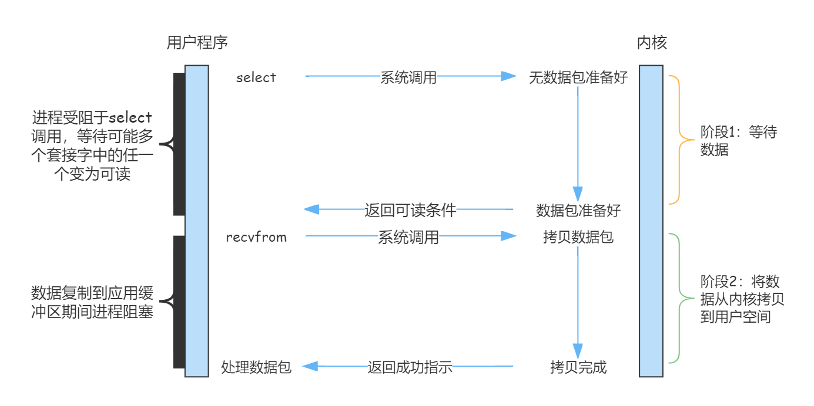

# I/O模型

前言

### 什么是I/O

在UNIX世界中，一切皆文件。文件就是一串二进制流，其实不管是Socket，还是FIFO、管道、终端。对于计算机而言，一切都是文件，一切都是流。在信息的交换过程中，计算机都是对这些流进行数据的收发操作，简称I/O操作（Input and Output）。例如从流中读入数据，系统调用Read；写入数据，系统调用Write。计算机对流的操作是由操作系统内核创建相应的文件描述符（File Descriptor，FD）来标识，一个FD就是一个非负整数，所以对这个整数的操作就是对这个文件（流）的操作。

I/O有内存I/O、网络I/O、磁盘I/O三种。

### I/O交互流程

用户进程中一次完整的I/O交换流程分为两个阶段：

1. 首先由磁盘经过内核空间，由操作系统处理。
2. 由内核空间到用户空间，由应用程序处理。

交互流程如下图所示：

对于一个Read操作而言，进程I/O系统调用后，内核会先看缓冲区中有没有相应的缓存数据，如果没有再到设备中读取。因为设备I/O一般速度较慢，因此需要等待。当内核缓冲区有数据时则直接复制到进程空间。所以，一个网络Read操作通常包含两个不同的阶段：

1. 数据准备阶段：等待网络数据到达网卡，然后将数据读取到内核缓冲区。
2. 数据拷贝阶段：从内核缓冲区复制数据，然后拷贝到用户空间。

## I/O模型

要想提高I/O的效率，就需要减少I/O的等待时间。因此发展出五种I/O模型：阻塞I/O模型、非阻塞I/O模型、多路复用I/O模型、信号驱动I/O模型和异步I/O模型。其中，前4中被称为同步IO。

### 1. 阻塞I/O模型

当用户进程调用recvfrom时，常常内核缓存的数据还没有准备好，此时需要等待内核准备好缓存数据，并将其拷贝到用户空间。此时用户进程才可能使用数据，在这个过程中，用户进程是被阻塞的。

### 2. 非阻塞I/O模型

与阻塞I/O模型不同的是在数据准备阶段，当用户进程发起recvfrom调用时，如果数据包没有准备好，内核不阻塞，而是直接返回error。而一旦数据包准备好，将拷贝数据，内核阻塞。对于用户进程而言，在数据准备阶段，发起recvfrom调用将马上会获得结果，而不需要等待。用户进程通过轮询的方式调用recvfrom以确认数据包是否准备好。

### 3. 多路复用I/O模型

多路复用I/O模型需要至少有一个复用器（Selector），多个I/O可以注册到一个Selector上，当用户进程调用Selector时，Selector会监听所有注册进来的I/O。如果Selector监听的所有I/O在内核缓冲区中都没有数据可读，那么调用select将会阻塞，而当任一I/O在内核缓冲区中有可读数据时，select调用将会返回。而后，调用select的进程可以自己，也可以另外通知其他进程再次发起recvfrom系统调用（读操作）。

多路复用I/O模型与阻塞I/O模型本质上没有什么不同，甚至性能还要更差一些，因为这里需要两个系统调用（select和recvfrom）。而阻塞I/O模型只有一次系统调用（recvfrom）。多路复用I/O模型的优势在于，其可以同时处理多个I/O连接，而不是相比阻塞I/O模型可以处理的更快。因此，在连接数不是很多的Web Server，使用select/epoll并不一定比使用多线程的阻塞I/O性能更好。

### 4. 信号驱动I/O模型

### 5. 异步I/O模型

IO模型特性总结：

|             | 特点                                                         | 典型应用                           | 优点                                                         | 缺点                                                         |
| ----------- | ------------------------------------------------------------ | ---------------------------------- | ------------------------------------------------------------ | ------------------------------------------------------------ |
| 阻塞I/O     | I/O在执行的两个阶段（数据准备和数据拷贝）都会被阻塞。        | 阻塞Socket，Java BIO               | ● 进程阻塞不消耗CPU资源，及时响应每个操作。 ● 实现难度低，开发应用较容易。 ● 适合并发量小的网络应用开发。 | ● 不适合高并发，因为请求I/O会阻塞进程。 ● 需要为每一个请求分配一个进程/线程，系统开销大。 |
| 非阻塞I/O   | 用户进程需要不断主动询问内核（Kernel）数据准备好没有。       | Socket设置NON_BLOCK                | ● 实现难度低，但相对阻塞I/O难。                              | ● 进程轮询调用。消耗CPU资源 ● 适合并发量较小，且不需要及时响应的网络应用开发。 |
| 多路复用I/O | 对于每一个socket，一般都设置成非阻塞，但是整个用户进程其实是一直被阻塞的，只不过进程是被select函数阻塞，而不是被Socket I/O阻塞。 | Java NIO、Nginx(epoll/poll/select) | ● 专一进程解决多进程阻塞问题，性能好，Reactor模式。 ● 适合高并发服务应用开发，一个进程/线程响应多个请求。 | 实现和开发难度较大                                           |
| 信号驱动I/O |                                                              |                                    |                                                              |                                                              |
| 异步I/O     |                                                              |                                    |                                                              |                                                              |

