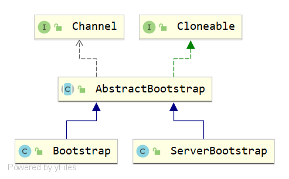
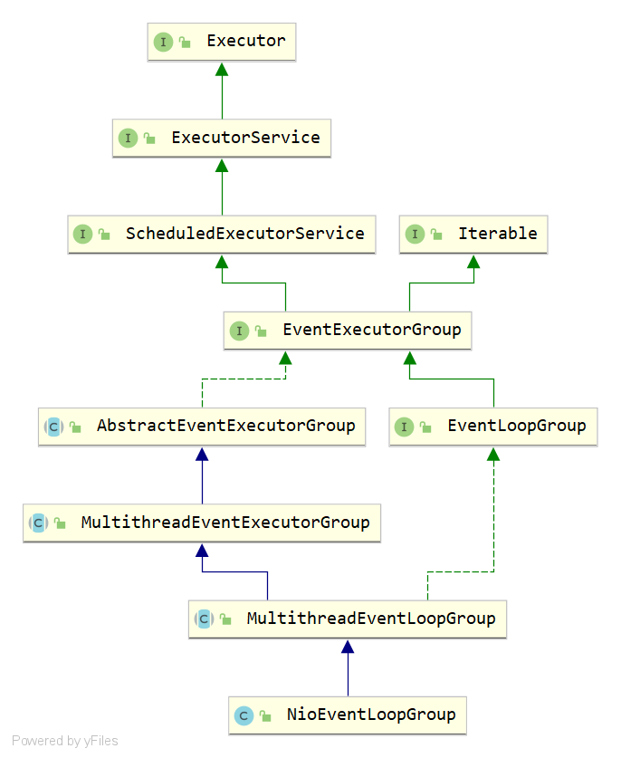
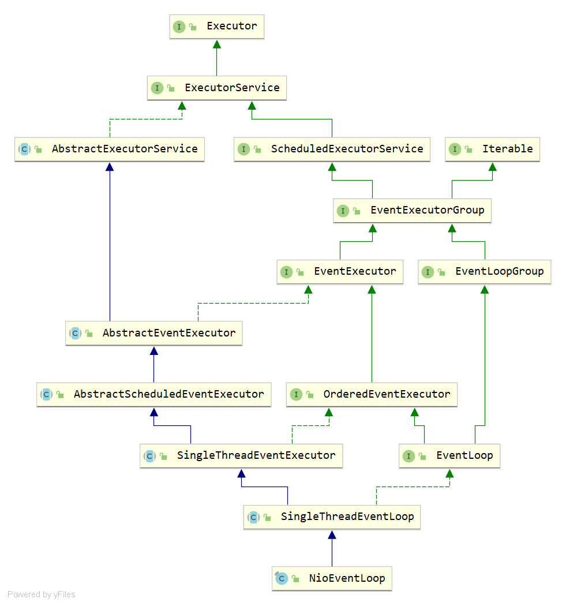
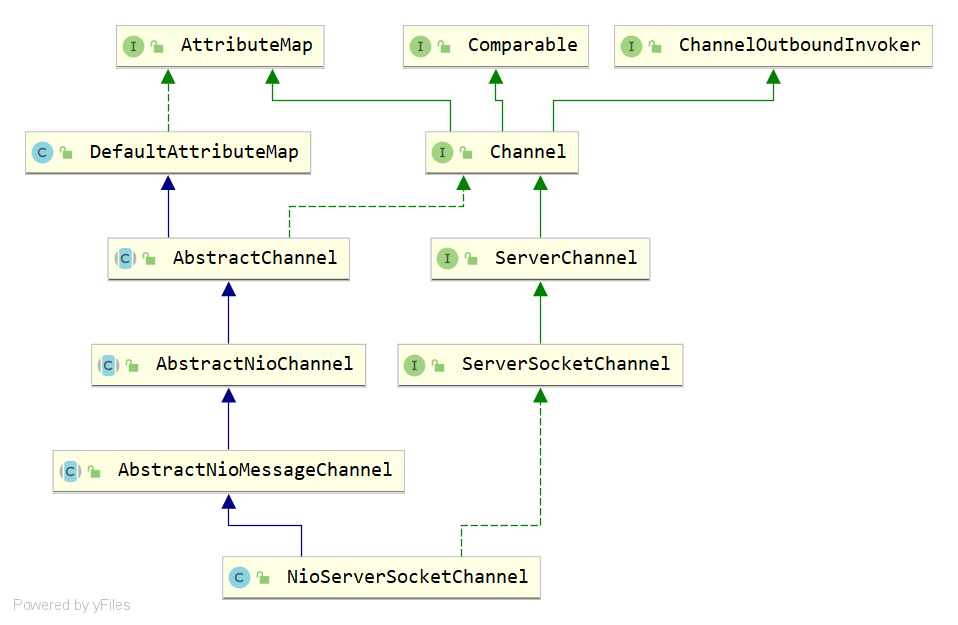
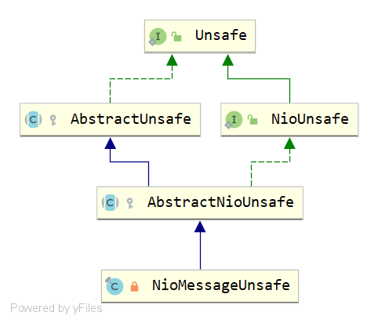

```
AbstractNioMessageChannel
```

# Netty


Netty架构模型


注册调用链
ServerBootstrap → EventLoopGroup → EventLoop → Unsafe
绑定调用链
ServerBootstrap → Channel → Pipeline → ChannelOutboundHandler → Unsafe


## Boot




## ByteBuf


## ChannelHandler


## ChannelPipeline

## EventLoopGroup




## EventLoop





## Channel




- DefaultAttributeMap：默认的AttributeMap实现，对每个桶使用简单的同步，以尽可能地降低内存开销。
- AbstractChannel：一个骨架通道实现。
- AbstractNioChannel：一个骨架通道实现。 Channel实现的抽象基类，使用基于Selector的方法。 
- AbstractNioMessageChannel：AbstractNioChannel基类，用于操作消息的通道。 
- NioServerSocketChannel：一个io.netty.channel.socket.ServerSocketChannel实现，它使用基于NIO选择器的实现来接受新连接。 


- AttributeMap：保存可以通过AttributeKey访问的属性。 实现必须是线程安全的。 
- ChannelOutboundInvoker：
- Channel
- ServerChannel：接受传入连接尝试并通过接受它们创建子通道的通道。 ServerSocketChannel就是一个很好的例子。 （这是一个标记接口）。
- ServerSocketChannel：一个TCP/IP ServerChannel，它接受传入的TCP/IP连接。 


### Channel

连接到网络套接字或能够进行读、写、连接和绑定等I/O操作的组件的一种连接。 

通道提供一个用户:

- 通道提供给用户:通道的当前状态(例如:是否打开? 它是连接吗?) 
- 通道的配置参数(如接收缓冲区大小)， 
- 通道支持的I/O操作(如读、写、连接和绑定)，以及 
- ChannelPipeline，它处理所有与通道相关的I/O事件和请求。 

所有I/O操作都是异步的。

Netty中的所有I/O操作都是异步的。 这意味着任何I/O调用将立即返回，而不保证所请求的I/O操作在调用结束时已经完成。 相反，当请求的I/O操作成功、失败或取消时，将返回一个ChannelFuture实例通知您。 

通道是分层的

Channel可以有父级，这取决于它是如何创建的。 例如，一个被ServerSocketChannel接受的SocketChannel将在parent()上返回ServerSocketChannel作为其父。 

层次结构的语义取决于Channel所属的传输实现。 例如，您可以编写一个新的Channel实现来创建共享一个套接字连接的子通道，就像BEEP和SSH所做的那样。 

向下转换以访问特定于传输的操作 

一些传输公开特定于该传输的其他操作。 将Channel向下转换为子类型以调用此类操作。 例如，对于旧的I/O数据报传输，多播加入/离开操作由DatagramChannel提供。 

释放资源

一旦你用完Channel，调用close()或close(ChannelPromise)来释放所有资源是很重要的。 这确保所有资源都以适当的方式释放，即文件句柄。 


```java
public interface Channel extends AttributeMap, ChannelOutboundInvoker, Comparable<Channel> {

    /**
     * 返回此通道的全局唯一标识符。 
     */
    ChannelId id();

    /**
     * 返回该通道已经注册的EventLoop。 
     */
    EventLoop eventLoop();

    /**
     * 返回此通道的父通道。
     *
     * @return 父通道。 如果此通道没有父通道，则为空。 
     */
    Channel parent();

    /**
     * 返回此通道的配置。 
     */
    ChannelConfig config();

    /**
     * 如果通道是打开的，则返回true，并可能在稍后激活。 
     */
    boolean isOpen();

    /**
     * 如果通道注册了EventLoop则返回true。 
     */
    boolean isRegistered();

    /**
     * 如果通道处于活动状态且连接正常，则返回true。 
     */
    boolean isActive();

    /**
     * 返回通道的ChannelMetadata，它描述了通道的性质。 
     */
    ChannelMetadata metadata();

    /**
     * 返回此通道绑定到的本地地址。 返回的SocketAddress应该向下转换为更具体的类型，
     * 如InetSocketAddress，以检索详细信息。 
     *
     * @return 此通道的本地地址。 如果此通道未绑定，则为Null。 
     */
    SocketAddress localAddress();

    /**
     * 返回连接此通道的远端地址。 返回的SocketAddress应该向下转换为更具体的类型，
     * 如InetSocketAddress，以检索详细信息。 
     *
     * @return 此通道的远端地址。 
     *         如果此通道未连接，则为空。 
     *         如果这个通道没有连接，但是它可以接收来自任意远程地址的消息
     *			(例如DatagramChannel，使用DatagramPacket#recipient()
     *         来确定接收到的消息的来源，因为这个方法将返回null。 
     */
    SocketAddress remoteAddress();

    /**
     * ChannelFuture，当此通道关闭时将通知该ChannelFuture。 
     * 这个方法总是返回相同的future实例。 
     */
    ChannelFuture closeFuture();

    /**
     * 当且仅当I/O线程将立即执行请求的写操作时，返回true。 当此方法返回false时，
     * 任何写请求都将排队等待，直到I/O线程准备好处理排队的写请求。 
     */
    boolean isWritable();

    /**
     * 获取在isWritable()返回false之前可以写入的字节数。 
     * 这个量总是非负的。 如果isWritable()为false则为0。 
     */
    long bytesBeforeUnwritable();

    /**
     * 获取在isWritable()返回true之前，必须从底层缓冲区清空多少字节。 
     * 这个量总是非负的。 如果isWritable()为真，则为0。
     */
    long bytesBeforeWritable();

    /**
     * 返回一个仅供内部使用的对象，该对象提供不安全操作。 
     */
    Unsafe unsafe();

    /**
     * 返回指定的ChannelPipeline。
     */
    ChannelPipeline pipeline();

    /**
     * 返回分配的ByteBufAllocator，它将用于分配bytebuf。 
     */
    ByteBufAllocator alloc();

    @Override
    Channel read();

    @Override
    Channel flush();

	......
}
```

closeFuture isRegistered remoteAddress localAddress eventLoop alloc pipeline parent bytesBeforeWritable bytesBeforeUnwritable isWritable id


### ChannelOutboundInvoker


```java
public interface ChannelOutboundInvoker {
    // 绑定
    ChannelFuture bind(SocketAddress localAddress);
    ChannelFuture bind(SocketAddress localAddress, ChannelPromise promise);
    // 连接
    ChannelFuture connect(SocketAddress remoteAddress);
    ChannelFuture connect(SocketAddress remoteAddress, SocketAddress localAddress);
    ChannelFuture connect(SocketAddress remoteAddress, ChannelPromise promise);
    ChannelFuture connect(SocketAddress remoteAddress, SocketAddress localAddress, ChannelPromise promise);
	// 断开连接
    ChannelFuture disconnect();
    ChannelFuture disconnect(ChannelPromise promise);
    // 关闭
    ChannelFuture close();
    ChannelFuture close(ChannelPromise promise);
    // 注销
    ChannelFuture deregister();
    ChannelFuture deregister(ChannelPromise promise);
	// 读
    ChannelOutboundInvoker read();
	// 写
    ChannelFuture write(Object msg);
    ChannelFuture write(Object msg, ChannelPromise promise);
    ChannelOutboundInvoker flush();
    ChannelFuture writeAndFlush(Object msg);
    ChannelFuture writeAndFlush(Object msg, ChannelPromise promise);
    
    ChannelPromise newPromise();
    ChannelProgressivePromise newProgressivePromise();

    ChannelFuture newSucceededFuture();
    ChannelFuture newFailedFuture(Throwable cause);
    
    ChannelPromise voidPromise();
}
```

<font>bind</font>

```java
ChannelFuture bind(SocketAddress localAddress);
ChannelFuture bind(SocketAddress localAddress, ChannelPromise promise);
```

请求绑定到给定的SocketAddress，并在操作完成后通知ChannelFuture(因为操作成功或因为错误)。 这将导致在通道的ChannelPipeline中调用下一个ChannelOutboundHandler的ChannelOutboundHandler#bind(ChannelHandlerContext, SocketAddress, ChannelPromise)方法。 

> 如果包含ChannelPromise参数，那么给定的ChannelFuture将被通知。 

<font>connect</font>

```java
ChannelFuture connect(SocketAddress remoteAddress);
ChannelFuture connect(SocketAddress remoteAddress, SocketAddress localAddress);
ChannelFuture connect(SocketAddress remoteAddress, ChannelPromise promise);
ChannelFuture connect(SocketAddress remoteAddress, SocketAddress localAddress, ChannelPromise promise);
```

请求连接到给定的SocketAddress，并在操作完成后通知ChannelFuture（因为操作成功或因为错误）。 

这将导致在通道的ChannelPipeline中调用下一个ChannelOutboundHandler的 `ChannelOutboundHandler#connect(ChannelHandlerContext, SocketAddress, SocketAddress, ChannelPromise)`方法。

如果连接由于连接超时而失败，则ChannelFuture将失败，并出现ConnectTimeoutException。

如果它因为连接被拒绝而失败，将使用ConnectException。 

> - 如果包含localAddress参数，那么还将同时绑定到localAddress
>
> - 如果包含ChannelPromise参数，那么给定的ChannelFuture将被通知。 

<font>disconnect</font>

```java
ChannelFuture disconnect();
ChannelFuture disconnect(ChannelPromise promise);
```

请求从远程对等端断开连接，并在操作完成后通知ChannelFuture（因为操作成功或因为错误）。

这将导致在通道的ChannelPipeline中调用下一个ChannelOutboundHandler的ChannelOutboundHandler#disconnect(ChannelHandlerContext, ChannelPromise)方法。

> 如果包含ChannelPromise参数，那么给定的ChannelFuture将被通知。 

<font>close</font>

```java
ChannelFuture close();
ChannelFuture close(ChannelPromise promise);
```

请求关闭Channel，并在操作完成后通知ChannelFuture（因为操作成功或因为错误）。关闭它之后，就不可能再重用它了。 

这将导致在通道的ChannelPipeline中调用下一个ChannelOutboundHandler的 ChannelOutboundHandler#close(ChannelHandlerContext, ChannelPromise)方法。

> 如果包含ChannelPromise参数，那么给定的ChannelFuture将被通知。 

<font>deregister</font>

```java
ChannelFuture deregister();
ChannelFuture deregister(ChannelPromise promise);
```

请求从先前分配的EventExecutor中注销注册，并在操作完成时通知ChannelFuture（因为操作成功或因为错误）。

这将导致在通道的ChannelPipeline中调用下一个ChannelOutboundHandler的ChannelOutboundHandler#deregister(ChannelHandlerContext, ChannelPromise)方法。 

> 如果包含ChannelPromise参数，那么给定的ChannelFuture将被通知。 

<font>read</font>

请求将数据从Channel读取到第一个入站缓冲区，如果读取数据，则触发ChannelInboundHandler#channelRead(ChannelHandlerContext, Object)事件，并触发channelReadComplete事件，以便处理程序可以决定继续读取。 如果已经有一个挂起的读操作，这个方法什么也不做。

> 这将导致在通道的ChannelPipeline中调用下一个ChannelOutboundHandler的ChannelOutboundHandler#read(ChannelHandlerContext)方法。

<font>write</font>

```java
ChannelFuture write(Object msg);
ChannelFuture write(Object msg, ChannelPromise promise);
```

通过ChannelPipeline请求通过这个ChannelHandlerContext写入消息。此方法不会请求实际的刷新，因此，如果您希望请求将所有挂起的数据刷新到实际传输，请确保调用flush()。 

> 如果包含ChannelPromise参数，那么给定的ChannelFuture将被通知。 

flush

```java
ChannelOutboundInvoker flush();
```

请求通过此ChannelOutboundInvoker刷新所有挂起的消息。 

writeAndFlush

```java
ChannelFuture writeAndFlush(Object msg);
ChannelFuture writeAndFlush(Object msg, ChannelPromise promise);
```

调用write(Object)和flush()的快捷方式。

调用write(Object, ChannelPromise)和flush()的快捷方式。 

<font>Promise</font>

newPromise：返回一个新的ChannelPromise。

```java
ChannelPromise newPromise();
```

newProgressivePromise：返回一个新的ChannelProgressivePromise。

```java
ChannelProgressivePromise newProgressivePromise();
```

voidPromise

```java
ChannelPromise voidPromise();
```

返回一个特殊的ChannelPromise，它可以在不同的操作中重用。 

它只支持对ChannelOutboundInvoker#write(Object, ChannelPromise)使用它

请注意，返回的ChannelPromise将不支持大多数操作，只有在您希望为每个写操作保存一个对象分配时才应该使用。 您将无法检测操作是否完成，只能检测它是否失败，因为在这种情况下，实现将调用ChannelPipeline#fireExceptionCaught(Throwable)。

注意，这是一个专家级特性，应该小心使用! 

<font>Future</font>

newSucceededFuture

创建一个已经标记为成功的新ChannelFuture。 所以ChannelFuture#isSuccess()将返回true。 所有添加到它的FutureListener都将被直接通知。 而且，每次调用阻塞方法都会返回而不会阻塞。 

```java
ChannelFuture newSucceededFuture();
```

newFailedFuture

创建一个已经标记为失败的新ChannelFuture。 所以ChannelFuture#isSuccess()将返回false。 所有添加到它的FutureListener都将被直接通知。 而且，每次调用阻塞方法都会返回而不会阻塞。

```java
ChannelFuture newFailedFuture(Throwable cause);
```


### Channel#Unsafe

Unsafe是一个很核心的接口。它是Channel的内部接口，document描述如下：

Unsafe operations that should never be called from user-code. These methods are only provided to implement the actual transport, and must be invoked from an I/O thread except for the following methods:
localAddress()
remoteAddress()
closeForcibly()
register(EventLoop, ChannelPromise)
deregister(ChannelPromise)
voidPromise()

简而言之，就是封装了所有对于NIO的原生操作，例如ChannelOutboundInvoker接口定义了很多注册，连接，绑定等接口，实际这些接口的实现最终调用了Unsafe对应的接口，而Unsafe也提供了注册，连接，绑定，关闭，注销等接口。

对于Unsafe接口的实现类结构如下图所示：



Unsafe接口的所有实现都是内部类，存在于Channel接口的实现，对应关系如下：

- Channel#Unsafe
- AbstractChannel#AbstractUnsafe

- AbstractNioChannel#NioUnsafe

- AbstractNioChannel#AbstractNioUnsafe
- AbstractNioMessageChannel#NioMessageUnsafe

在AbstractUnsafe中，它实现了Unsafe中除了connect的所有方法。AbstractNioUnsafe实现了Unsafe的connect方法以及NioUnsafe接口除了read之外的所有方法，而NioMessageUnsafe则仅仅实现NioUnsafe中read方法。

Channel#Unsafe源码：

```java
public interface Channel extends AttributeMap, ChannelOutboundInvoker, Comparable<Channel> {
    ......
    interface Unsafe {
        RecvByteBufAllocator.Handle recvBufAllocHandle();
        SocketAddress localAddress();
        SocketAddress remoteAddress();
        void register(EventLoop eventLoop, ChannelPromise promise);
        void bind(SocketAddress localAddress, ChannelPromise promise);
        void connect(SocketAddress remoteAddress, SocketAddress localAddress, ChannelPromise promise);
        void disconnect(ChannelPromise promise);
        void close(ChannelPromise promise);
        void closeForcibly();
        void deregister(ChannelPromise promise);
        void beginRead();
        void write(Object msg, ChannelPromise promise);
        void flush();
        ChannelPromise voidPromise();
        ChannelOutboundBuffer outboundBuffer();
    }
}
```


- `RecvByteBufAllocator.Handle recvBufAllocHandle()`：返回赋值的RecvByteBufAllocator。 接收数据时用于分配ByteBuf的句柄。 
- `SocketAddress localAddress()`：返回绑定到本地的SocketAddress，如果没有则返回null。
- `SocketAddress remoteAddress()`：返回绑定到远程的SocketAddress，如果还没有绑定，则返回null。
- `void register(EventLoop eventLoop, ChannelPromise promise)`：注册ChannelPromise的Channel，并在注册完成后通知ChannelFuture。
-  `void bind(SocketAddress localAddress, ChannelPromise promise)`：将SocketAddress绑定到ChannelPromise的通道，并在其完成后通知它。
- `void connect(SocketAddress remoteAddress, SocketAddress localAddress, ChannelPromise promise)`：将给定ChannelFuture的通道与给定的远程SocketAddress连接起来。如果需要使用特定的本地SocketAddress，则需要将其作为参数给出。否则就传递null给它。一旦连接操作完成，ChannelPromise将得到通知。
- `void disconnect(ChannelPromise promise)`：断开ChannelFuture的Channel，并在操作完成后通知ChannelPromise。
- `void close(ChannelPromise promise)`：关闭ChannelPromise的Channel，并在操作完成后通知ChannelPromise。
- `void closeForcibly()`：立即关闭通道，而不触发任何事件。可能只在注册尝试失败时有用。
- `void deregister(ChannelPromise promise)`：从EventLoop中注销ChannelPromise的Channel，并在操作完成后通知ChannelPromise。
- `void beginRead()`：调度一个读取操作，该操作填充ChannelPipeline中第一个ChannelInboundHandler的入站缓冲区。如果已经有一个挂起的读操作，这个方法什么也不做。
- `void write(Object msg, ChannelPromise promise)`：调度写操作。
- `void flush()`：清除通过write(Object, ChannelPromise)调度的所有写操作。
- `ChannelPromise voidPromise()`：返回一个特殊的ChannelPromise，它可以被重用并传递给Channel.Unsafe中的操作。它永远不会收到成功或错误的通知，因此它只是一个占位符，用于接受ChannelPromise作为参数但您不希望得到通知的操作。
- `ChannelOutboundBuffer outboundBuffer()`：返回存储挂起写请求的Channel的ChannelOutboundBuffer。

 AbstractNioChannel#NioUnsafe源码：

```java
    /**
     * Special {@link Unsafe} sub-type which allows to access the underlying {@link SelectableChannel}
     */
    public interface NioUnsafe extends Unsafe {
        /**
         * Return underlying {@link SelectableChannel}
         */
        SelectableChannel ch();

        /**
         * Finish connect
         */
        void finishConnect();

        /**
         * Read from underlying {@link SelectableChannel}
         */
        void read();

        void forceFlush();
    }
```

#### register


```java
@Override
public final void register(EventLoop eventLoop, final ChannelPromise promise) {
    ObjectUtil.checkNotNull(eventLoop, "eventLoop");
    if (isRegistered()) {
        promise.setFailure(new IllegalStateException("registered to an event loop already"));
        return;
    }
    if (!isCompatible(eventLoop)) {
        promise.setFailure(
            new IllegalStateException("incompatible event loop type: " + eventLoop.getClass().getName()));
        return;
    }

    AbstractChannel.this.eventLoop = eventLoop;

    if (eventLoop.inEventLoop()) {
        register0(promise);
    } else {
        try {
            eventLoop.execute(new Runnable() {
                @Override
                public void run() {
                    register0(promise);
                }
            });
        } catch (Throwable t) {
            logger.warn(
                "Force-closing a channel whose registration task was not accepted by an event loop: {}",
                AbstractChannel.this, t);
            closeForcibly();
            closeFuture.setClosed();
            safeSetFailure(promise, t);
        }
    }
}
```


```java
private void register0(ChannelPromise promise) {
    try {
        // check if the channel is still open as it could be closed in the mean time when the register
        // call was outside of the eventLoop
        if (!promise.setUncancellable() || !ensureOpen(promise)) {
            return;
        }
        boolean firstRegistration = neverRegistered;
        doRegister();
        neverRegistered = false;
        registered = true;

        // Ensure we call handlerAdded(...) before we actually notify the promise. This is needed as the
        // user may already fire events through the pipeline in the ChannelFutureListener.
        pipeline.invokeHandlerAddedIfNeeded();

        safeSetSuccess(promise);
        pipeline.fireChannelRegistered();
        // Only fire a channelActive if the channel has never been registered. This prevents firing
        // multiple channel actives if the channel is deregistered and re-registered.
        if (isActive()) {
            if (firstRegistration) {
                pipeline.fireChannelActive();
            } else if (config().isAutoRead()) {
                // This channel was registered before and autoRead() is set. This means we need to begin read
                // again so that we process inbound data.
                //
                // See https://github.com/netty/netty/issues/4805
                beginRead();
            }
        }
    } catch (Throwable t) {
        // Close the channel directly to avoid FD leak.
        closeForcibly();
        closeFuture.setClosed();
        safeSetFailure(promise, t);
    }
}
```


```java
@Override
protected void doRegister() throws Exception {
    boolean selected = false;
    for (;;) {
        try {
            selectionKey = javaChannel().register(eventLoop().unwrappedSelector(), 0, this);
            return;
        } catch (CancelledKeyException e) {
            if (!selected) {
                // Force the Selector to select now as the "canceled" SelectionKey may still be
                // cached and not removed because no Select.select(..) operation was called yet.
                eventLoop().selectNow();
                selected = true;
            } else {
                // We forced a select operation on the selector before but the SelectionKey is still cached
                // for whatever reason. JDK bug ?
                throw e;
            }
        }
    }
}
```


#### bind


#### connect


#### disconnect


#### close


#### deregister


### AbstractChannel

io.netty.channel.AbstractChannel是一个抽象类，它提供了一个骨架通道实现，即各种不同类型管道都需要的能力。

AbstractChannel实现了ChannelOutboundInvoker接口中的所有方法，不过虽然实现了，但是其具体的操作是委派给pipeline去完成的。

另外AbstractChannel实现了Channel接口的以下抽象方法：

```
closeFuture(),isRegistered(),remoteAddress(),localAddress(),eventLoop(),alloc(),pipeline(),parent(),bytesBeforeWritable(),bytesBeforeUnwritable(),isWritable(),id()
```

这些方法提供的都是不涉及具体网络协议的操作。例如eventLoop方法就提供的对EventLoop的引用。

在AbstractChannel完成了对ChannelId，ChannelPipeline的实例创建。

AbstractChanneld源码如下（成员变量）：

```java
public abstract class AbstractChannel extends DefaultAttributeMap implements Channel {

    private static final InternalLogger logger = InternalLoggerFactory.getInstance(AbstractChannel.class);

    // 父通道
    private final Channel parent;
    // 通道ID
    private final ChannelId id;
    private final Unsafe unsafe;
    private final DefaultChannelPipeline pipeline;
    private final VoidChannelPromise unsafeVoidPromise = new VoidChannelPromise(this, false);
    private final CloseFuture closeFuture = new CloseFuture(this);

    private volatile SocketAddress localAddress;
    private volatile SocketAddress remoteAddress;
    private volatile EventLoop eventLoop;
    private volatile boolean registered;
    private boolean closeInitiated;
    private Throwable initialCloseCause;

    /** Cache for the string representation of this channel */
    private boolean strValActive;
    private String strVal;
	
    ......
}
```


### AbstractNioChannel

AbstractNioChannel主要管理的是SelectableChannel，SelectionKey以及通道的注册。

AbstractNioChannel源码如下（成员变量）：

```java
public abstract class AbstractNioChannel extends AbstractChannel {
	......
    private final SelectableChannel ch;
    protected final int readInterestOp;
    volatile SelectionKey selectionKey;
    boolean readPending;
    private final Runnable clearReadPendingRunnable = new Runnable() {
        @Override
        public void run() {
            clearReadPending0();
        }
    };

    /**
     * The future of the current connection attempt.  If not null, subsequent
     * connection attempts will fail.
     */
    private ChannelPromise connectPromise;
    private ScheduledFuture<?> connectTimeoutFuture;
    private SocketAddress requestedRemoteAddress;
    ......
}
```


### AbstractNioMessageChannel

AbstractNioMessageChannel主要管理对消息的读取和写入。对于读取，是由于NioMessageUnsafe实现的read方法完成，对于写入是实现AbstractChannel的doWrite方法完成。另外doReadMessages和doWriteMessage抽象方法由子类实现：

```java
    /**
     * Read messages into the given array and return the amount which was read.
     */
    protected abstract int doReadMessages(List<Object> buf) throws Exception;

    /**
     * Write a message to the underlying {@link java.nio.channels.Channel}.
     *
     * @return {@code true} if and only if the message has been written
     */
    protected abstract boolean doWriteMessage(Object msg, ChannelOutboundBuffer in) throws Exception;
```


```java
public interface AttributeMap {
    /**
     * 获取给定AttributeKey的属性。 这个方法永远不会返回null，
     * 但可能返回一个还没有设置值的Attribute。 
     */
    <T> Attribute<T> attr(AttributeKey<T> key);

    /**
     * 当且仅当给定的属性存在于这个AttributeMap中时，返回true。 
     */
    <T> boolean hasAttr(AttributeKey<T> key);
}

```


```java
public interface ServerSocketChannel extends ServerChannel {
    @Override
    ServerSocketChannelConfig config();
    @Override
    InetSocketAddress localAddress();
    @Override
    InetSocketAddress remoteAddress();
}
```


### Unsafe


```java
public interface Channel extends AttributeMap, ChannelOutboundInvoker, Comparable<Channel> {

    ......
    
    /**
     * <em>Unsafe</em> operations that should <em>never</em> be called from user-code. These methods
     * are only provided to implement the actual transport, and must be invoked from an I/O thread except for the
     * following methods:
     * <ul>
     *   <li>{@link #localAddress()}</li>
     *   <li>{@link #remoteAddress()}</li>
     *   <li>{@link #closeForcibly()}</li>
     *   <li>{@link #register(EventLoop, ChannelPromise)}</li>
     *   <li>{@link #deregister(ChannelPromise)}</li>
     *   <li>{@link #voidPromise()}</li>
     * </ul>
     */
    interface Unsafe {

        /**
         * Return the assigned {@link RecvByteBufAllocator.Handle} which will be used to allocate {@link ByteBuf}'s when
         * receiving data.
         */
        RecvByteBufAllocator.Handle recvBufAllocHandle();

        /**
         * Return the {@link SocketAddress} to which is bound local or
         * {@code null} if none.
         */
        SocketAddress localAddress();

        /**
         * Return the {@link SocketAddress} to which is bound remote or
         * {@code null} if none is bound yet.
         */
        SocketAddress remoteAddress();

        /**
         * Register the {@link Channel} of the {@link ChannelPromise} and notify
         * the {@link ChannelFuture} once the registration was complete.
         */
        void register(EventLoop eventLoop, ChannelPromise promise);

        /**
         * Bind the {@link SocketAddress} to the {@link Channel} of the {@link ChannelPromise} and notify
         * it once its done.
         */
        void bind(SocketAddress localAddress, ChannelPromise promise);

        /**
         * Connect the {@link Channel} of the given {@link ChannelFuture} with the given remote {@link SocketAddress}.
         * If a specific local {@link SocketAddress} should be used it need to be given as argument. Otherwise just
         * pass {@code null} to it.
         *
         * The {@link ChannelPromise} will get notified once the connect operation was complete.
         */
        void connect(SocketAddress remoteAddress, SocketAddress localAddress, ChannelPromise promise);

        /**
         * Disconnect the {@link Channel} of the {@link ChannelFuture} and notify the {@link ChannelPromise} once the
         * operation was complete.
         */
        void disconnect(ChannelPromise promise);

        /**
         * Close the {@link Channel} of the {@link ChannelPromise} and notify the {@link ChannelPromise} once the
         * operation was complete.
         */
        void close(ChannelPromise promise);

        /**
         * Closes the {@link Channel} immediately without firing any events.  Probably only useful
         * when registration attempt failed.
         */
        void closeForcibly();

        /**
         * Deregister the {@link Channel} of the {@link ChannelPromise} from {@link EventLoop} and notify the
         * {@link ChannelPromise} once the operation was complete.
         */
        void deregister(ChannelPromise promise);

        /**
         * Schedules a read operation that fills the inbound buffer of the first {@link ChannelInboundHandler} in the
         * {@link ChannelPipeline}.  If there's already a pending read operation, this method does nothing.
         */
        void beginRead();

        /**
         * Schedules a write operation.
         */
        void write(Object msg, ChannelPromise promise);

        /**
         * Flush out all write operations scheduled via {@link #write(Object, ChannelPromise)}.
         */
        void flush();

        /**
         * Return a special ChannelPromise which can be reused and passed to the operations in {@link Unsafe}.
         * It will never be notified of a success or error and so is only a placeholder for operations
         * that take a {@link ChannelPromise} as argument but for which you not want to get notified.
         */
        ChannelPromise voidPromise();

        /**
         * Returns the {@link ChannelOutboundBuffer} of the {@link Channel} where the pending write requests are stored.
         */
        ChannelOutboundBuffer outboundBuffer();
    }
}
```

