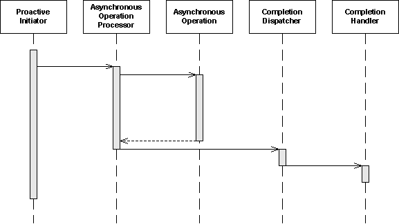

## [Proactor pattern](https://en.wikipedia.org/wiki/Proactor_pattern)

Proactor是一种用于事件处理的软件设计模式，在这种模式中，长时间运行的活动在异步部分中运行。完成处理程序在异步部分终止后被调用。proactor模式可以被认为是同步反应器模式的异步变体。

### 简介

特定操作成员

- 主动启动器通过异步操作处理器启动异步操作，并定义完成处理程序

- *Completion Handler*程序是异步操作处理器在操作结束时的调用
- 异步操作

标准成员：

- 异步操作处理器控制整个异步操作。
- Completion Dispatcher根据执行环境处理调用。

### 实现

- [Proactor and Boost.Asio](http://www.boost.org/doc/libs/release/doc/html/boost_asio/overview/core/async.html) ([C++](https://en.wikipedia.org/wiki/C%2B%2B))
- [Adaptive Communication Environment](https://en.wikipedia.org/wiki/Adaptive_Communication_Environment) ([C++](https://en.wikipedia.org/wiki/C%2B%2B))
- [RJR](https://github.com/movitto/rjr) (Ruby)

### 另请参阅

- [Reactor pattern](https://en.wikipedia.org/wiki/Reactor_pattern) (也是异步队列的事件模式，但是它们是同步的复用和分派)

### 参考文献

1. 面向模式的软件体系接口, 第二卷, Schmidt et al., Jon Wiley & Sons, Ltd, 2000

### 外部链接

- [Proactor - 用于异步事件的多路复用和调度处理程序的对象行为模式](https://www.dre.vanderbilt.edu/~schmidt/PDF/Proactor.pdf), Irfan Pyarali, Tim Harrison, [Douglas C. Schmidt](https://en.wikipedia.org/wiki/Douglas_C._Schmidt), Thomas D. Jordan, 1997 (pdf 143 kB)

